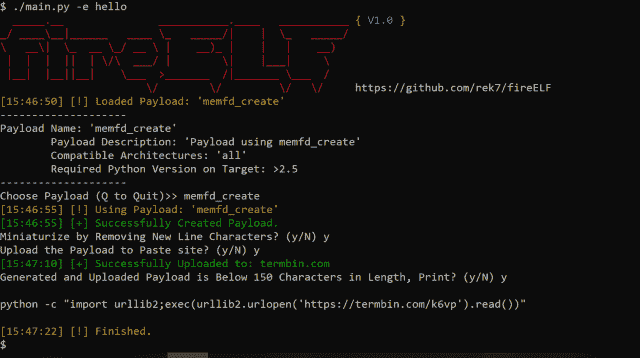
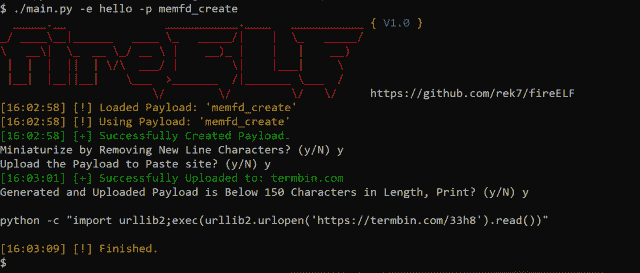

# FireELF:无文件 Linux 恶意软件框架

> 原文：<https://kalilinuxtutorials.com/fireelf/>

FireELF 是一个开源的无文件 linux 恶意软件框架，它跨平台，允许用户轻松地创建和管理有效负载。

默认情况下，它带有“memfd_create ”,这是一种完全从内存中运行 linux elf 可执行文件的新方法，无需二进制文件接触硬盘。

**也可阅读-[instant Box:几秒钟内获得一个干净的、随时可用的 Linux 盒子](https://kalilinuxtutorials.com/instantbox-linux-box/)**

**特性**

*   选择和构建有效负载
*   缩小有效载荷的能力
*   能够通过将有效负载源上传到 pastebin 来缩短有效负载，然后创建一个与 python <= 2.7 兼容的非常小的 stager，这允许轻松部署
*   将创建的有效负载输出到文件
*   能够从 url 或本地二进制文件创建有效负载

**包含有效载荷 memfd_create**

唯一包含的有效载荷“memfd_create”是基于 Stuart 的研究，该有效载荷在内存中创建一个匿名文件描述符，然后使用 fexecve 直接从文件描述符执行二进制文件。

这允许完全在内存中执行，这意味着如果 linux 系统重新启动，有效负载将无处可寻。

**创建有效载荷**

默认情况下，fireELF 自带“memfd_create ”,但用户可以开发自己的有效载荷。

默认情况下，有效载荷存储在有效载荷/中，为了创建一个有效的有效载荷，你只需要包含一个名为“desc”的字典，并带有参数“名称”、“描述”、“拱”和“python_vers”。下面是 desc 名言的一个例子:

**desc = {"name " : "测试有效负载"，"描述":"新内存注入或无文件 elf 有效负载"，" archs" : "all "，" python_vers" : " > 2.5"}**

除了“desc”字典之外，我构建的插件引擎使用的入口点需要一个 main 函数，该函数将自动传递两个参数，一个是 boolean，如果为真，则意味着传递了一个 url，传递的第二个参数是数据。下面是一个简单的入口点示例:

**def main(is_url，url_or_payload):
返回**

如果你有一个方法，请随意提交一个有效负载！

**安装**

通过运行以下命令下载依赖项:

**pip3 -U -r dep.txt**

fireELF 是用 Python 3.x.x 开发的

**用途**

用法:main . py[-h][-s][-p PAYLOAD _ NAME][-w PAYLOAD _ FILENAME]
(-u PAYLOAD _ URL |-e EXECUTABLE _ PATH)
fire elf，Linux File less Malware Generator
可选参数:
-h，–help 显示此帮助消息并退出
-s suppress Banner
-p PAYLOAD _ NAME 要使用的有效负载的名称
-w PAYLOAD_FILENAME 将有效负载写入的文件名(如果
您不使用粘贴站点，强烈推荐

**截图**

*   
*   

[**Download**](https://github.com/rek7/fireELF)