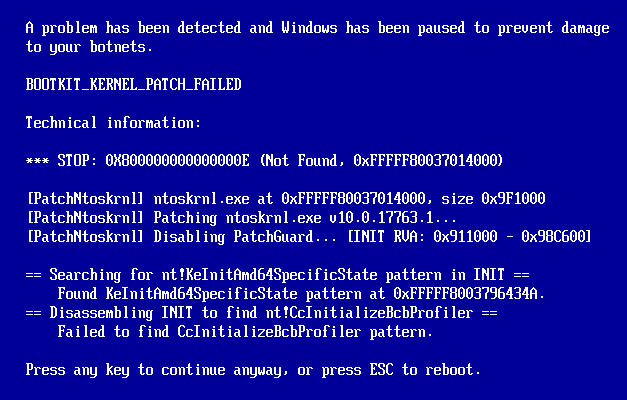
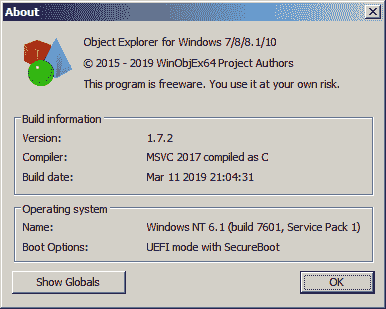
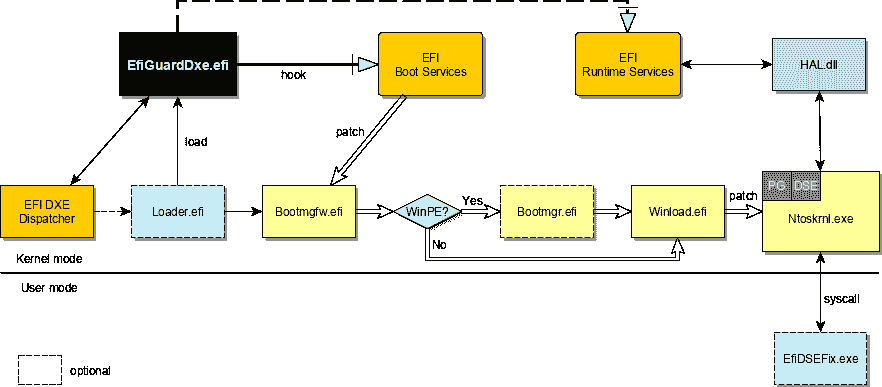

# EFI guard–在引导时禁用 PatchGuard 和 DSE

> 原文：<https://kalilinuxtutorials.com/efiguard-disable-patchguard-and-dse-at-boot-time/>

EfiGuard 是一个可移植的 x64 UEFI bootkit，它在引导时修补 Windows 引导管理器、引导加载程序和内核，以便禁用 PatchGuard 和驱动程序签名强制(DSE)。

**特性**

*   目前支持所有已发布的 Windows x64 的 EFI 兼容版本，从 Vista SP1 到 Server 2019。
*   易于使用:可以通过自动查找和引导 Windows 的加载程序从 u 盘启动。也可以使用 UEFI shell 或加载程序手动加载和配置驱动程序。
*   广泛使用 [Zydis](https://github.com/zyantific/zydis) 反汇编程序库进行快速运行时指令解码，以支持比签名匹配更强大的分析，签名匹配通常需要随着新的操作系统更新而改变。
*   被动工作:驱动程序不加载或启动 Windows 启动管理器。相反，它通过引导选择菜单或 EFI 应用程序(如加载程序)对固件引导管理器加载的`bootmgfw.efi`起作用。如果非 Windows 操作系统启动，驱动程序将自动卸载。
*   支持`bootmgfw.efi`启动`bootmgr.efi`而非`winload.efi`时的四阶段打补丁。当加载 WIM 文件以启动 WinPE、Windows 安装程序或 Windows 恢复模式时，就会出现这种情况。
*   正常恢复:如果补丁失败，驱动程序将显示错误信息，并提示继续引导或按 ESC 键重新引导。即使到最后的内核补丁阶段也是如此，因为最后的补丁阶段发生在调用`ExitBootServices`之前。许多 UEFI Windows bootkits 挂钩`OslArchTransferToKernel`，虽然通过模式匹配很容易找到，但它是一个在`ExitBootServices`之后以保护模式执行的函数。这意味着没有引导服务可以告诉用户出现了问题。

带有错误信息的模拟补丁故障

可调试:在内核修补阶段，可以将消息输出到内核调试器和屏幕(尽管是缓冲的)，在引导管理器和引导加载程序修补阶段，可以将消息输出到串行端口或不缓冲到屏幕。

如果驱动程序是用 PDB 调试信息编译的，那么通过指定虚拟 DXE 驱动程序库并像调试常规 nt 驱动程序一样调试它，就可以在 HAL 初始化后的任何时候加载调试符号。

DSE 旁路:既可以作为引导时简单的[升级的](https://github.com/hfiref0x/UPGDSED)风格的 DSE 禁用，也可以作为`SetVariable()` EFI 运行时服务的挂钩。

后者作为一个任意的内核模式读/写后门，可以使用`NtSetSystemEnvironmentValueEx`从 Windows 调用，并允许将`g_CiEnabled` / `g_CiOptions`设置为所需的值。

提供了一个名为`EfiDSEFix.exe`的小型 DSEFix 风格的应用程序，可以用来做这件事。也可以使 DSE 保持启用状态，而只禁用 PatchGuard。

默认情况下，加载程序将使用`SetVariable` hook 方法，因为一些反作弊和反病毒程序通常不理解作弊或恶意软件与自签名驱动程序之间的区别，并以升级修复为目标。

通过在每个阶段修补`ImgpValidateImageHash`和`ImgpFilterValidationFailure`来支持磁盘上修改的内核和引导加载程序，这可能会悄悄地向 TPM 或 SI 日志文件报告某些类别的违规。

允许安全启动工作与 Windows 7(不是一个笑话！).Windows 7 本身并不支持安全启动，或者([官方说法](https://msdn.microsoft.com/en-us/ie/dn938339(v=vs.60)))甚至在没有 CSM 的情况下启动。

这对于想要在需要 WHQL 安全引导的锁定设备上使用 Windows 7 的人来说非常有用。关于如何让它工作的 Wiki 条目[在这里](https://github.com/Mattiwatti/EfiGuard/wiki/Secure-boot-on-Windows-7)。

**问题和限制**

*   EfiGuard 无法禁用虚拟机监控程序强制的代码完整性(HVCI 或 HyperGuard ),因为 HVCI 运行在更高的权限级别。EfiGuard **可以**与 HVCI 共存，甚至在普通内核中成功禁用 PatchGuard，但这在实践中没有用，因为 HVCI 会捕捉到 PatchGuard 以前做过的事情。这两种类型的 DSE 旁路都被 HVCI 弄得毫无用处:引导时间补丁没有任何作用，因为内核遵从安全内核进行完整性检查，而`SetVariable`钩子如果被用来写`g_CiOptions`将导致`SECURE_KERNEL_ERROR`错误检查。
*   不支持检查的内核，因为禁用的优化和添加的断言以及检查的内核中对 PatchGuard 的其他更改导致 PatchGuard 和 DSE 初始化代码存在差异。这应该不是一个问题，因为如果没有附加内核调试器，检查的内核通常是没有用的，这将禁用 PatchGuard。
*   加载程序应用程序目前在某些电脑上无法直接启动(例如 Dell XPS)。在这种情况下，UEFI shell 可以用作后备(见下文)。

**如何使用**

有两种方法可以使用 EfiGuard:引导加载程序(最简单)，或者使用 UEFI shell 加载驱动程序。

**引导加载程序**

1.  下载或编译 EfiGuard，进入`EFI/Boot`，将`Loader.efi`或`Loader.config.efi`中的一个重命名为`bootx64.efi`。这两个是相同的，除了`Loader.efi`启动时没有用户交互，而`Loader.config.efi`会提示你配置驱动程序使用的 DSE 补丁方法(如果你想改变这一点)。
2.  将文件放在启动驱动器上，如 u 盘(用于物理机)或 ISO/虚拟磁盘(用于虚拟机)。路径应该是`/EFI/Boot/{bootx64|EfiGuardDxe}.efi`。建议使用 FAT32 格式的 u 盘。
3.  从新驱动器启动机器，而不是启动 Windows。大多数固件都提供了一个引导菜单来完成这项工作(可以通过 F10/F11/F12 访问)。否则，您需要配置 BIOS 从新驱动器启动。
4.  如果您使用的是默认加载程序，Windows 现在应该会启动，并且您应该会在启动过程中看到 EfiGuard 消息。如果您使用的是可配置加载程序，请回答配置提示，Windows 将会启动。
5.  如果您使用`SetVariable`钩子引导(默认)，那么在引导后从命令提示符运行`EfiDSEFix.exe -d`来禁用 DSE。运行`EfiDSEFix.exe`来查看选项的完整列表。

**使用 UEFI shell 加载驱动程序**

1.  按照上述步骤 1 和 2，但不要将加载器重命名为`bootx64.efi`。相反，要么使用 BIOS 提供的 shell(如果你有的话)，要么下载 [EDK2 UEFI Shell](https://github.com/tianocore/edk2/blob/master/ShellBinPkg/UefiShell/X64/Shell.efi?raw=true) 并将其重命名为`bootx64.efi`。
2.  将机器引导至 UEFI shell。
3.  在正确的文件系统上运行`cd`到`/EFI/Boot`并运行`load EfiGuardDxe.efi`来加载驱动程序。
4.  (可选)从同一目录运行`Loader.efi`或`Loader.config.efi`来引导 Windows。您也可以继续在 shell 中工作，或者使用`exit`返回 BIOS/boot 菜单并从那里启动。
5.  启动后，应用上述 DSE 修复程序(如果适用)。

**编译**

**编译 EfiGuardDxe 和加载程序**

EfiGuard 需要 EDK2 来构建。如果你没有安装 EDK2，首先按照[EDK2](https://github.com/tianocore/tianocore.github.io/wiki/Getting-Started-with-EDK-II)入门中的步骤操作，因为 ed k2 构建系统的设置相当复杂。本节假设您有一个您的`WORKSPACE`环境变量指向的`workspace`目录，其中有一个在`workspace/edk2`中签出的 EDK2 的副本。支持的编译器是 MSVC，Clang，海湾合作委员会和 ICL。

1.  将 EfiGuard 存储库克隆到`workspace/edk2/EfiGuardPkg`中。
2.  打开为 EDK2 设置环境变量的提示符或 shell。
3.  运行`build -a X64 -t VS2017 -p EfiGuardPkg/EfiGuardPkg.dsc -b RELEASE`，将您的工具链替换为 VS2017。

这将在`workspace/Build/EfiGuard/RELEASE_VS2017/X64`中产生`EfiGuardDxe.efi`和`Loader.efi`。要构建交互式可配置加载程序，将`-D CONFIGURE_DRIVER=1`添加到构建命令中。

**编译 EfiDSEFix**

EfiDSEFix 需要 Visual Studio 来生成。

1.  打开`EfiGuard.sln`并构建解决方案。

输出二进制数`EfiDSEFix.exe`将在`Application/EfiDSEFix/bin`中。

Visual Studio 解决方案还包括针对`EfiGuardDxe.efi`和`Loader.efi`的项目，它们可以与 [VisualUefi](https://github.com/ionescu007/VisualUefi) 一起使用，但这些项目不是默认构建的，因为没有额外的代码它们不会链接，并且构建输出将不如(大于)EDK2 产生的结果。`Loader.efi`由于 VisualUefi 缺少 UefiBootManagerLib，根本不会链接。

因此，这些项目文件仅作为开发辅助工具，EFI 文件仍应使用 EDK2 编译。要为此目的设置 VisualUefi，将存储库克隆到`workspace/VisualUefi`中并打开`EfiGuard.sln`。

**架构**

虽然 EfiGuard 是一个 UEFI 启动工具包，但它并不是一开始就有的。EfiGuard 最初是一个运行在 NT 上的磁盘修补程序(类似于[升级的](https://github.com/hfiref0x/UPGDSED))，旨在测试基于反汇编程序的 aproach 的可行性，而不是使用 PDB 符号和特定于版本的签名。

[PatchNtoskrnl.c](https://github.com/Mattiwatti/EfiGuard/blob/master/EfiGuardDxe/PatchNtoskrnl.c) 看起来还是很像这个原始设计。只有在这种方法被证明是成功的，并且在一年多的 Windows 更新中不需要修改代码之后，UEFI 才作为一种进一步改进功能和易用性的方法出现。

bootkit 方法提供的一些优势包括:

*   不需要在磁盘上修改内核或引导加载程序。
*   无需使用`bcdedit`修改引导配置存储。
*   不需要修补`ImgpValidateImageHash`(尽管这仍然是可选的)。
*   具有讽刺意味的是，使用 bootkit 允许启用安全引导，前提是您拥有平台密钥，并且能够将您的个人证书添加到`db`存储中。

EfiGuard 作为 bootkit 的最初化身是试图让 dude719 的 [UEFI-Bootkit](https://github.com/ajkhoury/UEFI-Bootkit) 与 Windows 10 的最新版本一起工作，因为它已经过时，不再适用于最新版本(像 UPGDSED，经常由版本敏感模式扫描引起)。

虽然我最终做到了这一点，但我对结果并不满意，主要是因为选择了挂钩`OslArchTransferToKernel`，如上所述，它在保护模式下执行，并且在`ExitBootServices`被调用后执行。

除此之外，我不满足于只能修补 Windows 10 的某些版本；我希望 bootkit 能够在迄今为止发布的所有 EFI 兼容版本的 Windows x64 上运行。因此，我从零开始重写了 bootkit，目标如下:

*   在启动的每个阶段提供补丁信息，包括内核补丁本身。
*   将支持的 EFI 兼容 Windows 版本的数量增加到“全部”(在撰写本文时)。
*   启用 bootkit 和可选内核后门的惰性实例化，通过 EFI 系统表挂钩实现。

上图显示了最终 EfiGuard 引导流程的总体概况。对于单个组件特定的钩子和补丁，参见源文件中的`EfiGuardDxe/PatchXxx.c`。对于驱动程序初始化/卸载和 EFI 引导和运行时服务挂钩，参见[efiguardxe . c](https://github.com/Mattiwatti/EfiGuard/blob/master/EfiGuardDxe/EfiGuardDxe.c)。

[**Download**](https://github.com/Mattiwatti/EfiGuard)