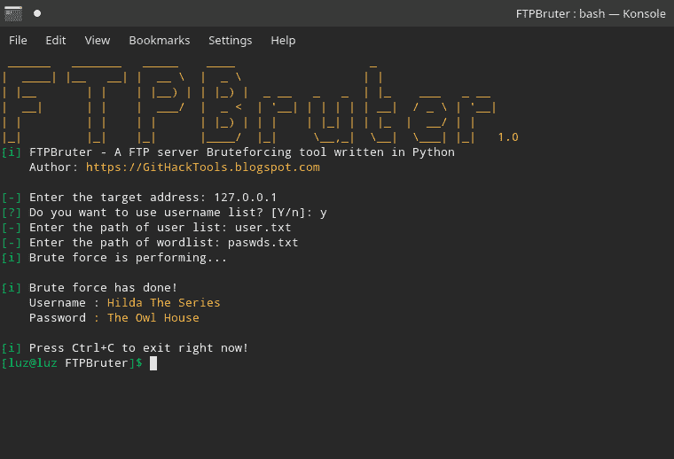
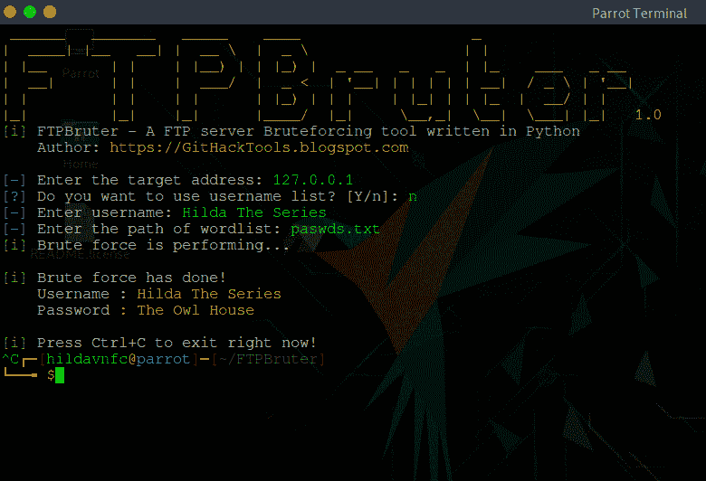
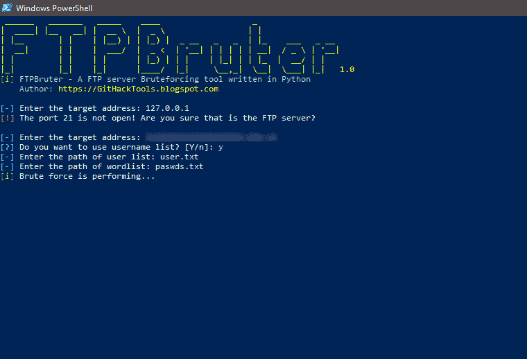

# FTPBruter:一个用 Python 3 编写的 FTP 服务器暴力破解工具

> 原文：<https://kalilinuxtutorials.com/ftpbruter/>

FTP 服务器暴力破解工具。FTPBruter 可以在任何操作系统上工作，如果他们有并且支持 Python 3 的话。用一个用户名或一系列用户名暴力攻击 FTP 服务器。

**在 Linux 上安装并运行**

*   你必须先安装 Python 3:
*   在 Arch Linux 及其发行版上安装 Python 3:sudo pacman-S Python 3
*   在 Debian 及其发行版上安装 Python 3:sudo 来安装 Python 3

**也可阅读-[silk etw:抽象出 ETW](https://kalilinuxtutorials.com/silketw-abstract-complexities-etw/) 复杂性的工具 **

**git 克隆 https://github . com/githacktools/ftpbrutor
CD ftpbrutor
python 3 ftpbrutor . py**

**在 Windows 上安装并运行**

*   从 Python.org 下载并运行 Python 3.7.x 安装文件。在安装 Python 3.7 时，启用将 Python 3.7 添加到路径。
*   从 Git-scm.com 下载并运行 Git 安装文件，并从 Windows 命令 Propmt 中选择使用 Git。
*   之后，打开 PowerShell 或命令 Propmt 并输入以下命令:

**git 克隆 https://github . com/githacktools/ftpbrutor
CD ftpbrutor
python 3 ftpbrutor . py**

如果不想安装 Git，可以下载 [FTPBruter-master.zip](https://github.com/GitHackTools/FTPBruter/archive/master.zip) ，解压使用。

**截图**

*   
*   
*   

**注:**你的蛮力速度可能取决于你的 ping，受害者的 ping，你的互联网。不要用一个大的单词表和一个小的内存来蛮力。

[**Download**](https://github.com/GitHackTools/FTPBruter)