# reverie–为 Parrot Linux 设计的自动化 Pentest 工具

> 原文：<https://kalilinuxtutorials.com/reverie-automated-pentest-tools/>

Reverie 是一个为 Parrot Linux 设计的自动化测试工具。

该工具将使您的基本测试任务，如信息收集、安全审计和报告，因此该工具将完全自动完成每项任务。

**使用指南**

下载或克隆

~# git 克隆 https://github.com/baguswiratmaadi/reverie

进入幻想目录

~# cd 遐想

允许幻想

~# chmod 777 *.sh

运行幻想而不安装

~# ./reverie.sh

如果你想安装幻想

~# ./install.sh

**Pentest 工具带着幻想自动执行**

*   Whois Lookup(是查找)
*   DNSwalk
*   Nmap
*   德米特里
*   Whatweb
*   wafw00f
*   负载平衡检测器
*   分析
*   TLSSled
*   自动售货机
*   Nikto
*   和更多工具

**也可理解为-[Raptor WAF:使用 DFA 测试版的网络应用防火墙](https://kalilinuxtutorials.com/raptor-waf/)**

**幻想自动测试预览**

**工具预览:**

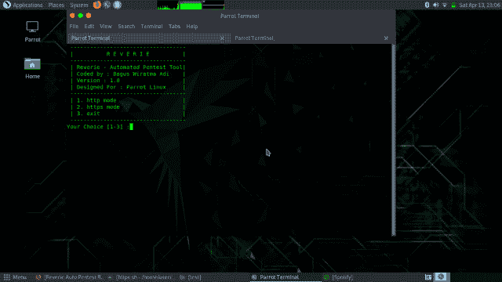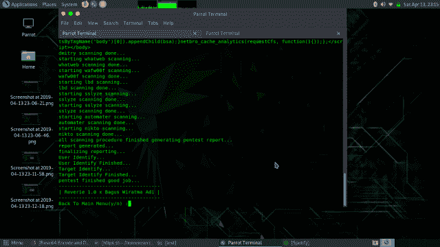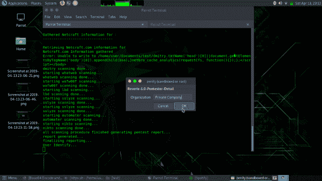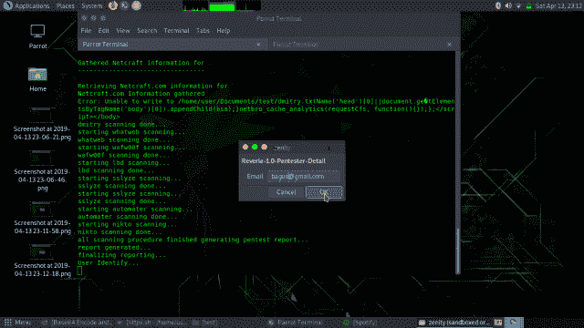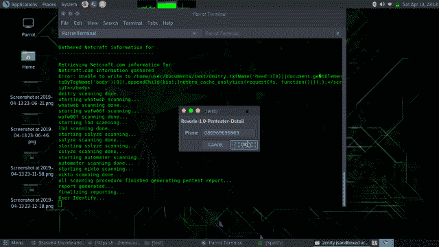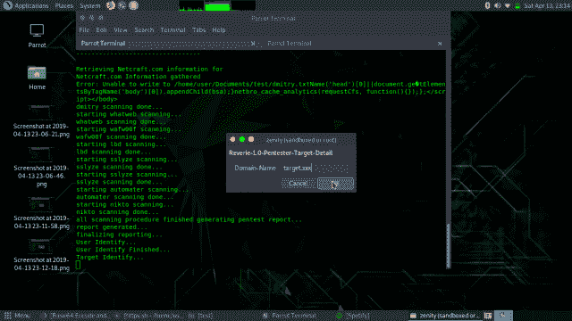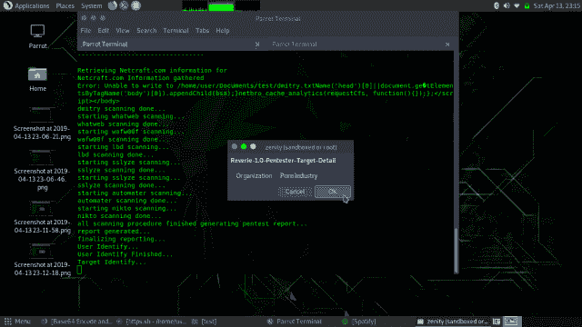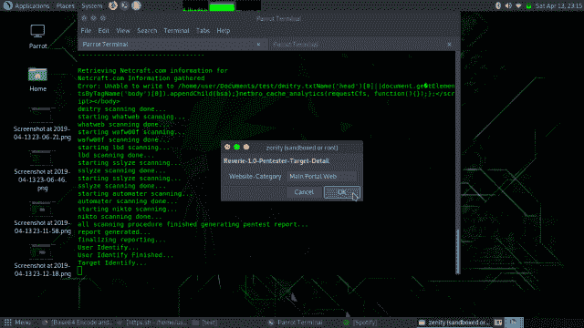

**输出结果**

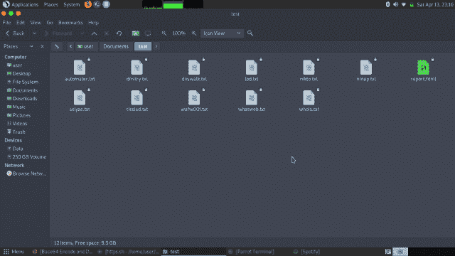

**HTML 格式的报告**

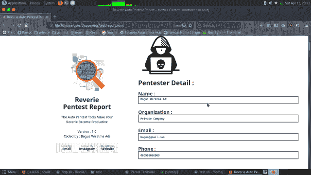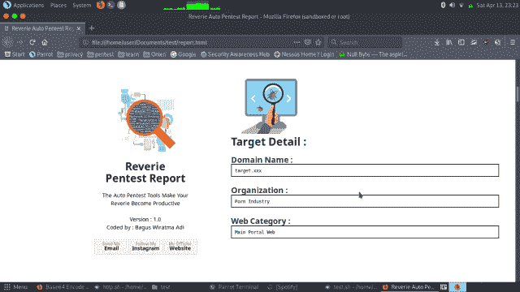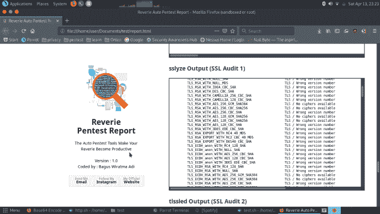

**免责声明**

*   未经法律许可，请勿扫描政府和私人 IT 对象。
*   自担风险

[Download](https://github.com/baguswiratmaadi/reverie)