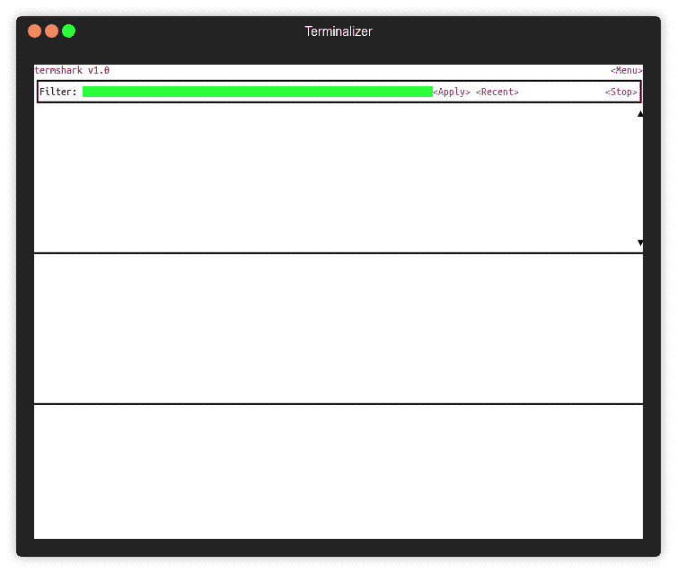

# termshark:t shark 的终端用户界面

> 原文：<https://kalilinuxtutorials.com/termshark-tshark/>

Termshark 是 tshark 的终端用户界面，灵感来自 Wireshark。

如果您正在一台具有大型 pcap 的远程机器上进行调试，并且不想将它 scp 回您的桌面，那么它会有所帮助！

**特性**

*   读取 pcap 文件或嗅探实时接口(允许使用 tshark)。
*   使用类似 Wireshark 的视图检查每个数据包
*   使用 Wireshark 的显示过滤器过滤 pcaps 或实时捕获
*   从终端将数据包范围复制到剪贴板
*   用 Golang 编写，在每个平台上编译成一个可执行文件——可下载，适用于 Linux (+termux)、macOS、FreeBSD 和 Windows

**也读:** [**HostHunter:使用 OSINT**](https://kalilinuxtutorials.com/hosthunter-hostnames-osint/) 发现主机名

**安装(FreeBSD)**

它在 FreeBSD 端口树中！要安装该软件包，请运行:

**pkg 安装 termshark**

要构建/安装端口，请运行:

**CD/usr/ports/net/termshark/&使安装干净**

**大楼**

它使用 Go 模块，所以最好用 Go 1.11 或更高版本编译。设置 GO111MODULE=on，然后运行:

去找 github.com/gcla/termshark/cmd/termshark

然后将 **~/go/bin/** 添加到你的**路径**中。

对于所有的数据包分析，它依赖于 Wireshark 项目的 tshark。确保 tshark 在你的路上。

**快速启动**

检查本地 pcap:

termshark -r test.pcap

在接口 eth0 上捕获 ping 数据包:

termshark -i eth0 icmp

运行 **termshark -h** 选项。

**依赖关系**

它依赖于这些开源包:

*   t shark–命令行网络协议分析器，Wireshark 的一部分
*   t cell——基于单元的终端处理包，灵感来自 termbox
*   gowid——复合终端 UI 小部件，受 urwid 启发，基于 tcell 构建

注意，tshark 是一个运行时依赖项，必须在您的路径中才能运行。需要版本 1.10.2 或更高版本(大约 2013 年)。

**演职员表**:格雷厄姆·克拉克

[**Download**](https://github.com/gcla/termshark)