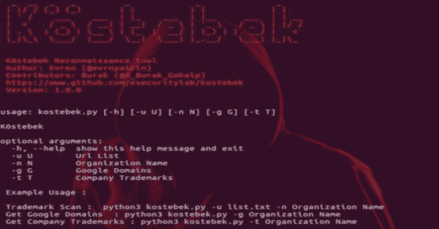

# Kostebek:发现企业领域的工具

> 原文：<https://kalilinuxtutorials.com/kostebek/>

Kostebek 是一个侦察工具，它使用公司的商标信息来发现它们的域名。

**安装**

在 Kali Linux 2018.2、Ubuntu 16.04 上测试

sudo apt-get -y 安装 python3-pip
pip3 安装要求. txt

下载最新版本的 Chromedriver 并配置你的驱动路径

**#sudo apt-get 安装解压
# sudo unzip/tmp/chrome driver . zip chrome driver-d/usr/local/bin/**

下载最新版本的 Chrome 浏览器

**https://www.google.com/chrome/browser/desktop/
# dpkg-I Google-chrome-stable _ current _ amd64 . deb
# apt-get install-f
# dpkg-I Google-chrome-stable _ current _ amd64 . deb**

**又读: [Adidnsdump : Active Directory 集成 DNS 转储工具](https://kalilinuxtutorials.com/adidnsdump-active-directory/)**

**例子**

**商标扫描:python3 kostebek.py -u list.txt -n 组织名称 Get

谷歌域名:python3 kostebek.py -g 组织名称

获取公司商标:python3 kostebek.py -t 组织名称**

**演示**

[https://www.youtube.com/embed/OR4YzrgNNcE?feature=oembed&enablejsapi=1](https://www.youtube.com/embed/OR4YzrgNNcE?feature=oembed&enablejsapi=1)

[**Download**](https://github.com/esecuritylab/kostebek)