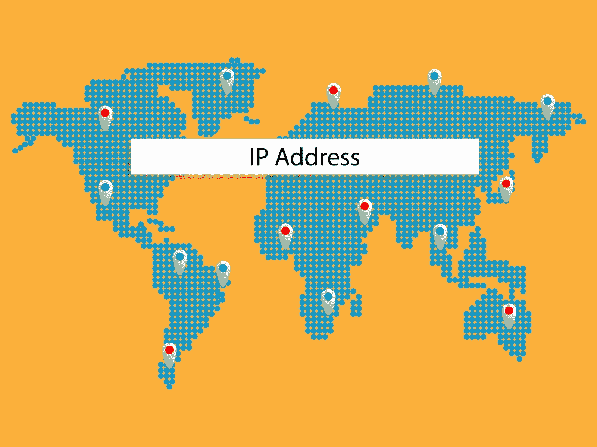
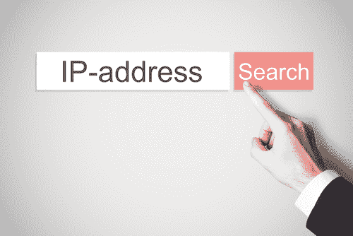

# 隐藏 IP 地址是个好主意的重要原因

> 原文：<https://kalilinuxtutorials.com/hiding-your-ip-address/>

互联网可能是信息的金矿，但如果你不够小心，它也可能是你遭遇身份盗窃和安全漏洞的原因。除了要小心你的网上活动，隐藏你的 IP 地址可能是一个好主意，以维护你的安全和网上安全。

互联网协议地址或 IP 地址是由您的互联网服务提供商提供的数字标签。当您在线访问任何网站时，网络主机可以通过您的 IP 地址跟踪您的位置和其他在线活动。

## **隐藏你的 IP 地址**

即使你已经离开了他们的网站，虚拟主机仍然可以做同样的事情。为了确保您不会在网上留下这种痕迹，[隐藏您的 IP](https://websafetyadvice.com/how-to-hide-your-ip-address/) 地址，因为它可以提供以下好处:

#### **1。隐藏你的 IP 地址可以阻止广告网络跟踪你。**

作为一名消费者，你可能理解营销在企业成功中的重要性。一个企业需要吸引顾客以赚取利润，他们可以通过创造不同的营销策略来实现这一目标。虽然这些在线广告中的一些可能是有趣和有效的，但随着时间的推移，其他广告可能会变得具有侵扰性。

如果你用一个可见的 IP 地址访问你的任何社交网站，你实际上是给了企业跟踪你的浏览历史的机会。因此，这些企业可以决定哪种产品或服务适合你的需求。如果你不想在下次使用互联网时被广告轰炸，隐藏你的 IP 地址。

#### **2。隐藏您的 IP 地址可以对您的 ISP 隐藏您的在线活动。**

你的网络服务提供商很容易通过你的 IP 地址知道你的在线活动。您的 ISP 会知道您通常访问什么类型的网站，以及您在每个网站上花了多少时间。大多数情况下，您的 ISP 也能知道您在线提交和接收的信息。虽然这些信息仍然受到您的 ISP 的保护，但在未来几年中，您就不能这么说了。他们可能未经你的同意就把你的信息卖给公司，以赚取更多利润。

当你开始隐藏你的 IP 地址时，你不需要担心数据跟踪和你的[网络安全](https://kalilinuxtutorials.com/w12scan-discovery-engine-cybersecurity/)。一旦你的 IP 地址被隐藏，你的 ISP 只能看到你连接到一个特定的网络，仅此而已。他们将无法访问您进行的任何在线搜索或您共享的信息。

**3。隐藏你的 IP 地址可以保护你的敏感研究隐私。**

作为一名记者、政治家和执法者，需要保密。要扮演这些角色，你必须彻底研究一个特定的主题，并可信地展示给公众。如果你不想特定的研究追踪到你，在你开始使用万维网之前隐藏你的 IP 地址。隐藏你的 IP 地址可以保持你的搜索匿名和隐私。

**4。隐藏你的 IP 地址可以让你避开地理障碍。**

互联网是每个人都可以访问的平台，但这并不意味着你可以在线访问所有网站。如果你住在美国以外，或者你喜欢出国旅行，你可能会在访问不同的在线服务(如网飞)时遇到问题。由于版权法的原因，该网站只向国际用户提供有限的内容。幸运的是，屏蔽你的 IP 地址可以帮助你通过这个网站。隐藏您的 IP 地址可以伪装您的服务器，好像它来自另一个位置，让您可以轻松访问这些网站。

安全总比后悔好[互联网](https://en.wikipedia.org/wiki/Internet)可以为你打开提高生产力和扩展知识面的大门。然而，总体而言，不谨慎的网上活动也会给你的职业生涯、人际关系和生活带来长期后果。为了确保您的在线安全，请按照本文中的信息学习如何隐藏您的 IP 地址。这种预防措施可以让你在网上有一个无压力的体验。