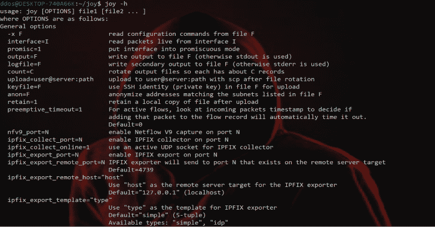

# Joy:捕获和分析网络流量数据和内部流量数据

> 原文：<https://kalilinuxtutorials.com/joy-network-flow-data-intraflow-data/>

Joy 是一个用于捕获和分析网络流数据和内部流数据的包，用于网络研究、取证和安全监控。

Joy 是 BSD 许可的基于 libpcap 的软件包，用于从实时网络流量或数据包捕获(pcap)文件中提取数据特征，使用类似于 IPFIX 或 Netflow 的面向流的模型，然后在 JSON 中表示这些数据特征。

它还包含可以应用于这些数据文件的分析工具。Joy 可用于探索大规模数据，尤其是安全和威胁相关的数据。

使用 JSON 是为了让数据分析工具可以轻松地使用输出。

另请参阅:Flerken : [混淆命令检测工具](https://kalilinuxtutorials.com/flerken-obfuscated-command-detection/)

虽然 JSON 输出文件有些冗长，但是它们相当小，并且能够很好地响应压缩。

Joy 可以配置为获取流内数据，即关于网络流内发生的事件的数据和信息，包括:

*   IP 数据包的长度和到达时间序列，最多可配置数据包的数量。
*   流的数据部分中字节的经验概率分布，以及从该值导出的熵，
*   TLS 记录的长度和到达时间序列，
*   其他未加密的 TLS 数据，如提供的密码套件列表、选定的密码套件、clientKeyExchange 字段的长度以及服务器证书字符串，
*   DNS 名称、地址和 TTL，
*   HTTP 头元素和 HTTP 正文的前八个字节，以及
*   与流相关联的进程的名称，用于在运行 pcap 的主机上发起或终止的流。

Joy 旨在用于安全研究、取证和监控(小规模)网络，以检测漏洞、威胁和其他未经授权或不想要的行为。

研究人员、管理员、渗透测试人员和安全运营团队可以很好地利用这些信息来保护被监控的网络，在出现漏洞的情况下，通过改进防御态势来造福更广泛的社区。

与任何网络监控工具一样，Joy 可能会被滥用；不要在您不是所有者或管理员的任何网络上使用它。

在积极心理学中,“心流”是一种状态，在这种状态中，一个人在进行一项活动时完全沉浸在一种精力充沛的专注、深度参与和喜悦的感觉中。

这第二个意思启发了这个软件包的名字的选择。

Joy 是 alpha/beta 软件；我们希望您使用它并从中受益，但是要明白它不适合生产使用。

**TLS 指纹识别**

我们最近发布了最大和最丰富的开源 TLS 指纹数据库。

在其他功能中，我们的方法建立在以前的工作基础上，完全自动化，并用更多的信息注释 TLS 指纹。

我们已经建立了一套 python 工具来实现这个数据库的应用，以及借助 Joy 生成新的数据库。

**与思科 ETA 的关系**

Joy 帮助支持了为思科加密流量分析(ETA)铺平道路的研究，但它没有直接集成到任何实现 ETA 的思科产品或服务中。

Joy 中的分类器是几年前在一个小数据集上训练的，并不代表 ETA 的分类方法或性能。

这个特性的目的是允许网络研究人员在 Joy 产生的数据特征子集上快速训练和部署他们自己的分类器。

版本 4.3.0

为 Joy 和 libjoy 添加 IPv6 支持
IPFix 收集和导出仅支持 IPv4
NFv9 仅支持 IPv4
匿名化仅支持 IPv4 地址
子网标记仅支持 IPv4 地址

4.2.0 版

重写 joy.c 以使用 libjoy 库
更新 joy.c 以利用多线程进行流处理
更新单元测试和 python 测试以反映新的代码更改
移除更新程序的内部以准备重写
修复了在命令行上处理多个文件的错误
其他小错误修复

**4 . 0 . 3 版本**

增加了对 Centos make install 的支持

演职员表:大卫·麦克格鲁、布莱克·安德森、菲利普·裴礼康和比尔·哈德森

[**Download**](https://github.com/cisco/joy/)