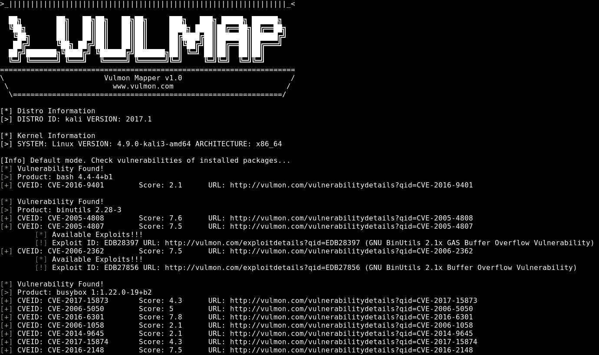
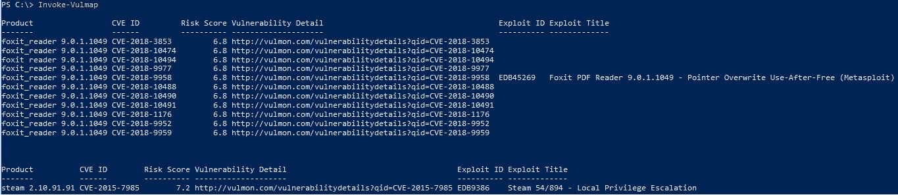

# Vulmap:在线本地漏洞扫描器项目

> 原文：<https://kalilinuxtutorials.com/vulmap-vulnerability-scanners/>

Vulmap 是一个开源的在线本地漏洞扫描器项目。它包括用于 Windows 和 Linux 操作系统的在线本地漏洞扫描程序。

这些脚本可以用于防御和进攻目的。使用这些脚本进行漏洞评估是可能的。此外，pentesters/red teamers 也可以使用它们来提升权限。

它可以用来扫描本地主机上的漏洞，查看相关的漏洞并下载它们。脚本基本上，扫描本地主机以收集已安装的软件信息，并询问 vulmon.com API 是否有任何与已安装的软件相关的漏洞和利用。

如果漏洞存在，它给 CVE ID，风险评分，漏洞的详细链接，如果存在相关的利用 ID 和利用标题。漏洞也可以用它下载。

其主要思想是从 Vulmon 获取实时漏洞数据，而不是依赖于本地漏洞数据库。这种方法甚至可以检测出最近的漏洞。

此外，其漏洞下载功能有助于权限提升过程。Pentesters 和 red teamers 可以从命令提示符下从 Exploit DB 下载漏洞。要使用此功能，唯一需要的是 id 的利用。

由于大多数 Linux 安装都有 Python，所以 Vulmap Linux 是用 Python 开发的，而 Vulmap Windows 是用 PowerShell 开发的，以便于在大多数 Windows 版本上运行。

Vulmap Linux 兼容 Python 2.x 和 dpkg 包管理系统。Vulmap Windows 与 PowerShell v3 和更高版本兼容。

**另请阅读-[隐藏 IP 地址是个好主意的重要原因](https://kalilinuxtutorials.com/hiding-your-ip-address/)**

使用以下链接获取有关 vulmap 的详细信息:

*   [Vulmap Linux](https://github.com/vulmon/Vulmap/tree/master/Vulmap-Linux)–用于 Linux 系统的 Python 脚本

*   [Vulmap Windows](https://github.com/vulmon/Vulmap/tree/master/Vulmap-Windows)–用于 Windows 系统的 Powershell 脚本

**贷项:t1[弓状地图集&](https://github.com/yavuzatlas) [弓状地图集](https://github.com/ozelfatih)**

[**Download**](https://github.com/vulmon/Vulmap)