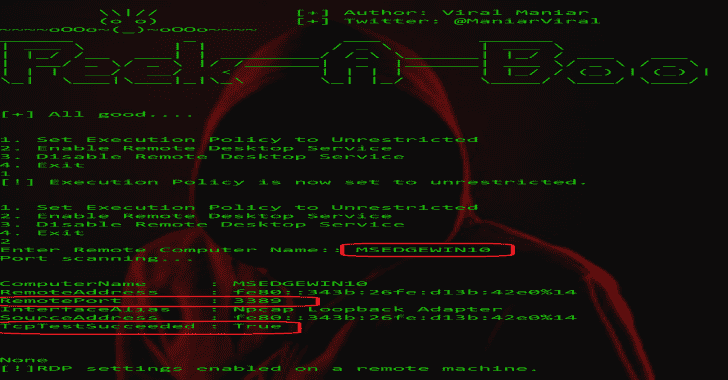
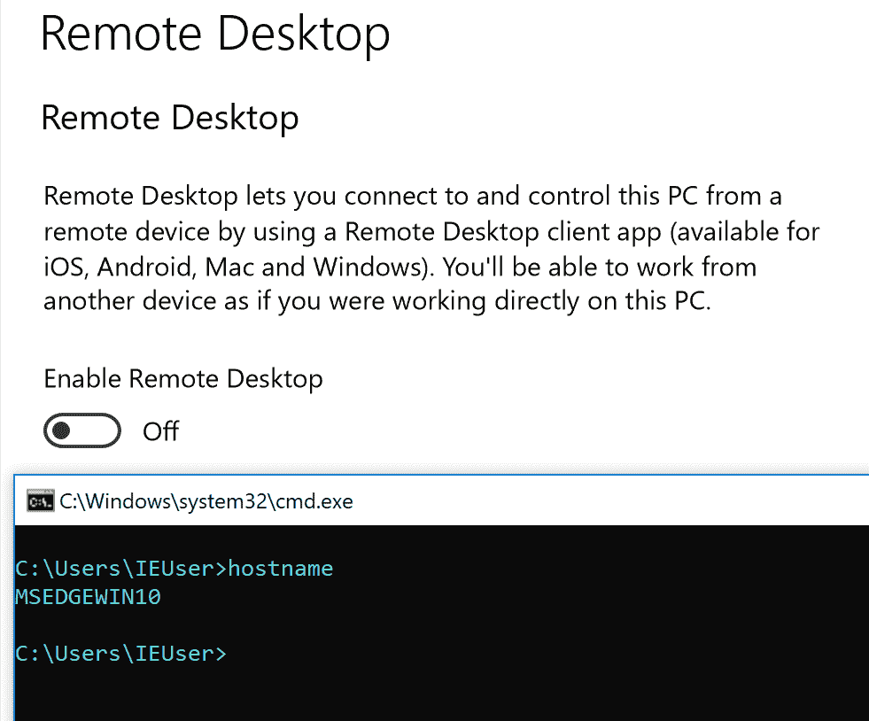
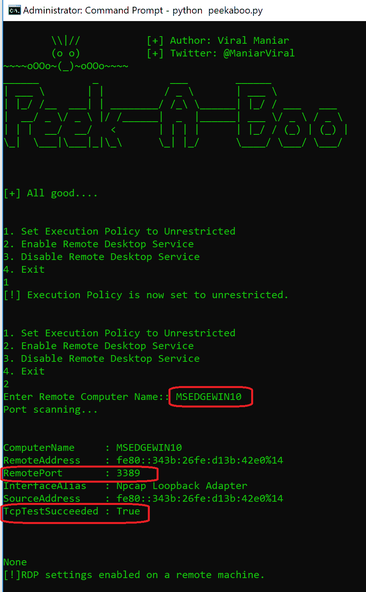
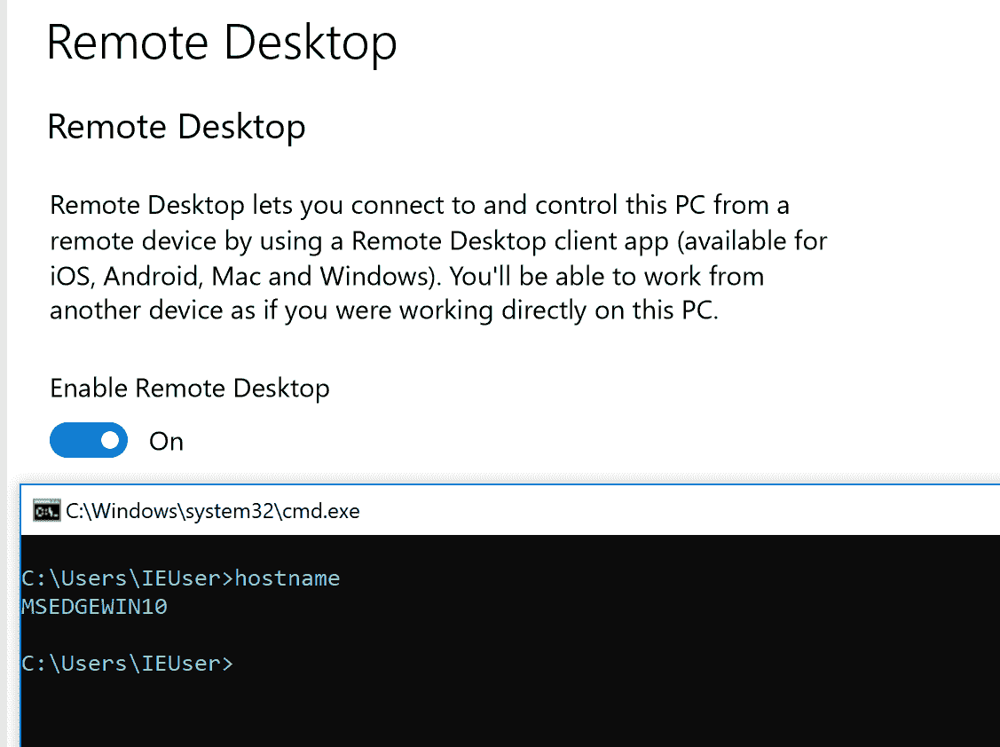

# PeekABoo:在目标机器上启用远程桌面的渗透测试

> 原文：<https://kalilinuxtutorials.com/peekaboo-penetration-testing-remote-desktop/>

当用户需要在目标机器上启用远程桌面时，可以在内部渗透测试期间使用 PeekABoo 工具。它使用 PowerShell 远程处理来执行此任务。

只有启用了 WinRM，该工具才有效。因为 Windows Server 2012 WinRM 默认情况下在所有 Windows Server 操作系统上启用，但在客户端操作系统上不启用。

**注意:**所有 Windows 操作系统默认禁用远程桌面。用户需要本地管理员密码或服务器上的管理员权限，才能在目标机器上启用 RDP。

**也读作——[喜悦:捕捉&分析网络流量数据&内部流量数据](https://kalilinuxtutorials.com/joy-network-flow-data-intraflow-data/)**

**截图**

内部网络上的目标机器禁用了 RDP:

通过按`option 2`在目标机器上启用远程桌面服务:

已在目标计算机上成功启用远程桌面服务:

**如何安装？**

**–git 克隆 https://github.com/Viralmaniar/PeekABoo.git
–CD 躲猫猫
–python PeekABoo . py**

**这个怎么用？**

*   按 1:这会将 PowerShell 设置为无限制模式。
*   按 2:激活目标机器上的`Remote Desktop`，显示 RDP 端口(3389)状态。
*   按 3:禁用目标机器上的`Remote Desktop`。
*   按 4:退出程序。

**我的 Windows 机器没有安装 Python，怎么办？**

*   从 Github 的 release 部分下载一个 exe 文件以及 PowerShell 文件，在这里[下载](https://github.com/Viralmaniar/PeekABoo/releases)或者在查看源代码后使用 PyInstaller 自行下载。
*   使用 [Pyinstaller](https://github.com/pyinstaller/pyinstaller) 将`peekaboo.py`编译成可执行文件
*   PyInstaller 可以在 PyPI 上获得。您可以通过 pip 安装它:

**pip 安装 pyinstaller**

[**Download**](https://github.com/Viralmaniar/PeekABoo)