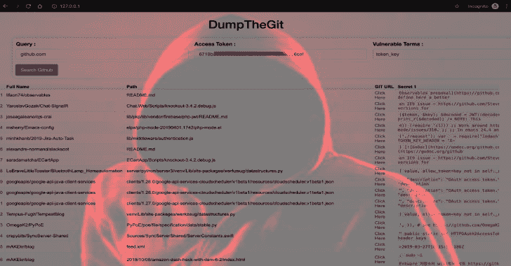
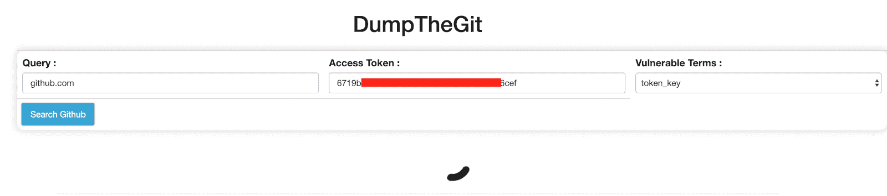
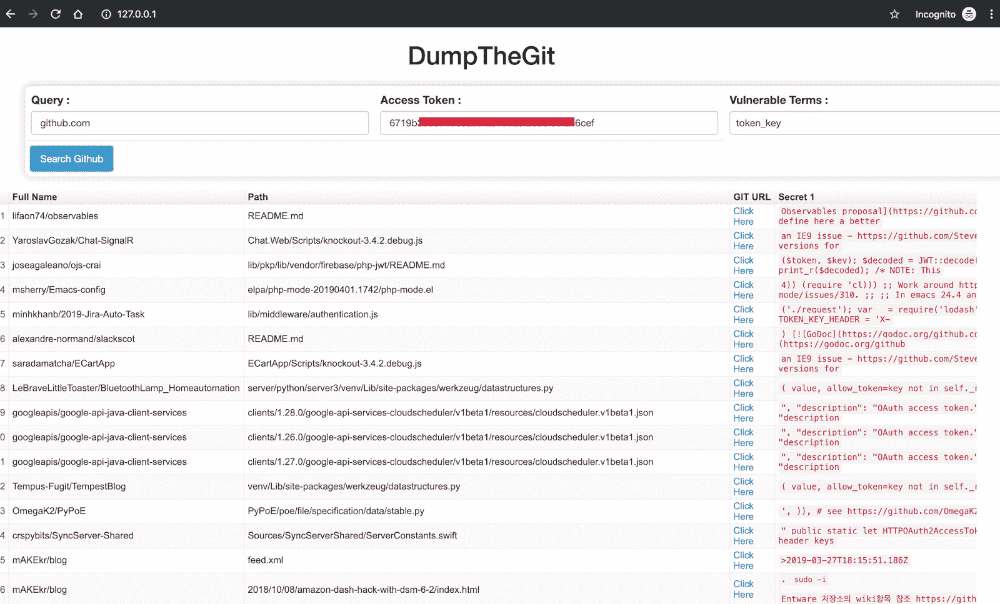

# DumpTheGit : Public Repositories 查找上传到 Github 存储库的敏感信息

> 原文：<https://kalilinuxtutorials.com/dumpthegit/>

DumpTheGit 搜索公共存储库，查找上传到 Github 存储库的敏感信息。

该工具将标记潜在敏感文件的匹配，如开发人员意外上传的凭证、密钥、令牌等。DumpTheGit 只需要你的 [Github 访问令牌](https://help.github.com/en/articles/creating-a-personal-access-token-for-the-command-line)来获取信息。

**也可阅读-[Kerbrute:一个执行 Kerberos 预授权强制的工具](https://kalilinuxtutorials.com/kerbrute-a-tool-to-perform-kerberos-pre-auth-bruteforcing/)**

**安装**

1.  将 DumpTheGit 存储库下载到您的系统中。
2.  在你的网络服务器上移动存储库的文件(例如:Tomcat，XAMPP，LAMP，default(MAC apache)等)。)
3.  打开 index.html 以访问该工具。

**截图**

**信用:**马尔基特·辛格&舒巴姆·舒班卡·夏尔马

[**Download**](https://github.com/Securityautomation/DumpTheGit)