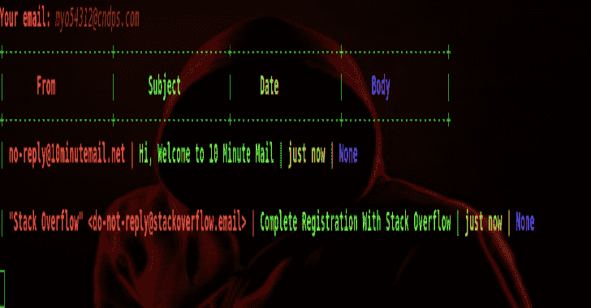
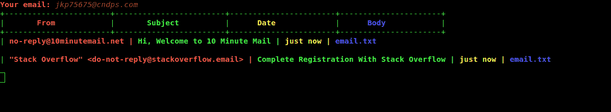
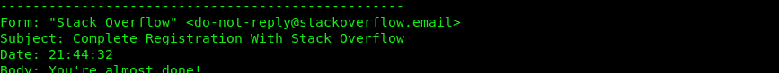

# 10 分钟邮件:Python 临时电子邮件

> 原文：<https://kalilinuxtutorials.com/10minutemail/>

10minutemail.net 是一种免费的一次性电子邮件服务。您的临时电子邮件地址将在 10 分钟后过期，此后您将无法访问它。你可以延长 10 分钟。

您注册的网站可能会出售您的个人信息；你永远不知道你的电子邮件会被公布在哪里。具有 10 分钟生命周期的电子邮件地址是防止这种情况的最佳解决方案。

**安装**

**wget https://raw . githubuser content . com/m4ll 0k/10 分钟电子邮件/master/10 分钟电子邮件. py&&python 10 分钟电子邮件. py**

**也读作-[AutoSource:自动化源代码 sonar qube](https://kalilinuxtutorials.com/autosource-sonarqube/)**

**用途**

**python 10 分钟电子邮件. py
python 10 分钟电子邮件. py–保存电子邮件. txt**

[**Download**](https://github.com/m4ll0k/10minutemail)

 ****