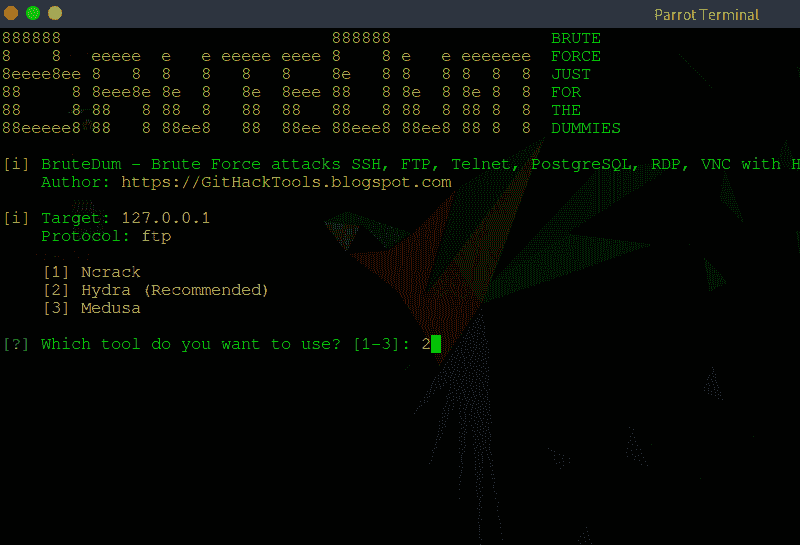
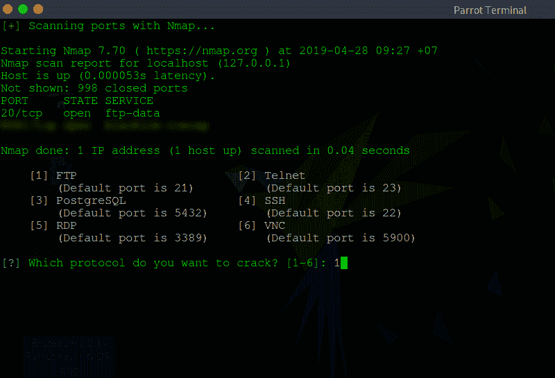
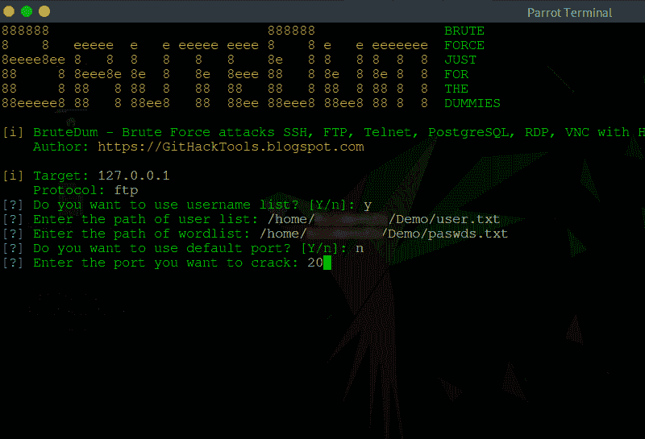

# 暴力攻击 SSH，FTP，Telnet，PostgreSQL，RDP，VNC 与九头蛇，美杜莎和 Ncrack

> 原文：<https://kalilinuxtutorials.com/brutedum/>

**BruteDum** 是一个 SSH，FTP，Telnet，PostgreSQL，RDP，VNC 蛮力工具，带有 Hydra，Medusa 和 Ncrack。如果他们有 Python 3，它可以和任何 Linux 发行版一起工作。

**特性**

*   SSH、FTP、Telnet、PostgreSQL、RDP、VNC 和 Hydra(推荐)
*   SSH，FTP，Telnet，PostgreSQL，RDP，VNC 与美杜莎
*   SSH、FTP、Telnet、PostgreSQL、RDP、带 Ncrack 的 VNC
*   用 Nmap 扫描受害者的端口

**也读作-[AutoSource:自动化源代码 sonar qube](https://kalilinuxtutorials.com/autosource-sonarqube/)**

**安装&运行在 Linux** 上

你必须先安装 Python 3:

*   在 Arch Linux 及其发行版上安装 Python 3:`**sudo pacman -S python3**`
*   在 Debian 及其发行版上安装 Python 3:`**sudo apt install python3**`

你还必须安装 Hydra、Medusa、Nmap 和 Ncrack:

*   关于 Arch Linux 及其发行版:`**sudo pacman -S nmap hydra medusa** **ncrack**`
*   关于 Debian 及其发行版:`**sudo apt install nmap hydra medusa ncrack**`

**git 克隆 https://github . com/githacktools/bruedum
raw edum CD
python 3 bruedum . py**

**截图**

**Menu of tools** 

**Scanning victim’s ports with Nmap**

**Ready to brute force**

**Brute force has done**

**视频演示**

[**Download**](https://github.com/GitHackTools/BruteDum)