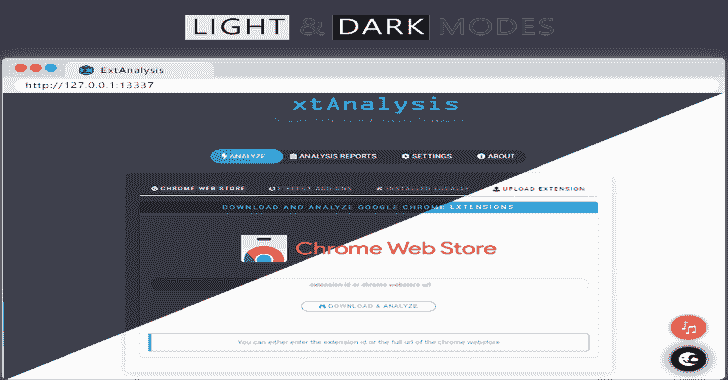
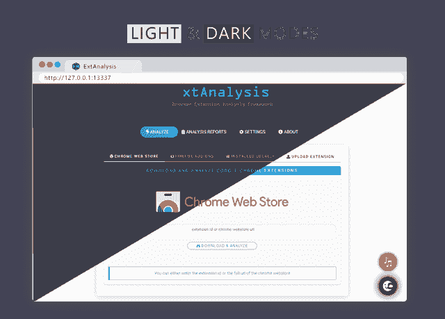
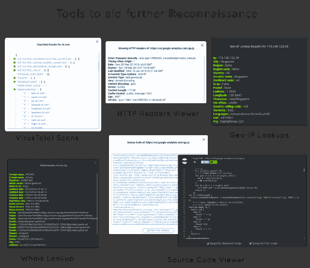

# ExtAnalysis:浏览器扩展分析框架

> 原文：<https://kalilinuxtutorials.com/extanalysis-browser-extension/>

**ExtAnalysis** 是一个浏览器扩展分析框架。安装很简单！它运行在 python3 上，所以要确保安装了 python3 和 python3-pip。

你能做什么？

*   从以下网站下载和分析扩展:
    *   [Chrome 网上商店](https://chrome.google.com/)
    *   火狐插件
*   分析已安装的扩展:
    *   谷歌浏览器
    *   Mozilla Firefox
    *   Opera 浏览器(即将推出)
*   上传和扫描扩展。支持的格式:
    *   。crx
    *   。xpi
    *   。活力

**特色**

*   查看基本信息:
    *   名称、作者、描述和版本
*   清单查看器
*   深度许可信息
*   从文件中提取信息，包括:
    *   URL 和域
    *   IPv6 和 IPv4 地址
    *   比特币地址
    *   电子邮件地址
    *   文件注释
    *   Base64 编码字符串
*   查看和编辑文件。支持的文件类型:
    *   超文本标记语言
    *   json
    *   Java Script 语言
    *   钢性铸铁
*   VirusTotal 扫描:
    *   资源定位符
    *   域
    *   文件
*   JavaScript 文件的 RetireJS 漏洞扫描
*   所有文件和 URL 的网络图
*   用于提取 URL 的侦察工具:
    *   是扫描
    *   HTTP 标题查看器
    *   URL 源查看器
    *   地理 IP 位置
*   一些有趣的东西包括:
    *   深色模式
    *   内置的 chiptune 播放器(*在工作的时候播放一些经典的 chip tune*

**也可阅读-[Vulmap:在线本地漏洞扫描器项目](https://kalilinuxtutorials.com/vulmap-vulnerability-scanners/)**

**安装**

**$ git 克隆 https://github.com/Tuhinshubhra/ExtAnalysis
$ CD ext analysis
$ pip 3 install-r requirements . txt**

为了进行正确的分析，不要忘记添加您的 virustotal api。

我如何使用它？

一旦安装完成，你可以直接向前跳，运行命令: **$** `python3 extanalysis.py`它应该会自动在一个新的浏览器窗口中启动它。

对于其他选项，请查看帮助菜单 **$** `**python3 extanalysis.py --help**`

**用法:**extanalysis . py[-h HOST][-p PORT][-v][-u][-q][–help]

**可选参数:**
-h HOST，–HOST HOST 要运行 ext analysis 的主机。默认主机是 127.0.0.1
-p 端口，–端口端口运行外部分析的端口。默认端口为 13337
-v，–版本显示版本并退出
-u，–更新检查更新
-q，–Quiet Quiet 模式仅显示 cli 上的错误！
–帮助显示该帮助菜单并退出

**使用的 Python 模块:**

*   `flask`对于网络服务器
*   `python-whois`查找 Whois
*   `maxminddb`用于解析地理 IP 数据库
*   `requests`用于 http 头和源代码查看器

**截图**

[**Download**](https://github.com/Tuhinshubhra/ExtAnalysis)