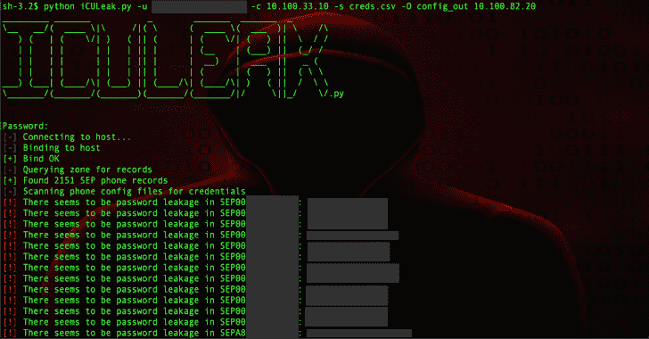

# iCULeak:从 CUCM 托管的电话配置文件中查找和提取凭证的工具

> 原文：<https://kalilinuxtutorials.com/iculeak/>

**iCULeak (iCULeak.py)** 是一款工具，用于在思科 CUCM(呼叫管理器)管理的环境中，从电话配置文件中查找和提取凭证。

当使用思科的 CUCM(呼叫管理器)时，电话配置文件存储在 TFTP 服务器上。这些 VoIP 电话配置文件经常包含敏感数据，包括电话 SSH/admin 凭证。

还有一个问题是，如果管理员在他们的浏览器中保存了凭证，一些浏览器**如何用他们的 CUCM 凭证(通常是他们的广告凭证)**自动填充字段，例如 SSH 用户名&密码字段。

使用自动插入凭证的密码管理器的管理员也面临这个问题，他们发现他们的凭证被自动输入到 SSH 用户名和密码字段，然后被保存(并以明文形式存储在配置文件中)。

虽然在 CUCM 12.0 中修复了该问题，但过去存储的凭据仍可能被发现。以下措施可以在一定程度上缓解这一问题:

*   定期清除现有配置文件中泄漏的凭据。
*   阻止 CUCM 上的自动保存/自动填充。
*   启用电话配置文件的加密。点击阅读更多关于[的内容。请注意，这并没有完全缓解问题，因为加密密码可以从手机的内存中获得，或者通过 CUCM 的管理访问获得——但它减少了黑客/pentester 转储配置文件的影响。](https://www.cisco.com/c/en/us/td/docs/voice_ip_comm/cucm/security/8_5_1/secugd/sec-851-cm/secuencp.html)

这个工具利用了 Dirk-jan 的工具 adidnsdump 中的大量代码，通过 LDAP 从 ADIDNS 中提取电话主机名列表。

要了解关于该技术和工具的更多信息，您可以阅读相关的博客文章。所以大部分代码都归功于他。

**也读-[10 分钟邮件:Python 临时邮件](https://kalilinuxtutorials.com/10minutemail/)**

**安装**

**安装工具:**

**git 克隆 https://github.com/llt4l/iCULeak.py
CD icleak . py
pip install-r requirements . txt**

**用途**

对在 DNS 区域中找到主机名的电话运行 I leak . py

**python icleak . py-u domain \ llt4l-c 10 . 100 . 1 . 29 10 . 100 . 1 . 1**

根据文件中提供的电话列表运行 I leak . py

**python icleak . py-l phones _ hostnames-c 10 . 100 . 1 . 29 10 . 100 . 1 . 1**

**标志**

*   **用`**-h**`或`**--help**`查看帮助页面**
*   **将用户的用户名**传递给带有`**-u**`或`**--user**`标志的 ADIDNS。用户前面应该是用户的域，所以应该是这样的: **`domain\\llt4l`** 。如果改为传递列表，则此标志是可选的。
*   **将密码**传递给带有`**-p**`或`**--password**`标志的程序。如果你不把它作为一个参数传递，而是传递一个用户名，那么程序将在运行时提示输入密码。
*   CUCM 服务器的 **IP 地址或主机名应该传递给带有`**-c**`或`**--cucm-server**`标志的程序。如果，出于任何原因，CUCM 用来存储电话配置文件的 TFTP 服务器被发现在另一台主机上，请提供该地址。**
*   提供一个**文件，其中包含带有`-l`或`**--list**`标志的电话主机名**的列表。该文件应该只是一个电话主机名列表，这样每一行看起来就像`**SEP112233445566**`。
*   如果您想**将结果保存到一个 CSV 文件**，传递`**-s**`或`**--save**` 标志以及要保存的文件名。
*   默认情况下，iCULeak.py 会检查 AD 中泄露的凭据的有效性。为了**禁用验证泄露凭证的认证尝试**，传递`**-nA**`或`**--no-authentication**`标志。
*   为了**保存所有手机配置文件**到一个目录，传递`**-O**`或`**--out-dir**`标志，以及你想要保存它的文件夹的名称。
*   对于**增加的冗长度**，可以通过`**-v**`或者`**--verbose**`标志。
*   如果手机的 DNS 条目与你正在验证的域名的默认区域在**不同的 DNS 区域**，你可以通过区域和`**-z**`或`**--zone**`标志。

[**Download**](https://github.com/llt4l/iCULeak.py)