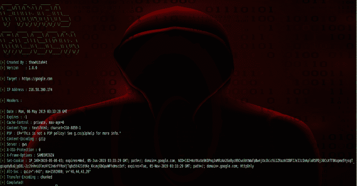
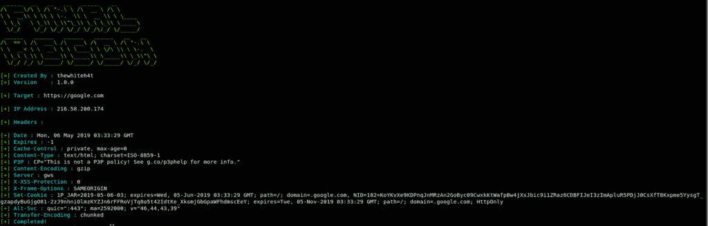
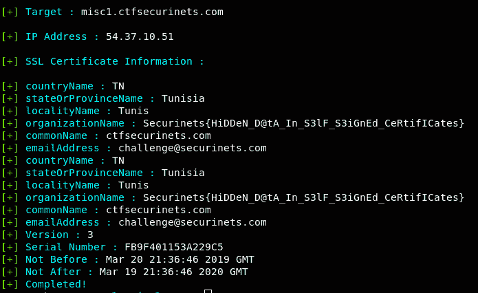
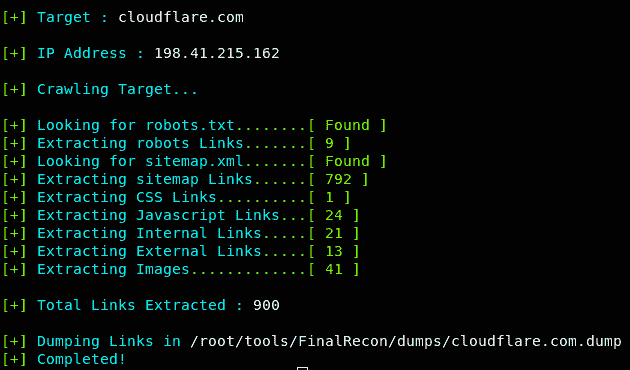

# FinalRecon:这是一款一体化的网络评估工具

> 原文：<https://kalilinuxtutorials.com/finalrecon/>

FinalRecon 是一个用于网络侦察的快速简单的 python 脚本。它遵循模块化结构，因此将来可以轻松添加新模块。

**特性**

它提供详细信息，例如:

**标题信息**

**又读-[ext Analysis:浏览器扩展分析框架](https://kalilinuxtutorials.com/extanalysis-browser-extension/)**

是

**SSL 证书详情**

**爬虫**

将来会添加更多的模块。

**测试于**

*   Kali Linux 2019.1
*   BlackArch Linux

**安装**

**git 克隆 https://github.com/thewhiteh4t/FinalRecon.git
CD final recon
pip 3 install-r requirements . txt**

**用途**

python3 finalrecon.py -h

python 3 final recon . py–headers

**【check SSL certificate】**
python 3 final recon . py–l info
**# check whois information【t】**

**演示**

[https://www.youtube.com/embed/5s0ghojbUtQ?feature=oembed&enablejsapi=1](https://www.youtube.com/embed/5s0ghojbUtQ?feature=oembed&enablejsapi=1)

[**Download**](https://github.com/thewhiteh4t/FinalRecon)