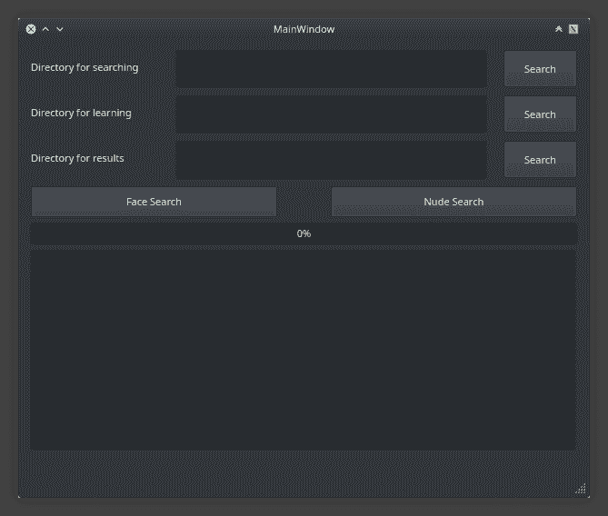

# PAnalizer:取证工具在特定目录中搜索图像

> 原文：<https://kalilinuxtutorials.com/panalizer/>

PAnalizer 是一个取证工具，可以在特定目录下搜索色情图片，这在行人检测中很实用。

你也可以在图像集中搜索一个特定的人，有必要给应用程序一些感兴趣的人的照片。

**又读- [Recon-T:侦察-足迹-信息泄露](https://kalilinuxtutorials.com/recon-t/)**

我们的目标始终是改进和创新信息学解决方案，我们寻找问题，应对挑战，并提供技术响应。

[**Download**](https://github.com/AaronSoria/PAnalizer)