# PacBot:面向云的持续合规和安全自动化平台

> 原文：<https://kalilinuxtutorials.com/pacbot-cloud/>

PacBot 是一个为云提供持续合规性监控、合规性报告和安全自动化的平台。在 PacBot 中，安全性和遵从性策略是作为代码实现的。

PacBot 发现的所有资源都根据这些策略进行评估，以衡量策略的一致性。PacBot 自动修复框架提供了通过采取预定义的操作来自动响应策略违规的能力。

PacBot 包含强大的可视化功能，提供简化的合规性视图，并使分析和补救违反策略的行为变得容易。

PacBot 不仅仅是一个管理云错误配置的工具，它还是一个通用平台，可用于对任何域进行持续的合规性监控和报告。

**也读-[10 分钟邮件:Python 临时邮件](https://kalilinuxtutorials.com/10minutemail/)**

**多云合规评估**

PacBot 基于插件的数据摄取架构允许从多个来源摄取数据。

我们构建了插件来从 Qualys 漏洞评估平台、Bitbucket、TrendMicro Deep Security、Tripwire、Venafi 证书管理、Redhat Satellite、Spacewalk、Active Directory 和其他几个定制的内部解决方案中提取数据。

我们正在努力开源这些插件和其他工具。您可以基于这些插件收集的数据编写规则，以获得您的生态系统的完整图片，而不仅仅是云错误配置。

例如，在 T-Mobile 中，我们实施了一项策略，将所有具有一个或多个严重性为 5 (CVSS 评分> 7)的漏洞的 EC2 实例标记为不符合。

它是如何工作的？

评估->报告->修复->重复是 PacBot 的理念。PacBot 发现资源，并根据作为代码实现的策略对它们进行评估。

所有违反策略的行为都被记录为一个问题。每当自动修复挂钩可用于策略时，当资源未通过评估时，就会执行这些自动修复。

策略违规无法手动关闭，必须在源位置修复问题，PacBot 将在下次扫描时将其标记为已关闭。可以将异常添加到策略违规中。

可以添加粘性异常(基于资源属性匹配标准的异常)来排除将来可能创建的类似资源。

PacBot 的资产组是可视化法规遵从性的强大方法。通过定义一个或多个目标资源的属性匹配标准来创建资产组。

例如，您可以通过定义标准来匹配所有具有 instancestate.name=running 属性的 EC2 实例，从而创建所有正在运行的资产的资产组。

创建资产组后启动的任何新 EC2 实例都将自动包含在该组中。在 PacBot UI 中，您可以选择特定资产组的门户范围。

PacBot 门户中显示的所有数据点将局限于所选资产组。使用云的团队可以将门户的范围设置为他们的应用程序或组织，并且只关注他们的策略违规。

这减少了噪音，并为云用户提供了清晰的画面。在 T-Mobile，我们为每个利益相关者、每个应用程序、每个 AWS 帐户、每个环境等创建一个资产组。

资产组也可以用来定义规则执行的范围。PacBot 策略被实现为一个或多个规则。这些规则可以配置为针对所有资源或特定资产组运行。

规则将评估配置为规则范围的资产组中的所有资源。这提供了一个机会来编写特定于应用程序或组织的策略。

例如，除了为所有云设置的全球标准之外，一些团队希望实施额外的标记标准。他们可以使用自定义规则实现这样的策略，并将这些规则配置为只在他们的资产上运行。

**PacBot 关键功能**

*   持续合规性评估。
*   详细的合规报告。
*   自动修复违反策略的情况。
*   全方位搜索-能够搜索所有发现的资源。
*   简化的策略违规跟踪。
*   自助服务门户。
*   自定义策略和自定义自动修复操作。
*   动态资产分组以查看合规性。
*   能够创建多个遵从域。
*   异常管理。
*   电子邮件摘要。
*   支持多个 AWS 帐户。
*   完全自动化的安装程序。
*   可定制的仪表板。
*   OAuth 支持。
*   登录 Azure 广告集成。
*   基于角色的访问控制。
*   资产 360 度。

**PacBot UI 仪表盘& Widgets**

##### 资产组选择小部件

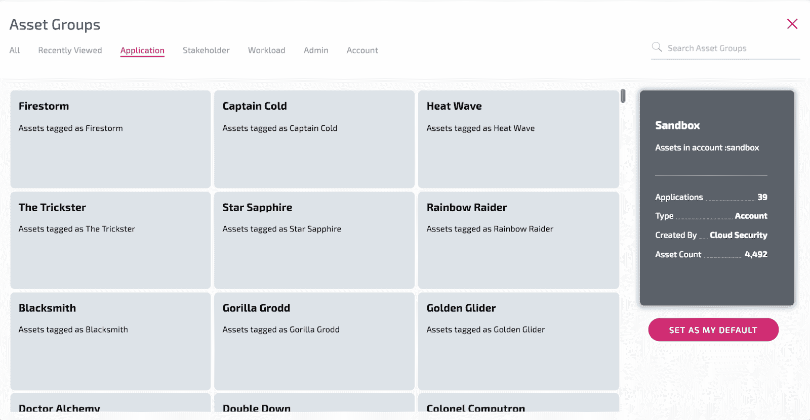

##### 合规仪表板

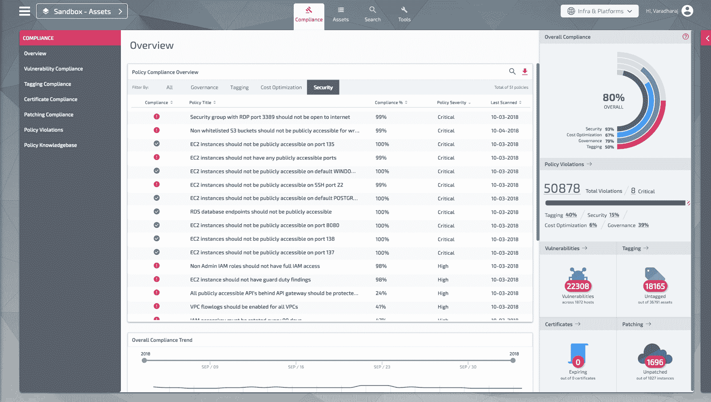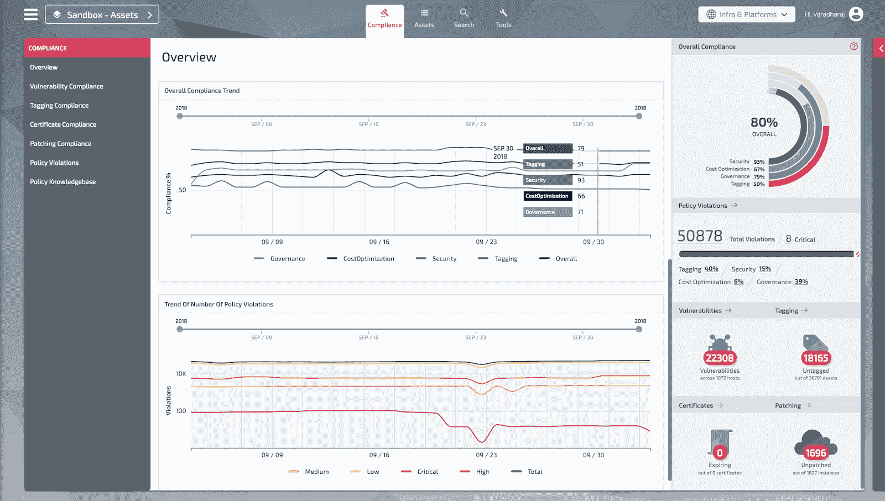

##### 政策合规性页面–S3 存储桶公共读取权限

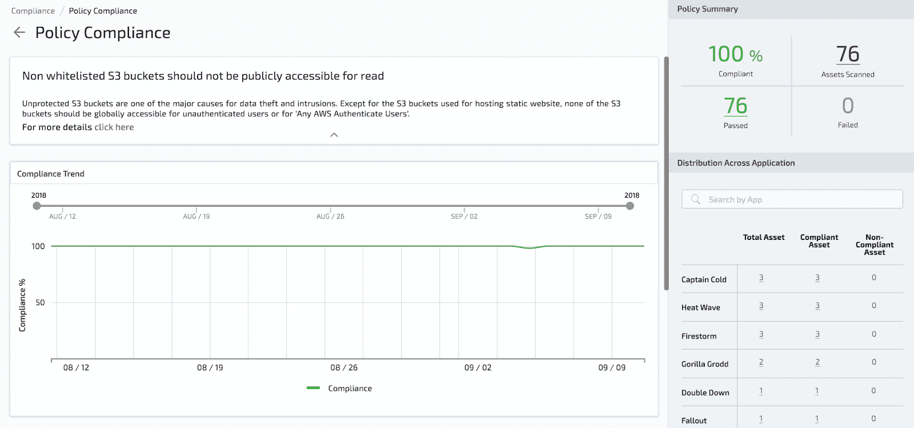

##### 一段时间内的策略遵从趋势

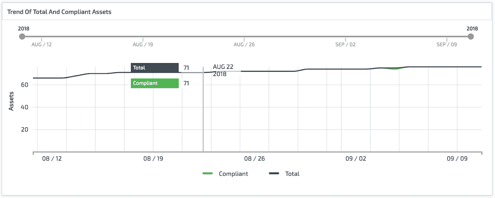

##### 资产仪表板

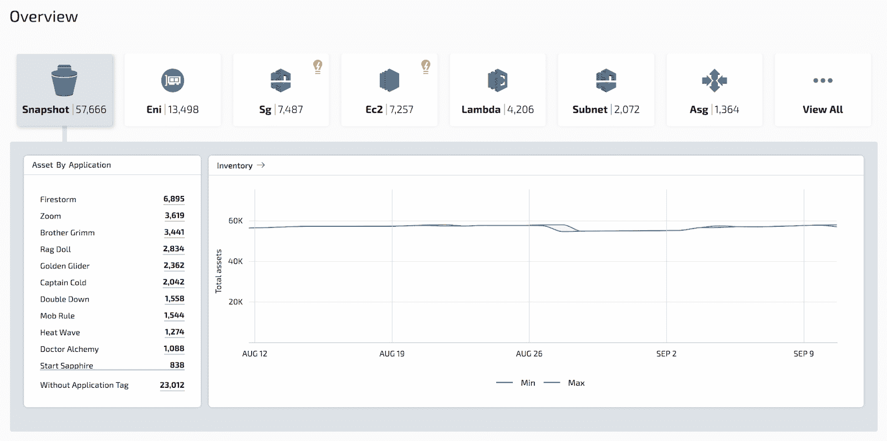

##### 资产仪表板–提供建议

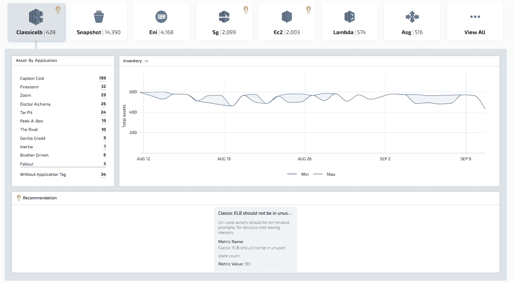

##### 资产 360 /资产详细信息页面

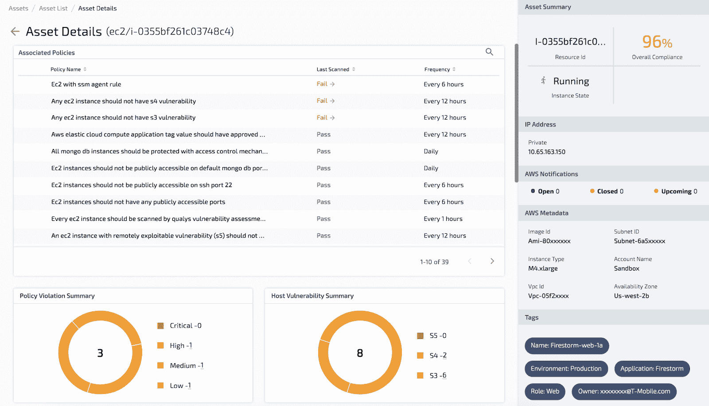

##### Linux 服务器季度补丁合规性

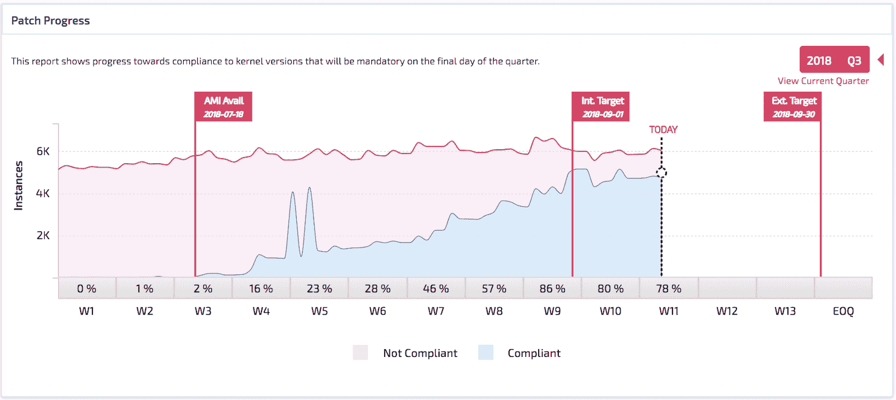

##### 全搜索页面

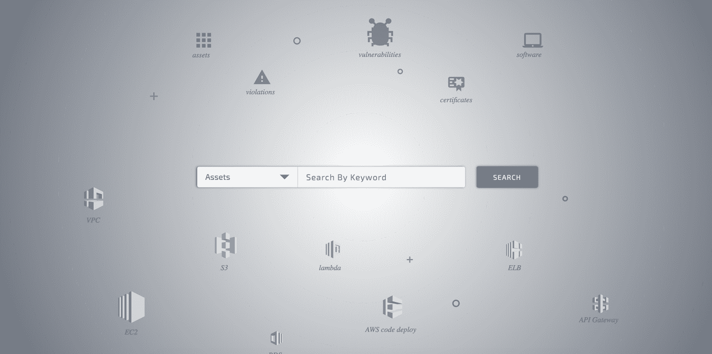

##### 带有结果过滤的搜索结果页面

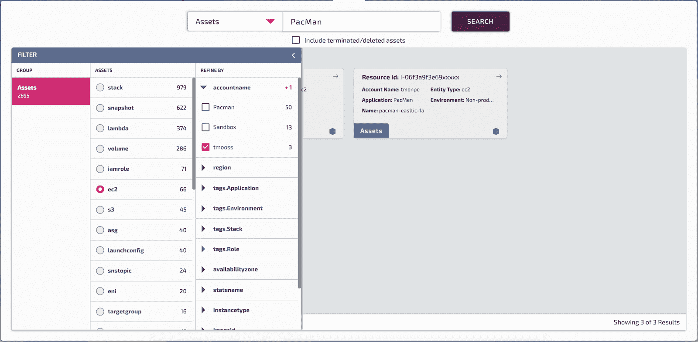

##### 标记合规性摘要小组件

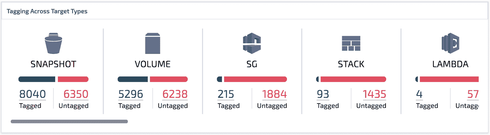[**Download**](https://github.com/tmobile/pacbot)