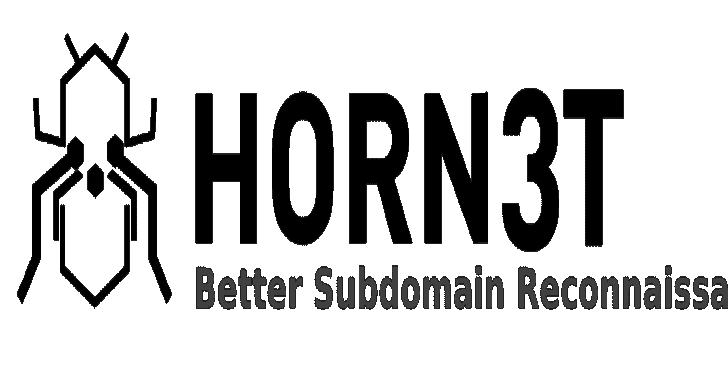
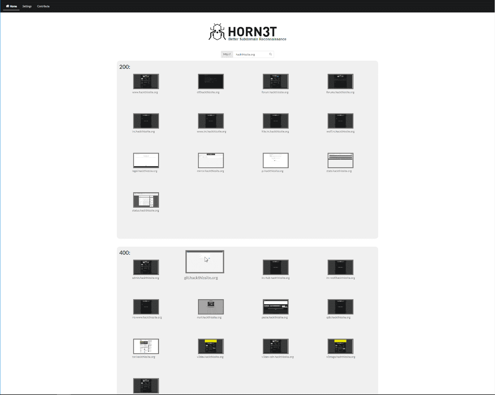

# Horn3t:点击鼠标，强大的可视化子域枚举

> 原文：<https://kalilinuxtutorials.com/horn3t-visual-subdomain-enumeration/>

Horn3t 是你可视化探索子域的头号工具。
用谷歌 Chrome/Chromium 73 在 Windows 10 和 Debian 上测试。

*   以极快的速度侦察你的目标
*   通过关注有趣的*看起来*的网站来提高你的生产力
*   **立即列举**关键地点
*   **蛰**你的目标

它建立在优秀的 Sublist3r 框架之上(或者可以用你最喜欢的框架进行扩展),可以搜索子域并生成令人惊叹的图片预览。通过 http 状态代码快速查看您的目标，添加自定义发现的子域，并通过一次单击直接访问发现的 URL。

**也可阅读-[I cleak:查找&的工具从 CUCM](https://kalilinuxtutorials.com/iculeak/) 的手机配置文件中提取凭证**

**安装**

1.  安装**谷歌浏览器**
2.  用 **pip3** 安装 **requirements.txt**
3.  用 **pip3** 安装**子列表 3r** 的 **requirements.txt**
4.  将目录放在您选择的 web 服务器中
5.  确保拥有正确的权限
6.  运行 **horn3t.py**

或者使用 docker 的 [install.sh](https://github.com/JannisKirschner/Horn3t/blob/master/install.sh) 文件。
之后你可以进入[下的门户网站 http://localhost:1337](http://localhost:1337/)

**托多**

1.  Firefox 上更好的伸缩性
2.  添加 Windows Dockerfile 文件
3.  Direkt Nmap 支持每点击一个子域
4.  Direkt Dirb 支持每点击一个子域
5.  生成找到的子域的 PDF 报告
6.  协助子域接管

**信用:**[【abul 3la】](https://github.com/aboul3la/sublist3r)、[【therook】](https://github.com/TheRook/)&【bitquark】

[**Download**](https://github.com/janniskirschner/horn3t)