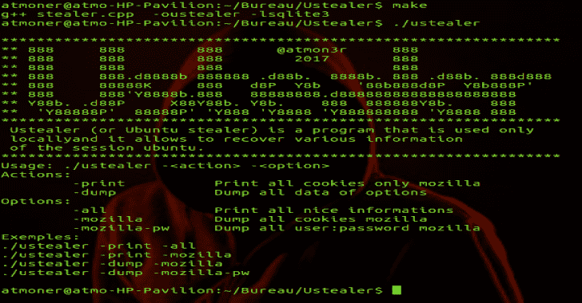
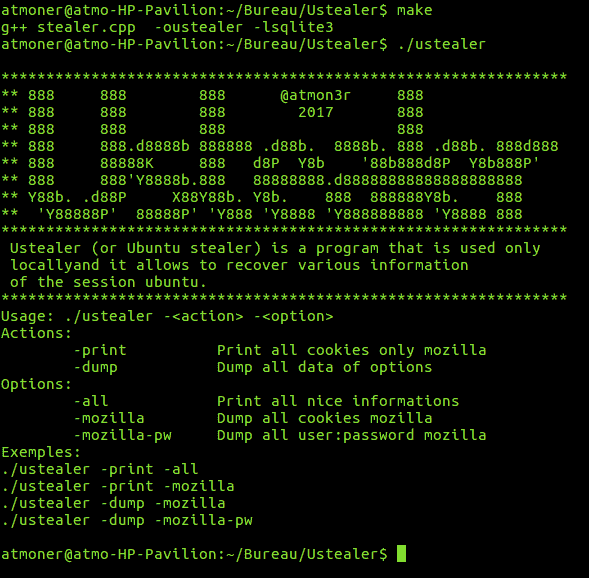

# 偷本地电脑上的 Ubuntu 信息

> 原文：<https://kalilinuxtutorials.com/ustealer-steal-ubuntu-information-in-local-pc/>

Ustealer 是一个 Ubuntu 窃取者，窃取本地 PC 中的 Ubuntu 信息。这个工具总是很适合搭配 USB 闪存盘。

**要求**

*   **G++**

**sudo apt-get 安装 g++**

*   **libsqlite3**

**sudo apt-get 安装 libsqlite3-dev**

**编译**

*   进入 **Ustealer/ folder** 并运行 makefile

**制作**

**也可理解为—[PAC bot:持续合规性平台&云安全自动化](https://kalilinuxtutorials.com/pacbot-cloud/)**

**用途**

**。/u 交易商**

[**Download**](https://github.com/atmoner/Ustealer)