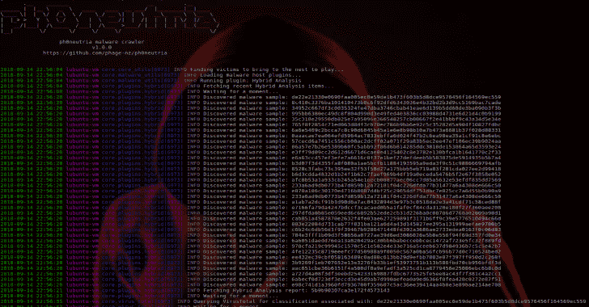
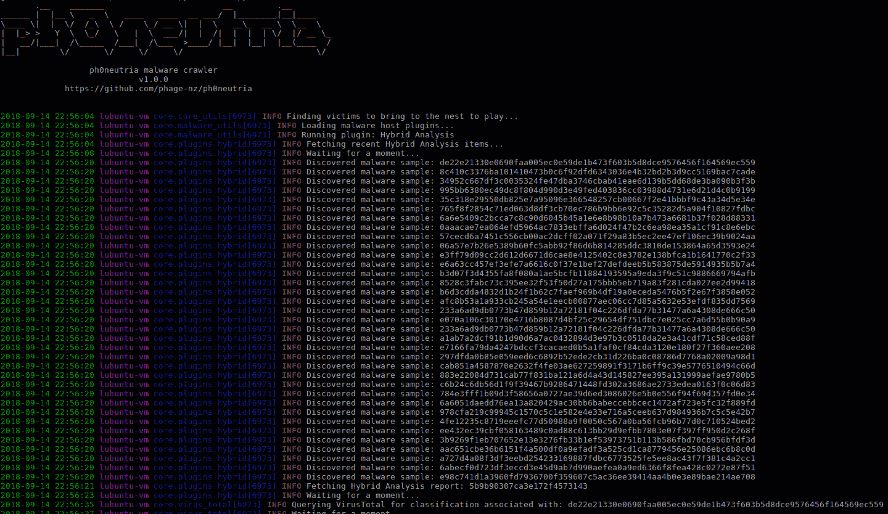
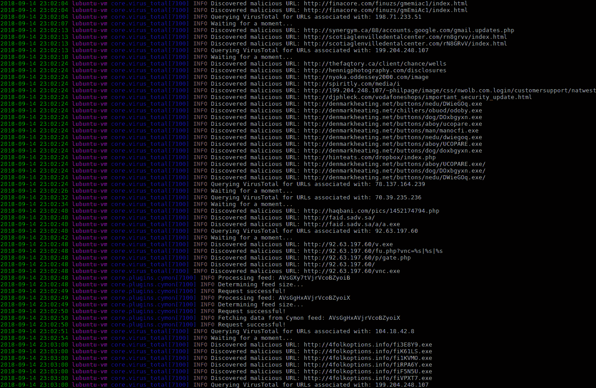
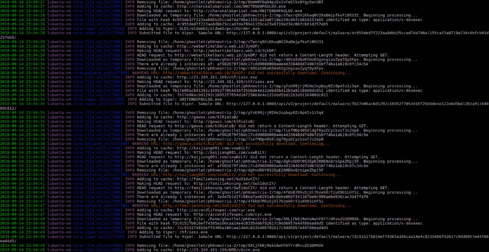
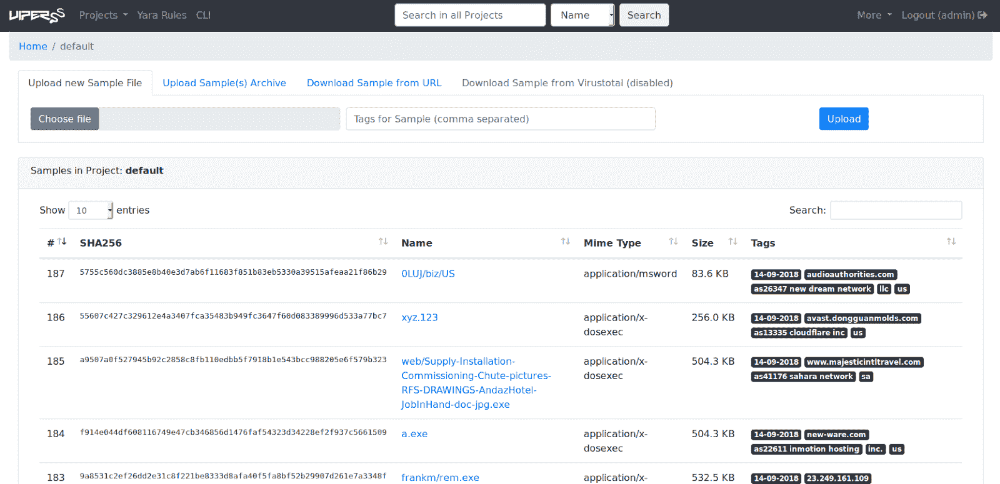
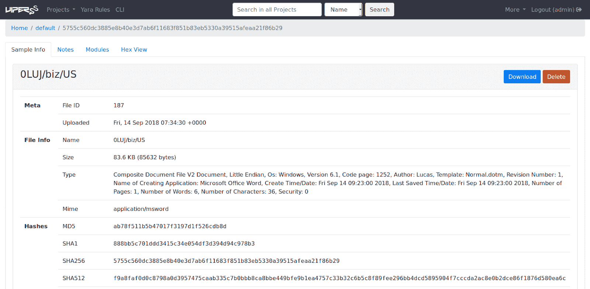
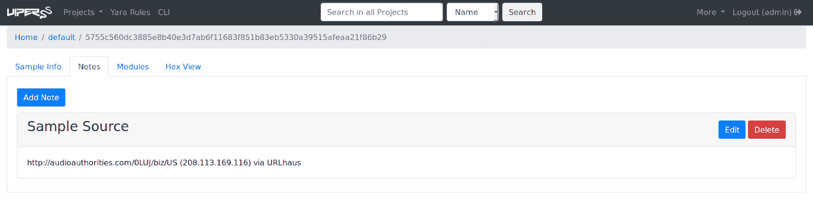

# Ph0neutria:恶意软件动物园生成器，直接从野外获取样本

> 原文：<https://kalilinuxtutorials.com/ph0neutria/>

Ph0neutria 是一个恶意软件动物园构建器，直接从野外获取样本。一切都存储在 Viper 中，以便于访问和管理。

它旨在:

*   将搜索范围限制为经常更新的可靠来源。
*   最大限度地提高单个指标的有效性。
*   提供单一、可靠且井然有序的储物机制。
*   不要做可以由 Viper 完成的工作。

名字是什么意思？“Phoneutria nigriventer”俗称巴西流浪蜘蛛:[https://en.wikipedia.org/wiki/Brazilian_wandering_spider](https://en.wikipedia.org/wiki/Brazilian_wandering_spider)

**也可理解为-[PAnalizer:取证工具在特定目录下搜索图像](https://kalilinuxtutorials.com/panalizer/)**

**来源**

从版本 1.0.0 开始，所有源代码都创建为“插件”,位于核心脚本文件夹的插件子目录中。默认来源是:

*   0xffff0800 的恶意软件库(鸣谢: [http://0day.coffee](http://0day.coffee/) )。
*   CleanMX(需要批准的用户代理)。
*   Cymon，其中包括:虐待。ch 追踪器，班比内克 C2 饲料，网络犯罪追踪器，Malc0de，URLVir 和 VX 保险库。
*   混合分析(需要经过审核的 API 密钥)。
*   OTX。
*   Shodan 使用恶意软件搜索工具。
*   乌尔豪斯。

每个插件都有操作前必须完成的参数。你会在每个插件文件的顶部找到这些。

VirusTotal 是 ph0neutria 的核心组件，不能被禁用。IP 列表被输入其中，以发现已知 IP 的 URL。如果你有一个标准的每分钟 5 个请求的 API 键，那么我鼓励你保守一点。您可以通过以下方式做到这一点:

*   减少 Cymon 饲料的数量。
*   减少您的 OTX 订阅数量。
*   将混合分析 SCORE_MIN 参数设置为 100。

**截图**

**安装**

以下脚本将安装 ph0neutria 以及 Viper 和 Tor:

**wget https://raw . githubusercontent . com/phage-NZ/ph0 neutria/master/install . sh
chmod+x install . sh
sudo。/install.sh**

**Optional**

配置其他 ClamAV 签名:

**cd /tmp
git 克隆 https://github.com/extremeshok/clamav-unofficial-sigs
CD clamav-official-sigs
CP clamav-official-sigs . sh/usr/local/bin
chmod 755/usr/local/bin/clamav-official-sigs . sh
mkdir/etc/clamav-official-sigs
CP config/*/etc/clamav-official-sigs
CD/etc/clamav-official-sigs**

重命名操作系统..例如，conf 到 os.conf:

**mv os.ubuntu.conf os.conf**

修改配置文件:

*   **master.conf:** 搜索“已启用的数据库”并启用/禁用所需的源。
*   **user.conf:** 取消注释您已启用的源的必填行，并完成它们。user.conf 会覆盖 master.conf。完成设置后，必须取消对 user _ configuration _ complete = " yes "的注释，以下命令才能成功。

**mkdir/var/log/clamav-official-sigs
clamav-official-sigs . sh–install-cron
clamav-official-sigs . sh–install-log rotate
clamav-official-sigs . sh–install-man
clamav-official-sigs . sh
CD/tmp/clamav-official-sigs
CP systemd/*/etc/systemd
CD..
RM-RF clamav-official-sigs ***

下载新签名需要一段时间，在此期间 ClamAV 可能不可用。

**用法**

在拼凑恶意软件动物园时采取预防措施:

*   除非替换为匿名 VPN，否则不要禁用 Tor。
*   在隔离网络和专用硬件上运行。
*   仅在合适的沙箱中执行样本(参考:[https://github . com/phage-NZ/malware-hunting/tree/master/Sandbox](https://github.com/phage-nz/malware-hunting/tree/master/sandbox))。
*   监控 API 键的滥用。

确保 Tor 已启动:

**服务重启**

启动 Viper API 和 web 界面:

**cd /opt/viper
sudo -H -u 蜘蛛蟒 3 蝰蛇网**

记下启动 Viper 时创建的管理员密码。使用它登录到`http://<viper IP\>:<viper port>/admin`(默认:`http://127.0.0.1:8080/admin`)并从令牌页面检索 API 令牌。

Viper web 主界面将在`**http://<viper IP>:<viper port>**` **(默认:** `**http://127.0.0.1:8080**` **)** 可用。

*   在`**/opt/ph0neutria/core/config/settings.conf**`完成配置文件
*   完成每个插件顶部的参数。如果您希望禁用插件，请设置 DISABLED = True: `**/opt/ph0neutria/core/plugins/*.py**`

启动 ph0neutria:

**CD/opt/ph0 neutria
sudo-H-u 蜘蛛 python3 run.py**

您可以随时按 Ctrl+C 取消运行。只要您愿意，您可以随时再次运行它——您不会得到重复的数据库。

要每天运行该脚本，请在/etc/cron.daily 中创建一个脚本，包含以下内容:

**！/bin/bash
CD/opt/ph0 neutria&&sudo-H-u 蜘蛛 python3 run.py***

**标签和注释**

**标签:
{1}、{2}、{3}**

*   日期戳。
*   样本域。
*   主机 ASN。
*   东道国。

**备注:
{1)({2})通过{3}**

*   示例 URL。
*   主机 IP 地址。
*   URL 源。

文件的原始名称构成了 Viper 中的标识名称。

[**Download**](https://github.com/phage-nz/ph0neutria)