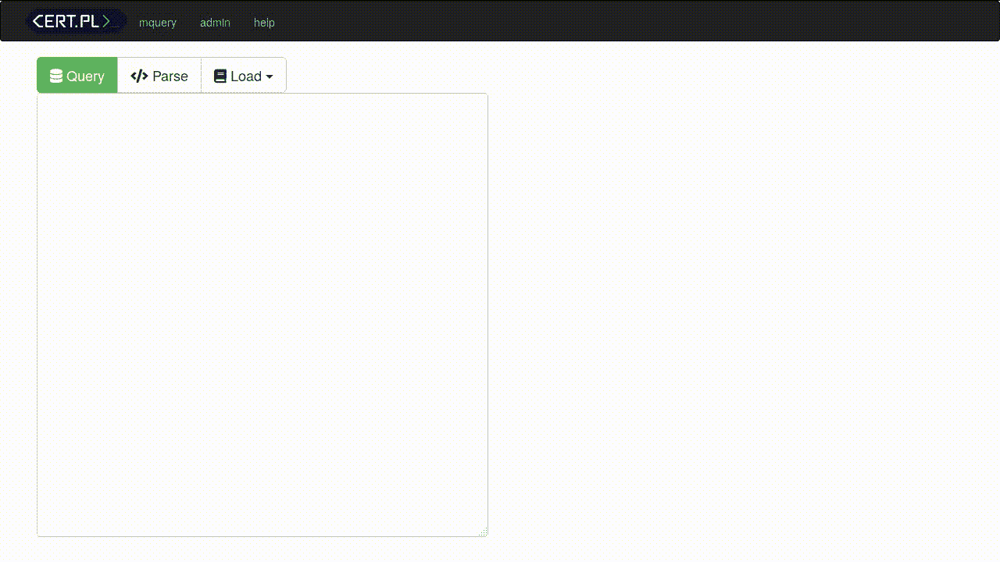
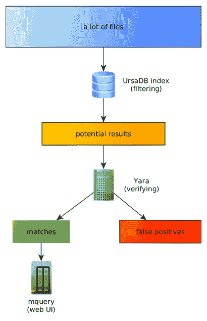

# YARA 恶意软件查询加速器

> 原文：<https://kalilinuxtutorials.com/mquery/>

**Mquery** 可用于在眨眼之间搜索数万亿字节的恶意软件:

搜索特定恶意软件样本时遇到过困难吗？我们的项目是一个分析师友好的网络图形用户界面来浏览你的数字仓库。

**演示**

看一看 https://mquery.tailcall.net 的快速演示。

不幸的是，你不会发现任何真正的恶意软件。出于演示目的，我们已经对该项目的源代码进行了索引——因此，您可以通过使用 yara 规则来尝试在我们的源代码中找到所有异常:

**规则查找 _ 异常:木马
{
meta:
author = " mquery _ demo "
字符串:
$ Exception _ string = " Exception "
条件:
全部
}**

**也读作-[Horn3t:点击鼠标时强大的可视化子域枚举](https://kalilinuxtutorials.com/horn3t-visual-subdomain-enumeration/)**

它是如何工作的？

YARA 速度很快，但是在大型数据集中搜索给定的签名会花费很多时间。为了解决这个问题，我们实现了一个名为 UrsaDB 的自定义数据库。

它能够预过滤结果，因此只需要对一小部分二进制文件运行 YARA:

**快速启动**

1.  启动整个系统(参见`**Installation (Docker)**`)。
2.  Web 界面(默认)应在`**http://localhost:80/**`可用
3.  将要索引的文件上传到`samples`目录，该目录在`**/mnt/samples**`绑定到所有容器。
4.  执行`**sudo docker-compose run ursadb-cli tcp://ursadb:9281 --cmd 'index "/mnt/samples";'**`。这将告诉数据库索引`**/mnt/samples**`中的所有文件(根据您的系统改变路径)。
5.  该命令应该输出进度。等到任务完成。
6.  成功建立索引后，您的文件应该是可搜索的。打开 web 界面，上传一些 YARA 规则，例如:

**规则 emotet4_basic:木马
{
meta:
author = " cert . pl "
字符串:
$emotet4_rsa_public = { 8d？？？？5?8d？？？？5?6a 00 68 00 80 00 00 ff 35[4]ff 35[4]6a 13 68 01 00 01 00 ff 15[4]85 }
$ emot et 4 _ CNC _ list = { 39？？？44 的 5 [4]?？(FF | A3)}
条件:
全部
}**

**注意:**可以使用 ursacb-cli 执行任何管理任务。参见 [CERT-Polska/ursadb](https://github.com/CERT-Polska/ursadb#queries) 获取支持命令的完整列表。

**安装(对接)**

安装软件的简单方法是使用`docker-compose`从源代码中构建它:

**git clone-recurse-sub modules https://github.com/CERT-Polska/mquery.git**
docker-compose up-scale daemon = 3

其中`**--scale daemon=...**`指同时处理选择/步进任务的工人数量。

提示:您的`docker-compose`必须支持`**docker-compose.yml**`的 v3 语法。如果您有任何问题，请更新您的软件。

对于生产环境，可以考虑使用 kubernetes(查看`**kuebrnetes**`目录开始)或手动安装(见下文)。

**安装(手动)**

有三个独立的组件:

*   ursadb(后端)-编译后运行`**db.ursa tcp://0.0.0.0:9281**`。(将监听 tcp 端口 9281)。需要 cwd 上的持久存储(对于 docker 部署，使用卷。对于裸机安装，您不需要做任何特殊的事情)
*   mquery(web ui)——在创建一个有效的`config.py`之后，运行`**python3 webapp.py**`或者通过 uwsgi 公开它。
*   daemon–获取 yara 查询的守护程序。使用相同的`**config.py**`文件。您可以使用多个守护进程。

您需要将 ursadb 索引的文件挂载到 mquery 和守护进程中相同的逻辑路径。

您还需要在某个地方有一个 redis 服务器(用作 mquery 和 daemon 的任务队列)。

[**Download**](https://github.com/CERT-Polska/mquery)