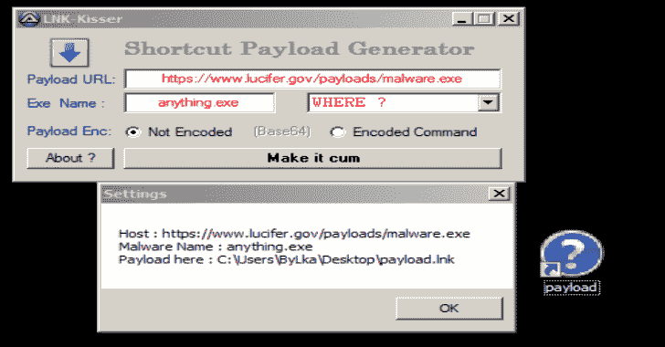
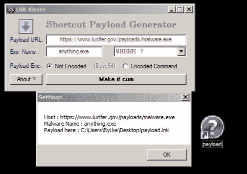
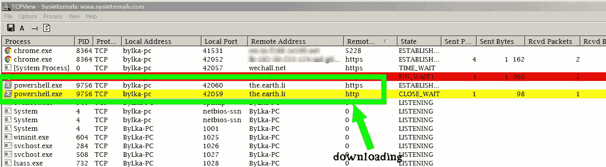

# LNK-KISSER : AutoIt HackTool，Shortcuts.lnk 有效载荷生成器

> 原文：<https://kalilinuxtutorials.com/lnk-kisser/>

LNK-KISSER 是一个 autoIt 黑客工具，shortcuts.lnk 有效载荷生成器。

*   利用 Powershell 制作快捷有效负载[fud]。
*   这里有太多的诡计，你可以把它变得更好，^_^.
*   对于 Ex:杀死 tcpview，taskmanager..下载时等。
*   下载后设置恶意软件的隐藏属性…等等
*   G00d by3。
*   .9 个月

**也读作-[Horn3t:点击鼠标时强大的可视化子域枚举](https://kalilinuxtutorials.com/horn3t-visual-subdomain-enumeration/)**

[**Download**](https://github.com/9aylas/Shortcut-Payload-Generator)