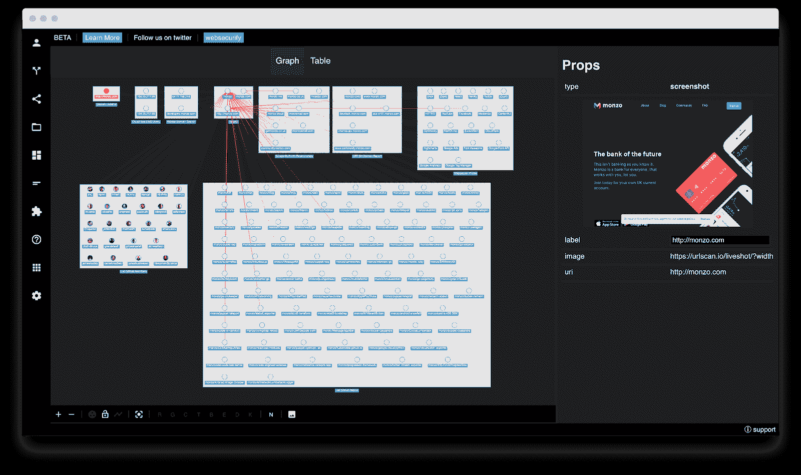
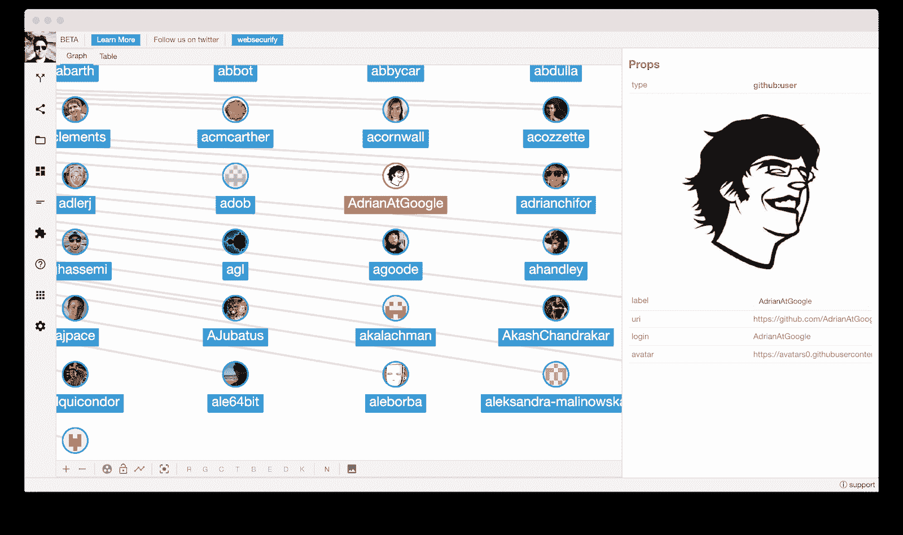

# Pown Recon:基于图论的强大目标侦察框架

> 原文：<https://kalilinuxtutorials.com/pown-recon-a-powerful-target-reconnaissance-framework-powered-by-graph-theory/>

Pown Recon 是一个基于图论的目标侦察框架。使用图论而不是平面表表示的好处是更容易找到不同类型信息之间的关系，这在许多情况下非常方便。

图论算法也有助于区分、搜索，如寻找最短路径，以及许多其他有助于信息发现和情报收集的任务。

**快速入门**

该工具旨在作为 Pown.js 的一部分使用，但也可以作为一个独立的工具单独调用。

照常首先安装 Pown:

**$ npm install -g pown@latest**

直接从 Pown 调用:

**$ pown recon**

否则，从项目的根目录本地安装此模块:

**$ NPM install @ pown/recon–save**

完成后，调用 pown cli:

**$ POWN_ROOT=。。/node_modules/。bin/pown-cli recon**

您还可以使用全局 pown 在本地调用该工具:

**$ POWN_ROOT=。战俘侦察**

**用途**

**警告:**这个 pown 命令目前正在开发中，因此可能会有重大变更。

**pown recon

目标 recon

命令:
pown recon transform 执行内联转换[aliases: t]
pown recon select 选择节点[aliases: s]
pown recon 遍历节点[aliases: v]
pown recon 添加节点[aliases: a]
pown recon 删除节点[aliases: r]
pown recon merge 执行至少两个 recon 文件之间的合并[aliases: m]
pown recon diff 执行比较
pown recon Group Group nodes[aliases:g]
pown recon Ungroup Ungroup nodes[aliases:u]
pown recon Load Load a file[aliases:l]
pown recon Save Save to file[aliases:a]
pown recon Import file[aliases:I]
pown recon Export Export to file[aliases:e]
pown recon Remote Remote manag[aliases:r]

选项:
–版本显示**

**pown recon 转换**

**pown recon transform

Perform inline transformation

Commands:
pown recon transform archiveindex [options] Obtain archive.org index for specific URL. [aliases: archive_index, arci]
pown recon transform awsiamendpoints [options] Enumerate AWS IAM endpoints. [aliases: aws_iam_endpoints, awsie]
pown recon transform bitbucketlistrepos [options] List Bitbucket repositories. [aliases: bitbucket_list_repos, bblr]
pown recon transform bitbucketlistsnippets [options] List Bitbucket snippets. [aliases: bitbucket_list_snippets, bbls]
pown recon transform bitbucketlistteamrepos [options] List Bitbucket team repos. [aliases: bitbucket_list_team_repos, bbltr]
pown recon transform bitbucketlistteammembers [options] List Bitbucket team members. [aliases: bitbucket_list_team_members, bbltm]
pown recon transform bufferoverrunsubdomainsearch [options] Obtain a list of subdomains using bufferover.run DNS service [aliases: bufferoverrun_subdomain_search, brss]
pown recon transform builtwithscraperelationships [options] Performs scrape of builtwith.com relationships. [aliases: builtwith_scrape_relationships, bwsr]
pown recon transform cloudflarednsquery [options] Query CloudFlare DNS API. [aliases: cloudflare_dns_query, cfdq]
pown recon transform commoncrawlindex [options] Obtain a CommonCraw index for specific URL. [aliases: commoncrawl_index, cci]
pown recon transform crtshcndomainreport [options] Obtain crt.sh domain report which helps enumerating potential target subdomains. [aliases: crtsh_cn_domain_report, crtshcdr]
pown recon transform crtshsandomainreport [options] Obtain crt.sh domain report which helps enumerating potential target subdomains. [aliases: crtsh_san_domain_report, crtshsdr]
pown recon transform bakeimages [options] Convert external image into data URIs for self-embedding purposes. [aliases: bake_images, be]
pown recon transform dnsresolve [options] Does not do anything. [aliases: dr, dns]
pown recon transform dockerhublistrepos [options] List DockerHub repositories for a given member or org. [aliases: dockerhub_list_repos, dhlr]
pown recon transform githublistrepos [options] List GitHub repositories for a given member or org. [aliases: github_list_repos, ghlr]
pown recon transform githublistgists [options] List GitHub gists for a given member or org. [aliases: github_list_gists, ghlg]
pown recon transform githublistmembers [options] List GitHub members in a given org. [aliases: github_list_members, ghlm]
pown recon transform gravatar [options] Get gravatar.
pown recon transform hackertargetreverseiplookup [options] Obtain reverse IP information from hackertarget.com. [aliases: hackertarget_reverse_ip_lookup, htril]
pown recon transform hackertargetonlineportscan [options] Obtain port information from hackertarget.com. [aliases: hackertarget_online_port_scan, htps]
pown recon transform hibpreport [options] Obtain haveibeenpwned.com breach report. [aliases: hibp_report, hibpr]
pown recon transform httpfingerprint [options] Performs a fingerprint on the HTTP server and application. [aliases: http_fingerprint, hf]
pown recon transform pkslookupkeys [options] Look the the PKS database at pool.sks-keyservers.net which pgp.mit.edu is part of. [aliases: pks_lookup_keys, pkslk]
pown recon transform pwndbsearch [options] Searching the PownDB database [aliases: pwndb_search, pds]
pown recon transform riddleripsearch [options] Searches for IP references using F-Secure riddler.io. [aliases: riddler_ip_search, rdis]
pown recon transform riddlerdomainsearch [options] Searches for Domain references using F-Secure riddler.io. [aliases: riddler_domain_search, rdds]
pown recon transform securitytrailssuggestions [options] Get a list of domain suggestions from securitytrails.com. [aliases: securitytrails_domain_suggestions, stds]
pown recon transform securitytrailsdomainreport [options] Get a domain report from securitytrails.com. [aliases: securitytrails_domain_report, stdr]
pown recon transform shodanorgsearch [options] Performs search using ORG filter. [aliases: shodan_org_search, sos]
pown recon transform shodansslsearch [options] Performs search using SSL filter. [aliases: shodan_ssl_search, sss]
pown recon transform tcpportscan [options] Simple port scanner [aliases: tcp_port_scan, tps]
pown recon transform threatcrowddomainreport [options] Obtain threatcrowd domain report which helps enumerating potential target subdomains and email addresses. [aliases: threatcrowd_domain_report, tcdr]
pown recon transform threatcrowdipreport [options] Obtain threatcrowd ip report which helps enumerating virtual hosts. [aliases: threatcrowd_ip_report, tcir]
pown recon transform urlscanliveshot [options] Generates a liveshot of any public site via urlscan. [aliases: urlscan_liveshot, usls]
pown recon transform urlscanliveshotsearchengines [options] Generates a liveshot of a number of search engines. [aliases: urlscan_liveshot_search_engines, uslsse]
pown recon transform nop [options] Does not do anything.
pown recon transform splitemail [options] Split email. [aliases: split_email, se]
pown recon transform buildemail [options] Build email. [aliases: build_email, be]
pown recon transform splitdomain [options] Split domain. [aliases: split_domain, ss]
pown recon transform builddomain [options] Build domain. [aliases: build_domain, bd]
pown recon transform splituri [options] Split URI. [aliases: split_uri, su]
pown recon transform builduri [options] Build URI. [aliases: build_uri, bu]
pown recon transform analyzeip [options] Analyze IP. [aliases: analyze_ip, ai]
pown recon transform wappalyzerprofile [options] Enumerate technologies with api.wappalyzer.com. [aliases: wappalyzer_profile, wzp]
pown recon transform whoaretheyreport [options] Find social accounts with the help of whoarethey database. [aliases: whoarethey_report, whoarethey, wmnr, wmn]
pown recon transform dnsenum [options] Perform full discovery of DNS subdomains.
pown recon transform auto [options] Select the most appropriate methods of transformation

Options:
–version Show version number [boolean]
–help Show help [boolean]
–read, -r Read file [string]
–write, -w Write file [string]**

**战俘侦察选择**

**pown recon Select

Select nodes

Options:
–version Show version number[boolean]
–help Show help[boolean]
–Read，-r Read file[string]
–Write，-w Write file[string]
–Output-format，-o Output format[string][choices:" table "，" grid "，" csv "，" JSON "][default:" table "]
–Output-fields fields[string][default:" "]
–Output-ids**

**pown 侦察遍历**

**pown recon Traverse

Traverse nodes

选项:
–版本显示版本号[布尔]
–帮助显示帮助[布尔]
–读取，-r 读取文件[字符串]
–写入，-w 写入文件[字符串]
–输出格式，-o 输出格式[字符串][选择:“表格”、“网格”、“csv”、“JSON”][默认:“表格”]
–输出-字段输出字段[字符串][默认:“”]
–输出-ids 输出**

**战俘侦察添加**

**pown recon Add**

**Add nodes

选项:
–version Show version number【boolean】
–help Show help【boolean】
–Group，-g Group nodes[string][default:" "]
–node-从命令行键入新节点的类型[string][default:" string "]
–Read，-r Read file[string]
–Write，-w Write file[string]
–Output-format，-o 输出格式 " JSON "][default:" table "]
–Output-fields 输出字段[string][default:" "]
–Output-ids 输出 id[boolean][default:false]
–Output-labels 输出标签[boolean][default:false]
–Output-images 输出图像[boolean][default:false]
–Output-parents 输出父项[boolean][default:false]
–Output-tags 输出标签[boolean] [de** fault: false】

**pown recon 移除**

**pown recon Remove

Remove nodes

选项:
–版本显示版本号[布尔]
–帮助显示帮助[布尔]
–读取，-r 读取文件[字符串]
–写入，-w 写入文件[字符串]
–输出格式，-o 输出格式[字符串][选择:“表格”、“网格”、“csv”、“JSON”][默认:“表格”]
–输出字段输出字段[字符串][默认:“”]
–输出-ids 输出**

**pown recon 合并**

**pown recon merge

在至少两个 recon 文件之间执行合并

选项:
–版本显示版本号【布尔】
–帮助显示帮助【布尔】
–写入，-w 写入文件【字符串】**

**pown recon diff**

**pown recon diff

执行两个 recon 文件之间的比较

选项:
–版本显示版本号【布尔】
–帮助显示帮助【布尔】
–子集，-s 子集选择【选项:“左”、“右”、“两者”】【默认:“左”]
–写入，-w 写入文件【字符串】
–输出格式，-o 输出格式【字符串】【选项:“表格”、“网格”、“csv】， " JSON "][default:" table "]
–Output-fields 输出字段[string][default:" "]
–Output-ids 输出 id[boolean][default:false]
–Output-labels 输出标签[boolean][default:false]
–Output-images 输出图像[boolean][default:false]
–Output-parents 输出父项[boolean][default:false]
–Output-tags 输出标签[boolean] [default: false]**

**战俘侦察组**

**pown recon Group

Group nodes

选项:
–版本显示版本号[布尔]
–帮助显示帮助[布尔]
–读取，-r 读取文件[字符串]
–写入，-w 写入文件[字符串]
–输出格式，-o 输出格式[字符串][选择:“表格”、“网格”、“csv”、“JSON”][默认:“表格”]
–输出字段输出字段[字符串][默认:“”]
–输出-ids 输出**

**pown recon ungroup**

**pown recon Ungroup

Ungroup nodes

选项:
–版本显示版本号[布尔]
–帮助显示帮助[布尔]
–读取，-r 读取文件[字符串]
–写入，-w 写入文件[字符串]
–输出格式，-o 输出格式[字符串][选择:“表格”、“网格”、“csv”、“JSON”][默认:“表格”]
–输出字段输出字段[字符串][默认:“”]
–输出**

**pown 侦察负荷**

**pown recon load

加载文件

选项:
–版本显示版本号【布尔】
–帮助显示帮助【布尔】
–写入，-w 写入文件【字符串】**

**战俘侦察保存**

**pown recon Save

Save to file

选项:
–版本显示版本号【布尔】
–帮助显示帮助【布尔】
–读取，-r 读取文件【字符串】**

**pown recon 导入**

**pown recon 导入

导入文件

选项:
–版本显示版本号【布尔】
–帮助显示帮助【布尔】
–文件类型导入文件类型【选择:“JSON”]
–节点类型导入节点类型【默认:“字符串”]
–id 字段，-I id 字段
–type 字段，-I type 字段
–label 字段，-l 标签字段
–image 字段，-m " JSON "][default:" table "]
–Output-fields 输出字段[string][default:" "]
–Output-ids 输出 id[boolean][default:false]
–Output-labels 输出标签[boolean][default:false]
–Output-images 输出图像[boolean][default:false]
–Output-parents 输出父项[boolean][default:false]
–Output-tags 输出标签[boolean] [default: false]**

**pown recon 导出**

**pown recon 导出

导出到文件

选项:
–版本显示版本号【布尔】
–帮助显示帮助【布尔】**

**pown 侦察遥控**

**pown recon Remote

Remote manag

命令:
pown recon Remote List List remotes【别名:l】
pown recon Remote Add Add Remote【别名:a】
pown recon Remote Remove Remote【别名:a】

选项:
–版本显示版本号【布尔】
–帮助显示帮助【布尔】**

**预览**

为了方便起见，可以在 SecApps Recon 中预览生成的图形，该工具基于 sec apps Recon。您可以从浏览器访问 SecApps Recon，但也可以从命令行调用它。

首先，您需要安装@pown/apps:

**$ pown 模块安装@pown/apps**

这将安装可选的应用程序命令包。

使用写入选项生成图形:

**$ pown recon transform auto-w path/to/file . network–节点型品牌目标**

一旦重建完成，在 SecApps 重建中打开图形进行预览:

**$ pown apps recon <路径/到/文件.网络**

您将看到类似如下的屏幕:

**脚本**

Pown recon 被设计为通过您最喜欢的 shell 环境或 [Pown 脚本](https://github.com/pownjs/pown-script)编写脚本。如果您使用 Pown 脚本，您将受益于每次命令执行之间保留的上下文。

这意味着您可以构建一个图形，而无需保存和恢复到中间文件中。

使用您最喜欢的编辑器创建一个名为`example.pown`的文件，包含以下内容:

**echo 这是脚本
recon add–节点型品牌目标
recon t auto**

从 pown 执行脚本:

**$ pown 脚本路径/to/example.pown**

有关更多信息，请参见示例。

**选择器**

有些命令需要图形选择器。文档的其余部分是 **cytoscape.js** 选择器手册的副本，略有不同。

选择器在 DOM 元素上的功能类似于 CSS 选择器，但是 Recon 中的选择器在图形元素集合上工作。这个机制是由强大的 cytoscape.js 提供的。

选择器可以组合在一起进行强大的查询，例如:

**pown select '节点【重量> = 50】【高度<180】'**

选择器可以用逗号连接在一起(有效地创建一个逻辑 OR ):

**pown select 'node#j，edge[source = "j"]'**

需要注意的是，字符串需要用引号括起来:

**pown select ' node[type = " domain "]'**

请注意，元字符`**( ^ $ \ / ( ) | ? + * [ ] { } , . )**`需要转义:

pown select '#some\$funky\@id '

**组，类，& ID**

*   `node`、`edge`或`*`(组选择器)基于组匹配元素(节点匹配节点，边匹配边，*匹配所有)。
*   `.className`匹配具有指定类别的元素(例如，使用。名为“foo”的类的 foo)。
*   `#id`匹配具有匹配 ID 的元素(例如`#foo`与`[id = 'foo']`相同)

**数据**

*   `[name]`匹配定义了指定数据属性的元素，即非未定义的元素(如`[foo]`匹配名为“foo”的属性)。这里，null 被认为是一个定义的值。
*   如果指定的数据属性未定义，即未定义(如`[^foo]`)，则`[^name]`匹配元素。这里，null 被认为是一个定义的值。
*   如果指定的数据属性是真值(如`[?foo]`)，则`[?name]`匹配元素。
*   如果指定的数据属性是 falsey 值(如`[!foo]`)，则`[!name]`匹配元素。
*   如果元素的数据属性与指定值匹配，则`[name = value]`匹配元素(如`[foo = 'bar']`或`[num = 2]`)。
*   如果元素的数据属性与指定值不匹配，则`[name != value]`匹配元素(例如`[foo != 'bar']`或`[num != 2]`)。
*   `[name > value]`匹配数据属性大于指定值的元素(如`[foo > 'bar']`或`[num > 2]`)。
*   `[name >= value]`匹配数据属性大于或等于指定值的元素(如`[foo >= 'bar']`或`[num >= 2]`)。
*   `[name < value]`匹配数据属性小于指定值的元素(如`[foo < 'bar']`或`[num < 2]`)。
*   `[name <= value]`匹配数据属性小于或等于指定值的元素(如`[foo <= 'bar']`或`[num <= 2]`)。
*   如果元素的数据属性包含指定值作为子字符串，则`[name *= value]`匹配元素(例如`[foo *= 'bar']`)。
*   `[name ^= value]`匹配数据属性以指定值开始的元素(如`[foo ^= 'bar']`)。
*   `[name $= value]`匹配数据属性以指定值结尾的元素(如`[foo $= 'bar']`)。
*   `@`(数据属性运算符修饰符)前置到运算符，不区分大小写(如`[foo @$= 'ar']`、`[foo @>= 'a']`、`[foo @= 'bar']`)
*   `!`(数据属性操作符修饰符)前置到一个操作符，使其被求反(如`[foo !$= 'ar']`、`[foo !>= 'a']`)
*   `[[]]`(元数据括号)用双方括号代替方括号，匹配元数据而不是数据(例如`[[degree > 2]]`匹配度数大于 2 的元素)。支持的属性有`degree`、`indegree`、`outdegree`。

**复合节点**

*   `>`(子选择器)匹配父节点的直接子节点(如`node > node`)。
*   (后代选择器)匹配父节点的后代(例如`node node`)。
*   `$`(主题选择器)设置选择器的主题(如`$node > node`选择父节点而不是子节点)。

**变换**

*   GitHub 搜索 Repos、Gists 和成员
*   回购，摘录和成员的位桶搜索
*   cloud flare 1.1.1.1 DNS API
*   CRTSH (CN 和 SAN)
*   DockerHub 回购搜索
*   Gravatar URLs
*   黑客目标反向 IP 查找
*   我被 Pwned Lookup 了吗
*   PKS 查找
*   缓冲区。运行
*   Urlscan 实时拍摄
*   威胁人群查找
*   瓦帕里斯
*   AWS iam pages(AWS iam 页面)
*   建筑
*   谜语者
*   CommonCraw
*   Archive.org
*   肖丹
*   我叫什么名字
*   效用转换
*   安全路径
*   自动侦察

**教程**

为了展示 Pown Recon 和基于图形的 OSINT(开源智能)的强大功能，让我们来看看下面这个小例子。

让我们从查询每一个作为谷歌工程团队成员并为其 GitHub 账户做出贡献的人开始。

**pown recon t-w Google . network ghlm Google**

你刚刚创建了你的第一个网络！

为了方便起见，这种表示是表格形式的，但是在下面，我们得到了一个由边连接的节点组成的模型。

如果你想知道那看起来像什么，你可以使用 [SecApps Recon](https://recon.secapps.com) 。命令行没有必要的交互性来呈现复杂的图形。

`-w google.network`命令行选项将网络导出到一个文件。您可以使用文件打开功能将文件直接加载到 SecApps Recon 中。结果将如下所示:

现在想象一下，我们想要查询这些 Google 工程师正在处理哪些存储库。这很简单。

首先，我们需要选择图中的节点，然后用 **GitHub 列表存储库**转换来转换它们。这是我们从命令行完成的方法:

**pown recon t ghlr-r Google . network-w Google 2 . new work-s ' node[type = " github:member "]'**

既然现在我们有两个文件`google.network`和`google2.network`，你可能想知道它们之间有什么区别。我们有一个工具可以做到这一点。

**pown recon diff Google . network Google 2 . network**

现在我们知道了！如果你在制作大型侦查地图，并且想知道主要的区别，这个功能非常有用。

假设您的 cron 工作每天执行相同的侦察，并且您想知道是否有值得进一步探索的新内容出现。你好，虫子赏金猎人！

**鸣谢:**【secapps.com】T2

[**Download**](https://github.com/pownjs/pown-recon)