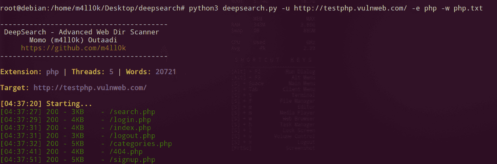

# DeepSearch 用于暴力的高级网页目录扫描仪

> 原文：<https://kalilinuxtutorials.com/deepsearch-bruteforce/>

DeepSearch 是一个简单的命令行工具，用于暴力网站中的目录和文件。也可以使用 **[暗网浏览器](https://gbhackers.com/top-5-best-dark-web-browser/)** 匿名上网。

## **DeepSearch 安装**

```
**$ git clone https://github.com/m4ll0k/DeepSearch.git deepsearch
$ cd deepsearch 
$ pip3 install requests
$ python3 deepsearch.py**
```

**也读 [Invisi-Shell:将你的 Powershell 脚本隐藏在众目睽睽之下(绕过所有 Powershell 安全特性)](https://kalilinuxtutorials.com/invisi-shell-hide-powershell-script/)**

## **用途**

**基本:**

`**python3 deepsearch.py -u http://testphp.vulnweb.com/ -e php -w wordlist.txt**`

**每个单词表条目强制扩展(支持一个扩展):**

`**python3 deepsearch.py -u http://testphp.vulnweb.com/ -e php -w wordlist.txt -f**`

**通过主机名(ip)发出请求:**

`**python3 deepsearch.py -u http://testphp.vulnweb.com/ -e php -w wordlist.txt -b**`

**对每个单词列表条目强制小写:**

`**python3 deepsearch.py -u http://testphp.vulnweb.com/ -e php -w wordlist.txt -l**`

**对每个单词列表条目强制大写:**

**`python3 deepsearch.py -u http://testphp.vulnweb.com/ -e php -w wordlist.txt -p`**

**仅显示由逗号分隔的状态代码:**

`**python3 deepsearch.py -u http://testphp.vulnweb.com/ -e php -w wordlist.txt -o 200,301,302**`

**排除逗号分隔的状态代码:**

`**python3 deepsearch.py -u http://testphp.vulnweb.com/ -e php -w wordlist.txt -x 501,502,503,401**`

**URL 注入点(%word%):**

`**python3 deepsearch.py -u http://testphp.vulnweb.com/test%1%.php -e php -w wordlist.txt**`

**URL 注入点(%)%:**

`**python3 deepsearch.py -u http://testphp.vulnweb.com/id/%%/index.html -e php -w wordlist.txt**`

**参数中的 URL 注入点:**

`**python3 deepsearch.py -u http://testphp.vulnweb.com/index.php?id=%2%&user=1 -e php -w wordlist.txt**`

`**python3 deepsearch.py -u http://testphp.vulnweb.com/index.php?%id%=1&user=2 -e php -w wordlist.txt**`

**添加标题:**

`**python3 deepsearch.py -u http://testphp.vulnweb.com/ -e php -w wordlist.txt -H "Content-Type:text/html\nETag:1234"**`

**代理:**

`**python3 deepsearch.py -u http://testphp.vulnweb.com/ -e php -w wordlist.txt -P 127.0.0.1:8080**`

**按列表排列的 URL:**

`**python3 deepsearch.py -U my_urls.txt -e php -w wordlist.txt**`

**其他选项:**

`**python3 deepsearch.py -u http://testphp.vulnweb.com/ -e php -w wordlist.txt -t 10 -T 3 -d 2 -R -c "test=test" --random-agent**` 

## **截图**



[ ](https://github.com/m4ll0k/DeepSearch) ** *您可以在 [Linkedin](https://www.linkedin.com/company/gbhackers/) 、 [Twitter](https://twitter.com/GbhackerOn) 、[脸书](https://www.facebook.com/gbhackersadmin)上关注我们的日常网络安全更新，您还可以在线参加[最佳网络安全课程](https://ethicalhackersacademy.com/)以保持自我更新。***