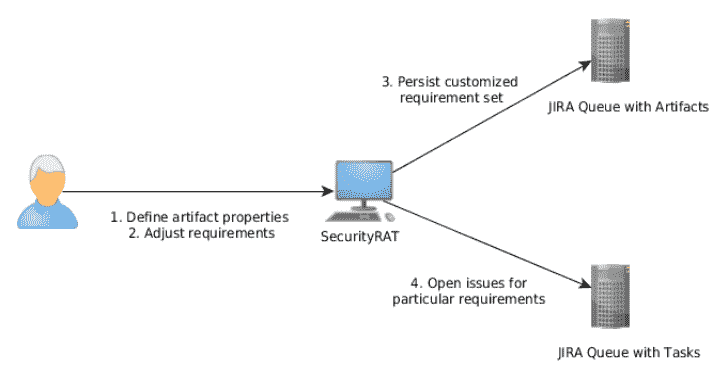

# 安全 RAT:开发中处理安全需求的工具

> 原文：<https://kalilinuxtutorials.com/security-rat/>

OWASP Security RAT(需求自动化工具)是一个在应用程序开发过程中帮助解决安全需求问题的工具。典型的使用案例是:

*   指定您正在开发的软件工件的参数
*   基于这些信息，生成了常见安全需求列表
*   浏览需求列表，选择您想要如何处理需求
*   将状态保存在 JIRA 票证中(状态作为 YAML 文件附加)
*   在开发人员队列中以批处理方式为特定需求创建 JIRA 票证
*   随时将主 JIRA 票证导入工具，以便查看特定票证的进度。

**也可阅读-[ph0 neutria:恶意软件动物园构建器，直接从野外获取样本](https://kalilinuxtutorials.com/ph0neutria/)**

最后，您可以使用 Security RAT 来加载步骤 3 中持久化需求集。SecurityRAT 还会将信息加载到为此集合创建的所有问题中，并显示它们的状态。

为了在 40 分钟内获得关于该工具的更多信息，您可以观看此视频；

[https://www.youtube.com/embed/6N__PgMSfYU?feature=oembed&enablejsapi=1](https://www.youtube.com/embed/6N__PgMSfYU?feature=oembed&enablejsapi=1)

[**Download**](https://github.com/SecurityRAT/SecurityRAT)