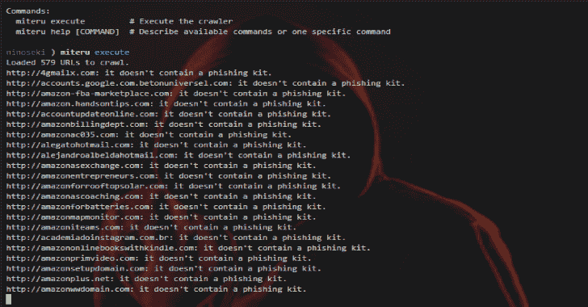

# Miteru:一个实验性的钓鱼工具包检测工具

> 原文：<https://kalilinuxtutorials.com/miteru-phishing-kit-detection/>

Miteru 是一款实验性的网络钓鱼工具包检测工具。以下是可用于该工具的功能:

*   网络钓鱼工具包检测和收集。
*   宽限通知。
*   穿线。

它是如何工作的？

*   它从以下源中收集网络钓鱼 URL:
    *   [cert stream-通过 urlscan.io 的可疑馈送](https://urlscan.io/search/#certstream-suspicious)
    *   [通过 urlscan.io 打开网络钓鱼订阅源](https://urlscan.io/search/#OpenPhish)
    *   [通过 urlscan.io 的网页仿冒网站摘要](https://urlscan.io/search/#PhishTank)
    *   [绫茂饲料](https://github.com/ninoseki/ayashige)
*   它检查每个网络钓鱼 URL 是否启用目录列表，是否包含网络钓鱼工具包(压缩文件)。
    *   注:压缩文件=`***.zip**`**`***.rar**`**`***.7z**`**`***.tar**``***.gz**`。******

 ******又念: [Mquery : YARA 恶意软件查询加速器](https://kalilinuxtutorials.com/mquery/)**

**安装**

**$ gem 安装 miteru**

**用途**

**$ miteru
命令:
miteru execute #执行爬虫
miteru help【命令】#描述可用**
**命令或某个特定命令**

$ miteru help execute
**用法:**
miteru execute

**选项:**
[–自动下载]，[–不自动下载] #启用或禁用自动下载钓鱼工具包
[–目录漫游]，[–不目录漫游] #启用或禁用目录漫游
[–DOWNLOAD-TO = DOWNLOAD _ TO]#下载文件的目录
#默认:/tmp
[–Post(最大值:10，000)
#默认值:100
[–threads = N]#要使用的线程数
#默认值:10
[–verbose]，[–no-verbose]
#默认值:true

**执行爬虫**
$ miteru 执行
……
https://dummy 1 . com:不含钓鱼工具包。
https://dummy2.com:不含钓鱼工具包。https://dummy3.com:它不包含钓鱼工具包。https://dummy4.com:它可能包含网络钓鱼工具包(dummy.zip)。

**使用 Docker(如果你没有安装 Ruby 的话可以选择)**

$ git 克隆 https://github . com/Nino Seki/mitru . git
$ CD mitru/docker
$ docker build-t mitru。
$ dock run mitru
ex。自动下载检测到网络钓鱼工具包进入主机计算机的/tmp 目录
$ docker run-v/tmp:/tmp mitru execute–自动下载

**奥斯卡影后**

**注**

为了使用`**--post-to-slack**`功能，您应该设置以下环境变量:

*   你的 Slack Webhook 网址。
*   `**SLACK_CHANNEL**`:发布消息的松弛通道(默认:“#general”)。

[**Download**](https://github.com/ninoseki/miteru)****