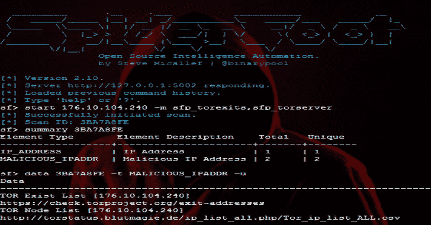

# 蜘蛛脚:最完整的信息收集和侦察工具

> 原文：<https://kalilinuxtutorials.com/spiderfoot-osint-reconnaissance-tool/>

**SpiderFoot** 是一款开源智能(OSINT)自动化工具。它的目标是自动收集有关给定目标的情报，这些目标可能是 IP 地址、域名、主机名、网络子网、ASN、电子邮件地址或人名。

它可以用于攻击，即作为黑盒渗透测试的一部分来收集有关目标的信息，也可以用于防御，以识别您的组织免费提供给攻击者用来攻击您的信息。

**也可阅读-[wafw 00 f:识别&指纹网络应用防火墙(WAF)产品保护网站](https://kalilinuxtutorials.com/wafw00f-2/)**

**什么是 OSINT？**

OSINT(开源情报)是在公共领域可获得的数据，它可能揭示关于你的目标的有趣信息。

这包括 DNS、Whois、网页、被动 DNS、垃圾邮件黑名单、文件元数据、威胁情报列表以及 SHODAN、HaveIBeenPwned？还有更多。查看蜘蛛脚使用的数据源的完整列表。

我可以用蜘蛛脚做什么？

蜘蛛脚扫描返回的数据将揭示关于您的目标的大量信息，提供对可能的数据泄漏、漏洞或其他敏感信息的洞察，这些信息可以在渗透测试、红队演习或威胁情报中加以利用。

在您自己的网络上尝试一下，看看您可能暴露了什么！

[**Download**](https://github.com/smicallef/spiderfoot)