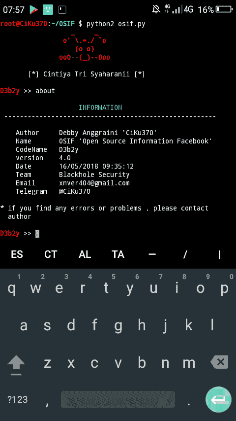

# OSIF:开源信息脸书

> 原文：<https://kalilinuxtutorials.com/osif/>

**OSIF** 是一个准确的脸书帐户信息收集，所有敏感信息可以很容易地收集，即使目标将其所有隐私转换为(只有我)，关于住所，出生日期，职业，电话号码和电子邮件地址的敏感信息。

**安装**

**$ pkg 更新升级
$ pkg 安装 git python2
$ git 克隆 https://github.com/ciku370/OSIF
$ CD OSIF**

**设置**

**$ pip 2 install-r requirements . txt**

**运行中**

**$ python2 osif.py**

**也可阅读-[JWT 工具:一个测试工具包，调整&破解 JSON 网络令牌](https://kalilinuxtutorials.com/jwt-tool/)**

**截图**

*   如果您不知道如何使用它，请键入“帮助”来显示帮助菜单
*   [警告]使用此程序前，请关闭您的 VPN！！！
*   【小贴士】不要过度使用这个程序！！！

[**Download**](https://github.com/CiKu370/OSIF)