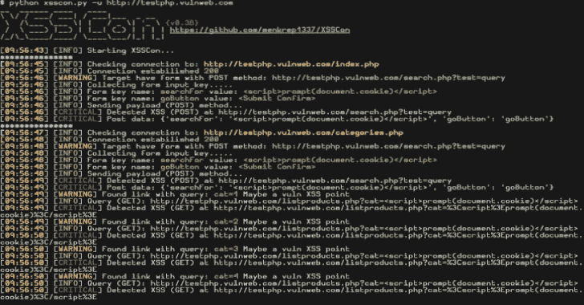

# XSSCon:简单的 XSS 扫描仪工具

> 原文：<https://kalilinuxtutorials.com/xsscon/>

XSSCon 是一个简单的 XSS 扫描仪工具，也是一个用 python 3.7 制作的强大的 XSS 扫描仪。

**安装**

*   要求:

BeautifulSoup4

**pip 安装 bs4**

*   要求

**pip 安装请求**

*   python 3.7

**命令**:

**git 克隆 https://github . com/menkrep 1337/xsscon
chmod 755-r xsscon
CD xsscon
python 3 xsscon . py–help**

**也可阅读-[Rogue:一个可扩展的工具包，为渗透测试人员提供了一个易于使用的平台](https://kalilinuxtutorials.com/rogue-toolkit-penetration-testing/)**

**用法**

*   基本用法:

**python 3 XSS con . py-u http://testphp.vulnweb.com**

*   高级用法:

**python 3 XSS con . py–帮助**

**主要特征**

*   抓取网站上的所有链接(爬虫引擎)
*   支持 POST 和 GET 表单
*   许多可以自定义的设置
*   等等。

**路线图**

*   **v0.3B:**

添加了自定义选项(–代理、–用户代理等)

*   **v0.3B 补丁:**

添加了对(表单方法 GET)的支持

*   **v0.4B:**

改进的错误处理现在支持 GET 方法的多个参数

**注**

*   对不起，我的英语不好
*   如果你在 win10 终端上运行 xsscon，你会得到一个混乱的输出
*   现在它不支持 DOM

[**Download**](https://github.com/menkrep1337/XSSCon)