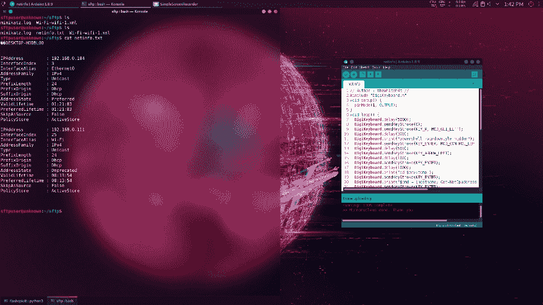
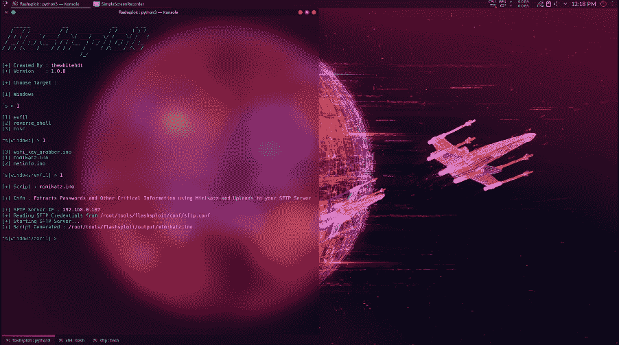
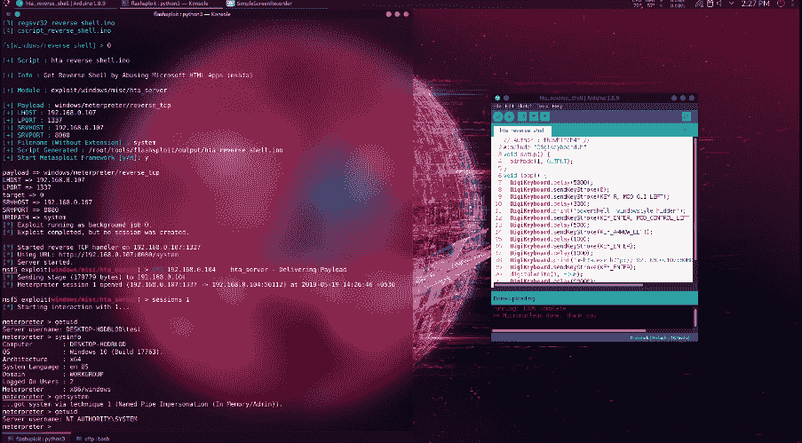
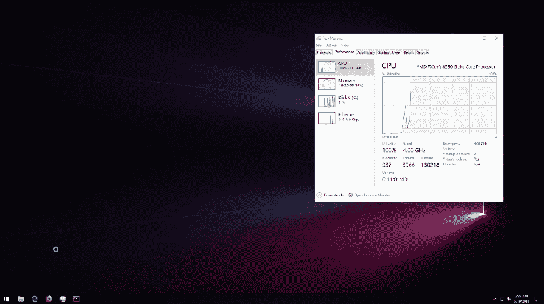
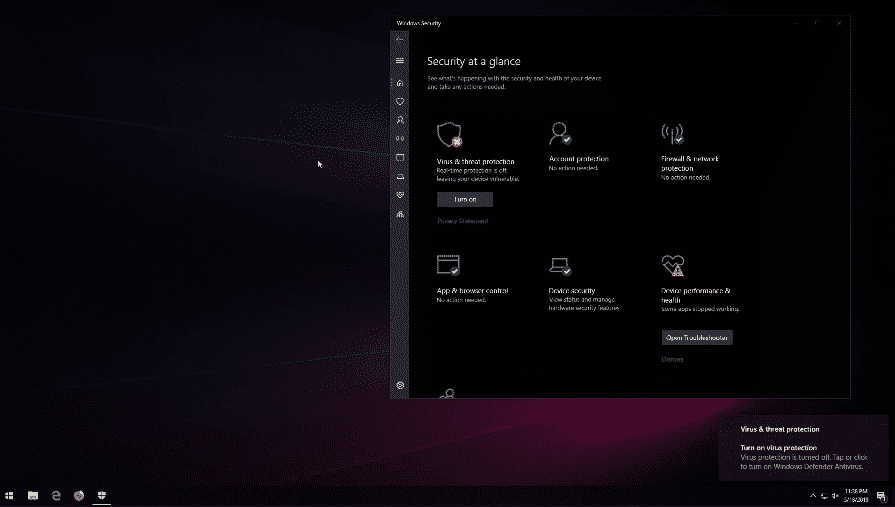

# FlashSploit:基于 ATtiny85 的 HID 攻击的利用框架

> 原文：<https://kalilinuxtutorials.com/flashsploit/>

**Flashsploit** 是一个利用 ATtiny85 HID 设备(如 Digispark USB 开发板)进行攻击的利用框架，Flashsploit 生成 Arduino IDE 兼容(。ino)脚本，然后在脚本需要时在 Metasploit-Framework 中启动一个侦听器，概括地说:使用自动化 msfconsole 自动生成脚本。

**窗户**

**数据泄露**

*   提取所有 WiFi 密码并上传一个 XML 到 SFTP 服务器| YouTube:

*   提取目标系统的网络配置信息并上传到 SFTP 服务器| YouTube:

*   使用 Mimikatz 提取密码和其他重要信息，并上传到 SFTP 服务器| YouTube:

**亦读-[阴谋诡计核心:发现你的攻击面](https://kalilinuxtutorials.com/intrigue-core-external-attack/)**

**反向炮弹**

*   通过滥用 Microsoft HTML Apps (mshta)获得反向外壳| YouTube:

*   通过滥用证书颁发机构实用程序(certutil)获得反向外壳
*   通过滥用 Windows 脚本主机(csript)获得反向外壳
*   通过滥用 Windows Installer (msiexec)获得反向外壳
*   通过滥用 Microsoft Register Server Utility(regsvr 32)获得反向外壳

**杂项**

*   更改目标机器的壁纸| YouTube:

*   使用. bat 脚本使 Windows 不响应(100% CPU 和 RAM 使用率)

*   放下并执行你选择的文件，也许是勒索软件？😉
*   禁用目标计算机上的 Windows Defender 服务

**测试于**

*   卡利 Linux 2019.2
*   BlackArch Linux

**依赖关系**

Flashsploit 依赖于 4 个软件包，这些软件包通常预安装在主要的 Pentest 操作系统中:

*   Metasploit 框架
*   python3
*   science for the people 为人类服务的科学
*   服务器端编程语言（Professional Hypertext Preprocessor 的缩写）

如果你认为我还应该做一个安装脚本，打开一个问题。

**用法**

**git 克隆 https://github . com/thewhite 4t/flashspleet . git
CD flashspleet
python 3 flashspleet . py**

[**Download**](https://github.com/thewhiteh4t/flashsploit)