# Converto:在 VPS 服务器上安装 Kali Linux

> 原文：<https://kalilinuxtutorials.com/converto/>

[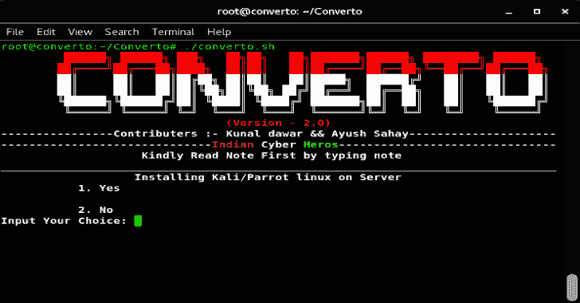](https://3.bp.blogspot.com/-ZCBkipi4GOY/XOb3JYsD4cI/AAAAAAAAAfs/kCT96ZKaSTUSseA2oVZtEu8d_If94TGIQCLcBGAs/s1600/Converto-1%25281%2529.png)

Converto 是一个用于 VPS 的自动化 Kali Linux 或 Parrot OS 安装程序，也安装 VNC(图形/非图形 VNC)。它在以下方面进行测试:

*   在 Ubuntu 上测试
*   在 Debian 上测试

**安装**

**sudo apt-get 更新
sudo apt-get 安装 git
git 克隆 https://github.com/developerkunal/Converto.git
CD Converto。
chmod +x converto.sh
。/converto.sh**

**也可阅读-[XSS con:简单的 XSS 扫描仪工具](https://kalilinuxtutorials.com/xsscon/)**

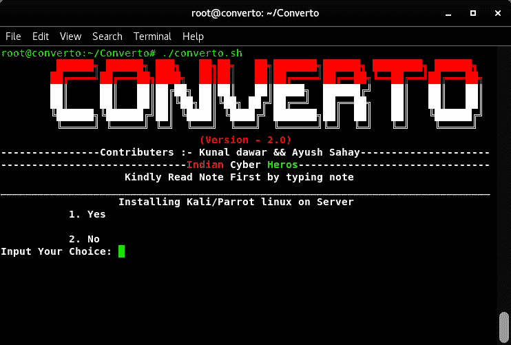

*   安装类型 1

类型 2 为退出
类型备注为阅读备注(推荐)

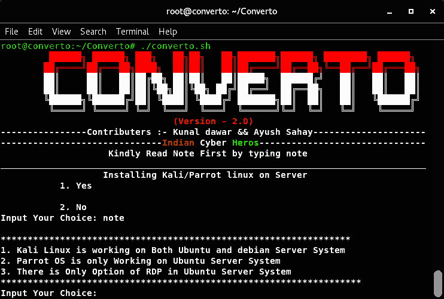

*   按 1 并输入

*   现在选择所需的选项。

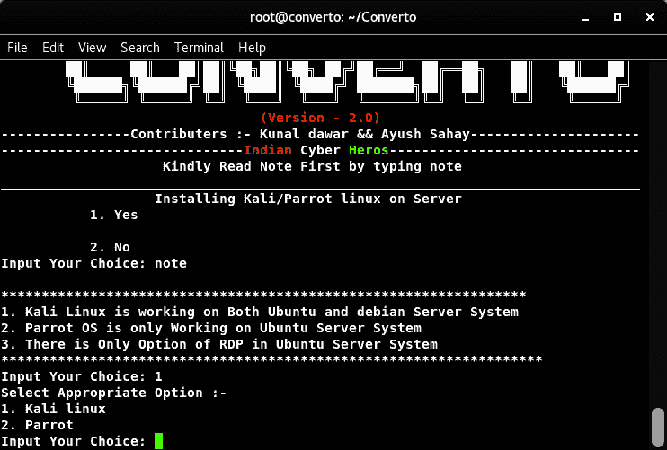

*   我为 Parrot OS 选择 2。

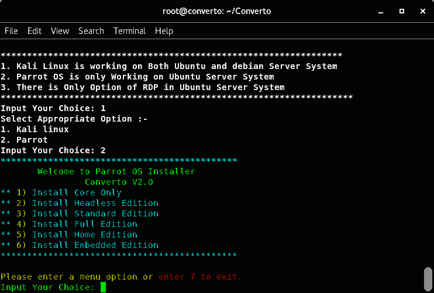

*   现在选择所需的选项。

1.  仅安装核心
2.  安装 Headless 版本
3.  安装标准版
4.  安装完整版
5.  安装家庭版
6.  安装嵌入式版本

*   选择 4 进行完全安装

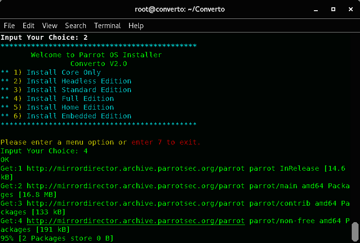

*   选择是。(必要的)

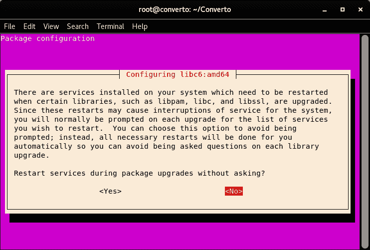

*   选择是。(必要的)

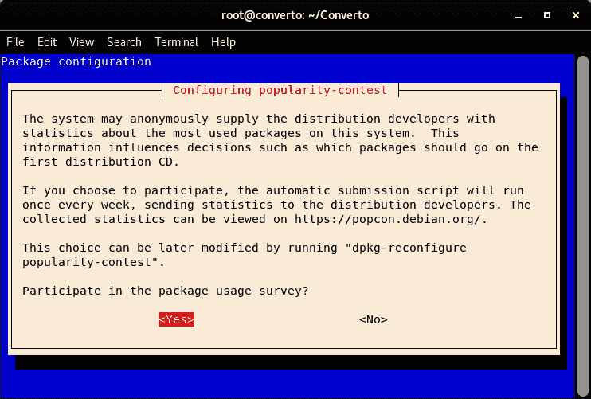

*   键入 Y，然后按 Enter 键。(必要的)

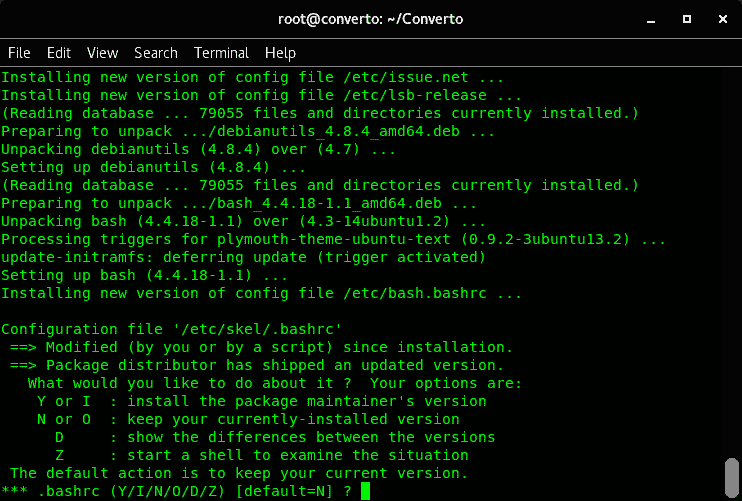

*   键入 Y，然后按 Enter 键。(必要的)

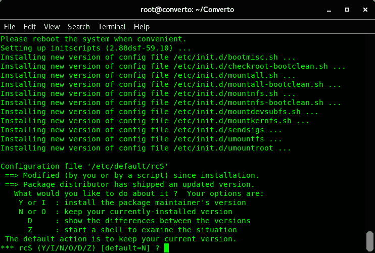

*   选择安装软件包维护者的版本。

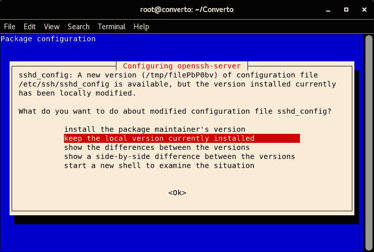

**安装完成**

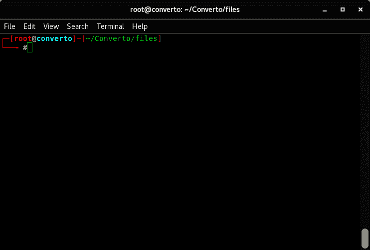

**安装 VNC 的可选步骤**

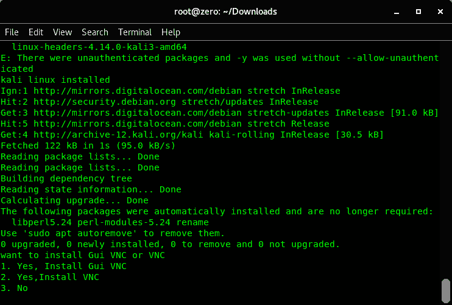

**步骤**

*   选择您想要安装的 VNC 类型(建议使用图形化 VNC)

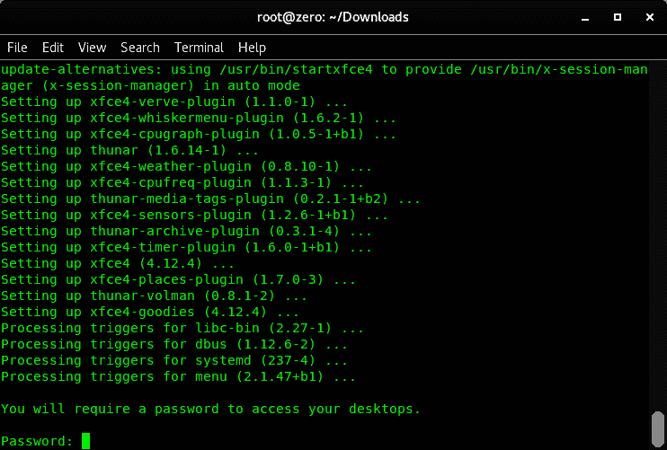

*   现在输入 VNC 连接的密码，并再次输入密码进行验证。

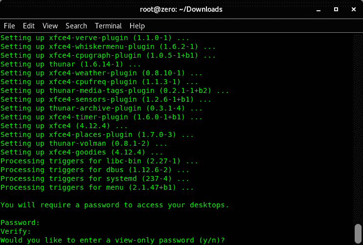

*   可选:如果您想要仅查看密码，请按 Y 键(在仅查看密码中，拥有该密码的用户只有查看屏幕的权限。)

**启动和停止 VNC 服务器的命令**

**启动 VNC 服务器**

**root@kali:~# vncserver
(它总是在端口 1 上启动)**

**停止一个 VNC 服务器**

**root @ kali:~ # vncserver-kill:1
VNC 查看器中的示例 IP:127 . 0 . 0 . 1:1**

**演职员表:**库纳尔·达瓦尔&阿尤什·萨海

[**Download**](https://github.com/developerkunal/Converto#steps--)