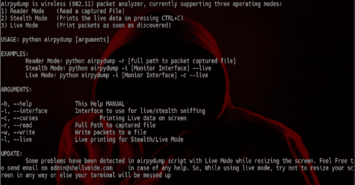

# AirpyDump:动态分析无线数据包

> 原文：<https://kalilinuxtutorials.com/airpydump/>

AirpyDump 是一个无线数据包分析器，它提供的接口很可能是 aircrack suite 中的 airodump-ng。它目前提供三种工作模式，即阅读器，隐形和现场。

读取器模式用于通过 airodump、wireshark 或 airpydump 本身读取之前编写的捕获文件。当您正在跑步，但不想看到实时交通状况，但刚刚结束跑步时，可以使用隐形模式。

因此，您可以在运行结束时按 CTRL+C，捕获的数据包将会显示给您。尚未完全构建的实时模式实际上利用了 python 的 curses 库，到目前为止还存在一些问题，它打印实时数据包，即一旦它们被无线适配器捕获。

实时模式的问题在于调整终端的大小。因此，不要试图最大化或恢复屏幕，而活嗅否则你的终端将被搞乱。唯一的方法，然后你必须摆脱它是强行关闭它，然后再次产生一个新的终端。

**也可阅读—[Secure tea 项目:旨在帮助保护未授权访问的 OWASP 应用](https://kalilinuxtutorials.com/securetea/)**

**模式**

**阅读器模式:**python airpydump . py-r[/path/to/。cap/file]
**隐身模式:** python airpydump.py -i【监控接口】–直播
**直播模式:** python airpydump.py -i【监控接口】–直播–诅咒

**用途**

**【用法】python airpydump.py【参数】**

**自变量**

**-h，–help 打印帮助手册
-i，–Interface =监控模式界面使用
-r，–Read =读取较早捕获的文件，如 packets.cap
-w，–Write =将数据包写入文件。
-c，–curses 利用 curses 库打印直播包
-i，–live 必须用于隐身和直播模式**

**更新**

实时嗅探时终端大小调整错误

[**Download**](https://github.com/hash3liZer/airpydump)