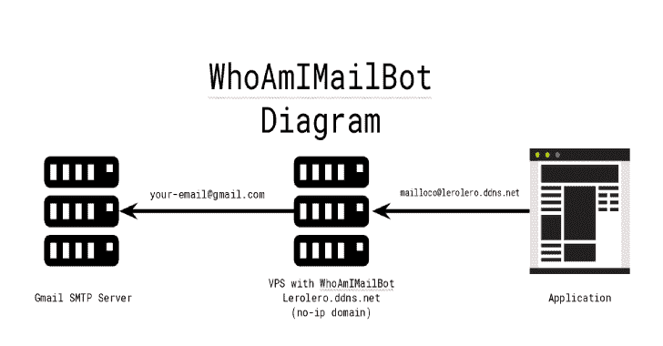
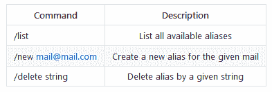

# 屏蔽你的电子邮件的服务

> 原文：<https://kalilinuxtutorials.com/whoamimailbot/>

WhoAmIMailBot 是一种屏蔽你的电子邮件的服务。它的灵感来自于 [Blur](https://abine.com/) ，你可以为你的电子邮件创建一个别名，并用它来注册应用程序。Blur 的问题是，所有的电子邮件都要通过它们的基础结构，我不需要/不想让任何人看到我的电子邮件，所以我做了这个项目。它类似于模糊服务，但运行在你自己的基础设施上！

它是如何工作的？

您将需要:

*   一个域名(为了不花钱，你可以使用无 ip 服务)；
*   允许 smtp 出站的 VPS
*   电报机器人 ID；
*   您的电报用户 ID；
*   这个项目。

您的 VPS 将运行一个后缀，该后缀将使用虚拟别名的后缀功能重定向电子邮件(您可以设置一个电子邮件地址，将所有收到的消息重定向到另一个电子邮件)，无 ip 域将是您将在别名电子邮件上使用的域，电报机器人将管理您的别名。

**也可阅读-[versions scan:用于报告可能漏洞的 PHP 版本扫描器](https://kalilinuxtutorials.com/versionscan/)**

**安装**

*   来自源

git 克隆 https://github . com/mthbernrdes/whoamimailbot . git
CD whoamimailbot
dock build-t whoamimailbot。
码头工执行-d-p25:25–名称 whoamimailbot-v/data/postfix/:/data-e 报文 _BOT_TOKEN="BOT_TOKEN" -e 报文 _USER_ID="USER_ID "

*   从枢纽码头

您可以使用以下命令下载该映像:

**码头工拉 btamburi/whoamimailbot**

或者

**docker run-d-p 25:25–name whoamimailbot-v/data/postfix/:/data-e TELEGRAM _ BOT _ TOKEN = " BOT _ TOKEN "-e TELEGRAM _ USER _ ID = " USER _ I**

**环境变量**

此图像使用环境变量来允许在运行时配置一些参数:

*   **电报机器人令牌**:电报机器人令牌。(使用: [@BotFather](https://telegram.me/botfather) )
*   **电报用户 ID** :您的电报 ID。(使用: [@my_id_bot](https://telegram.me/my_id_bot) )
*   **FAKE_DOMAIN** :你接收邮件的假域名。(例如:mailbot.ddns.net)

**用途**

在你的电报机器人上你有以下命令，

[**Download**](https://github.com/mthbernardes/WhoAmIMailBot)