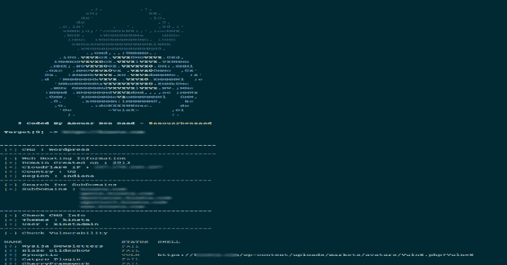
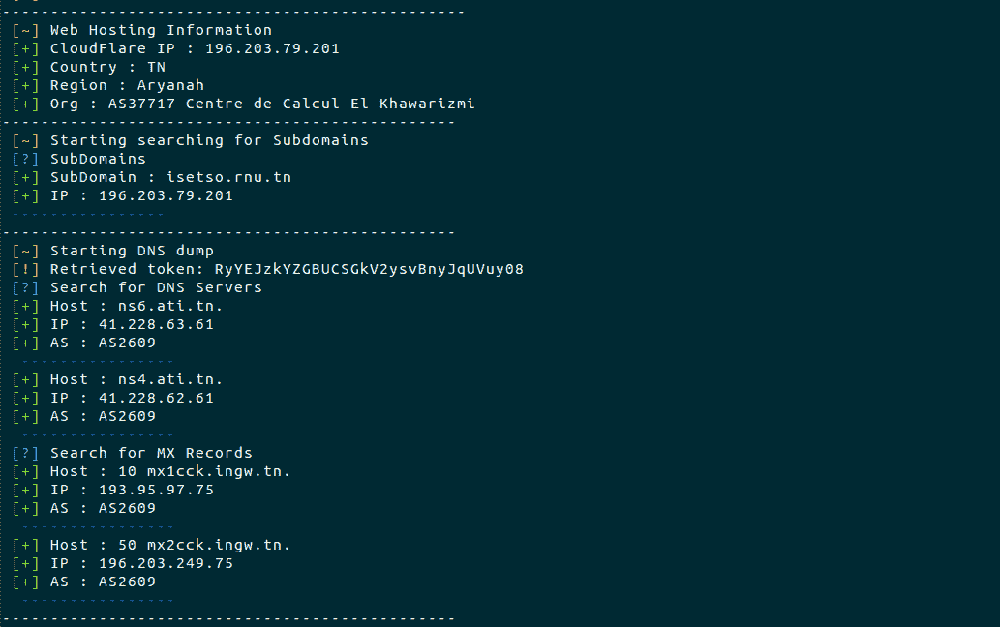
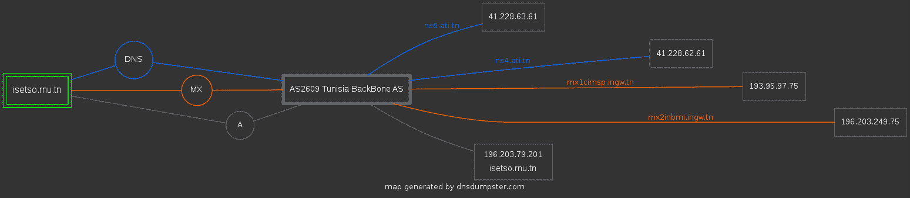

# Vulnx : CMS &漏洞检测器&一个智能机器人自动外壳注入器

> 原文：<https://kalilinuxtutorials.com/vulnx/>

**Vulnx** 是一个 cms 和漏洞检测，一个智能的自动[外壳注入器](https://github.com/anouarbensaad/vulnx/wiki/Usage#run-exploits)，快速 cms 目标检测和快速扫描器和信息收集，如子域，IP 地址，国家，组织，时区，地区，ans 等…

vulnx 不像其他工具那样注入 shell 并检查它的工作情况，而是分析响应并接收 shell 是否成功上传。vulnx 正在搜索带有 [dorks](https://github.com/anouarbensaad/vulnx/wiki/Usage#searching-dorks) 的 URL。

**特色**

*   检测 cms (wordpress，joomla，prestashop，drupal，opencart，magento，lokomedia)
*   目标信息收集
*   目标子域收集
*   按需多线程
*   检查漏洞
*   汽车外壳注射器
*   利用呆子搜索器
*   `**Ports Scan**`高水平
*   `**DNS**`-服务器转储

**又念——[电报 BBBot:电报 Bug 赏金 Bot](https://kalilinuxtutorials.com/telegram-bbbot/)**

**DNS-Map-Results**

为此，我们将使用–DNS 标志和-d 对子域进行扫描。要生成 isetso.rnu.tn 的映射，可以在终端窗口中运行命令`**vulnx -u isetso.rnu.tn --dns -d --output $PATH**`。

`**$PATH**`:图形导出到哪里？

让我们放大来看看子域名，MX & DNS 记录。

**战功**

**可用的命令行选项**

**用法:vulnx【选项】

-u–要扫描的 url url 目标
-D–呆子搜索有呆子的网页
-o–output 指定输出目录
-t–超时 http 请求超时
-c–cms-info 搜索 CMS 信息【主题、插件、用户、版本..]
-e-exploit 搜索漏洞&run exploits
-w-we b-info web 信息收集
-d-domain-info 子域信息收集
-l，–dork-list 列出利用漏洞的 dorks 名称
-n，–number-搜索引擎(Google)的页码页
-p，–ports 要扫描的端口
-i，–input 指定要扫描的域的输入文件
–threads 线程数
–DNS DNS**

**码头工人**

VulnX 可以在 docker 中启动。

**git 克隆 https://github . com/anouaachusad/vulcnx . git
$ CD Vulcan
$ docker build-t Vulcan。/docker/
$ docker run-it-name vunx:latest-u http://example . com**

创建本地卷，以便在日志文件中查看结果

**$ docker run-it–name VulnX-v " $ PWD/logs:/VulnX/logs " VulnX:latest-u http://exemple.com**

**在 Ubuntu 上安装 vulnx**

**git 克隆 https://github . com/anouanoisaad/vulcnx . git
$ CD vulcnx
$ chmod+x install . sh
$。/install.sh**

现在运行 vulnx

**在 Termux 上安装 vulnx**

**$ pkg 更新
$ pkg install -y git
$ git 克隆 http://github.com/anouarbensaad/vulnx
$ CD vulnx
$ chmod+x install . sh
$。/install.sh**

**点击此处显示结果**

带有选项的命令示例:settimeout=3，cms-gathering = all，-d 子域-收集，run 利用

**vulnx-u http://example.com–超时 3-c all-d-w–exploit**

用于搜索呆子的示例命令:-D 或-呆子，-l-列表呆子

vulnx–list-dorks 返回漏洞名称表。使用 blaze dork 发现的 vulnx -D blaze 返回 URL

[**Download**](https://github.com/anouarbensaad/vulnx)