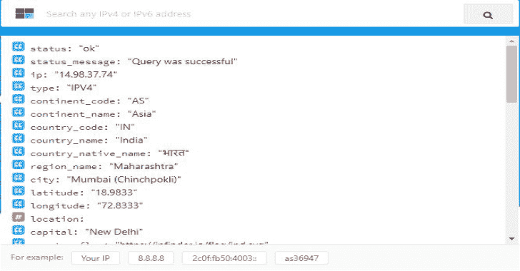

# IP Finder CLI:IP Finder 的官方命令行客户端

> 原文：<https://kalilinuxtutorials.com/ip-finder-cli/>

IP Finder CLI 是 IP Finder 的官方命令行客户端，在[https://ipfinder.io/auth/signup](https://ipfinder.io/auth/signup)注册一个免费账户，获得免费的 IPFinder API 访问令牌。

免费计划每天限于 4000 个请求，并且不包括一些数据字段，以启用所有数据字段和额外的请求量参见[https://ipfinder.io/pricing](https://ipfinder.io/pricing)。

它包括以下特征:

*   支持单个 IP 地址、asn、范围、防火墙作为输入
*   支持批量
*   将结果导出到屏幕或输出文件
*   支持 IPv4 和 IPv6
*   支持 ASN 号码、范围、防火墙

**也读作-[LANGhost:一个可以通过电报控制的局域网 Dropbox 聊天机器人](https://kalilinuxtutorials.com/langhost/)**

**系统要求**

*   PHP >= 7.0
*   JSON PHP 扩展
*   CURL PHP 扩展
*   IPfinder 的官方 PHP 库。

**安装**

**Via 作曲**

首先，使用 Composer 下载 IPfinder cli:

**composer global 需要 ipfinder-io/ip-finder-cli**

请确保将 composer 的系统级供应商 bin 目录放在您的`$PATH`中，以便您的系统可以找到 IPfinder 可执行文件。根据您的操作系统，此目录位于不同的位置；但是，一些常见的位置包括:

*   苹果电脑:`**$HOME/.composer/vendor/bin**`
*   GNU / Linux 发行版:`**$HOME/.config/composer/vendor/bin**`
*   视窗:`**%USERPROFILE%\AppData\Roaming\Composer\vendor\bin**`

**Linux 发行版/ macOS**

使用 curl 从 github 下载 IPfinder cli

**# #使用 curl** $ curl-LO https://github . com/IP finder-io/IP-finder-CLI/releases/download/v 1 . 0 . 0/IP finder . phar
**# #使用 wget** $ wget https://github . com/IP finder-io/IP-finder-CLI/releases/download/v 1 . 0 . 0/IP finder . phar
$ chmod+x IP finder . phar
$ sudo mv IP finder

**窗户**

*   从 github 下载 IPFINDER PHAR
*   为 PHP 二进制文件创建一个目录；例如`C:\bin`
*   打开命令行(例如，按下 **Windows+R** type `cmd` ENTER)
*   创建打包批处理脚本(结果为`C:\bin\ipfinder.cmd`):

C:\ Users \ username > CD
C:\ bin C:\ bin>echo @ PHP " % ~ DP 0 IP finder . phar " % *>IP finder . cmd
C:\ bin>退出

*   打开一个新的命令行，并确认您可以从任何路径执行 IPfinder:

c:\ Users \ username > IP finder–帮助

[**Download**](https://github.com/ipfinder-io/ip-finder-cli)