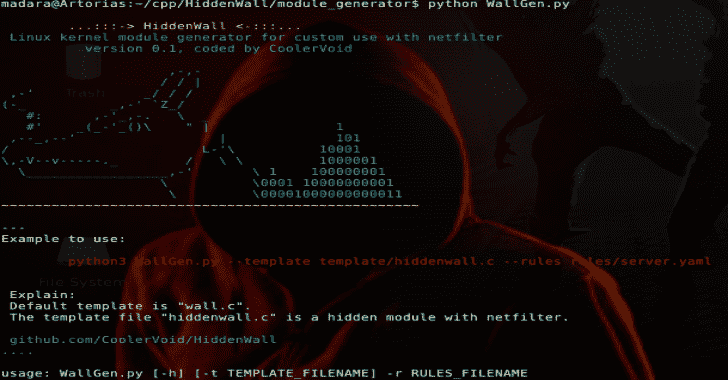

# HiddenWall:使用 Netfilter 定制规则的 Linux 内核模块生成器

> 原文：<https://kalilinuxtutorials.com/hiddenwall/>

HiddenWall 是一个使用 netfilter 定制规则的 Linux 内核模块生成器。(阻止端口、隐藏模式、rootkit 功能等)。动机:在糟糕的情况下，攻击者可以将你的 iptables/ufw 设置为 fal。

但是如果你有 HiddenWall，攻击者将不会发现隐藏的阻止外部访问的内核模块，因为在内核层有一个到 netfilter 的钩子(就像防火墙的第二层)。

我在这个项目的最初目的是保护我的个人服务器，现在是保护我朋友的机器。当我说“朋友”时，我指的是不知道如何写低级代码的人。

使用 HiddenWall，您可以为您的防火墙配置生成自定义内核模块。低级程序员可以为模块等编写新的模板

**也可阅读-[Graffiti:一种生成混淆的 One Liners 以帮助渗透测试的工具](https://kalilinuxtutorials.com/graffiti/)**

**第一步，运行前了解**

验证内核版本是 3.x、4.x 还是 5.x:

**uname -r**

克隆存储库

**git 克隆 https://github.com/CoolerVoid/HiddenWall**

输入文件夹

**cd 隐藏墙/模块 _ 生成器**

在目录 rules/server.yaml 中编辑您的防火墙规则，python 脚本使用该文件生成新的防火墙模块。

**$ cat rules/server . YAML
module _ name:sand wall
public _ ports:80，443，53
unhide _ key:AbraKadabra
hide _ key:Shazam
fake _ device _ name:USB 14
freedom _ in _ 2 _ out:True
白名单:machine:
IP:192 . 168 . 100 . 181
open _ ports:22，21 【T10**

如果你想学习静态代码生成，看看目录“模板”的内容。

**第二步，生成你的模块**

如果您想要生成遵循 YAML 规则文件内核模块，请遵循以下命令:

**$ python 3 wall gen . py–template template/hidden wall . c-r rules/server . YAML**

这生成了一个具有 server.yaml 规则的通用模块，如果您想使用另一个模板，您可以使用“wall.c ”,因此模板模块“hiddenwall”可以选择在隐藏模式下运行(例如，对“# lsmod”不可见)。

**第三步，安装你的模块**

要测试模块:

**# cd 输出；使干净；制作
# insmod SandWall.ko**

YAML 生成模块的规则很简单，丢弃所有出到入站的数据包，接受端口 80、443 和 53。机器 192 * 181 可以连接到端口 22 和 21…

如果您在 localhost/127.0.0.1 上使用 nmap，您可以查看打开的端口…因为规则解放 _ 输入 _ 2 _ 输出为真。

让防火墙可见的密码是“AbraKadabra”。

让防火墙隐形的密码是“Shazam”。

你需要发送你的假设备“usb14”的密码。

要退出模块，您需要在“lsmod”命令下变为可见…

**# echo “AbraKadabra” > /dev/usb14
# lsmod | grep SandWall
# rmmod SandWall**

[**Download**](https://github.com/CoolerVoid/HiddenWall)