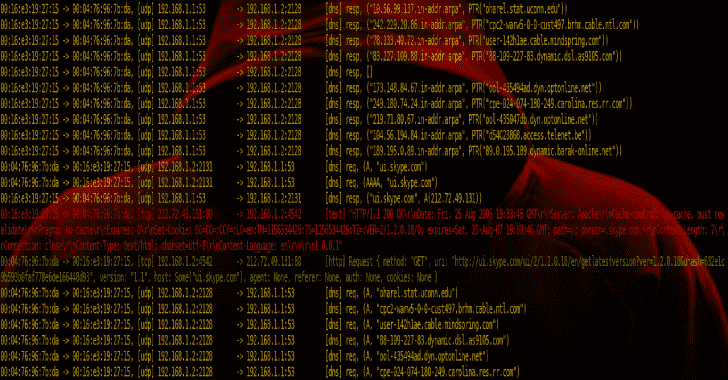

# Sniffglue:安全多线程数据包嗅探器

> 原文：<https://kalilinuxtutorials.com/sniffglue/>

**Sniffglue** 是一个用 rust 写的网络嗅探器。使用线程池并行解析网络数据包，以利用所有 cpu 内核。

项目的目标是你可以在不可信的网络上安全地运行 sniffglue，并且在处理数据包时它不能崩溃。默认情况下，输出应该尽可能有用。

**用途**

**嗅探胶 enp0s25**

**安装**

有一个适用于 archlinux 的官方软件包:

**pacman -S sniffglue**

要从源代码构建，确保安装了 libpcap 和 libseccomp，Debian/Ubuntu: `**libpcap-dev libseccomp-dev**`，Archlinux: `**libpcap libseccomp**`。

**货物安装嗅探胶**

**也读作-[Vulnx:CMS&漏洞检测器&一个智能 Bot 自动外壳注入器](https://kalilinuxtutorials.com/vulnx/)**

**协议**

*   以太网
*   ipv4
*   ipv6
*   阿尔普
*   传输控制协议
*   用户数据报协议
*   网间控制报文协议
*   超文本传送协议（Hyper Text Transport Protocol 的缩写）
*   坦克激光瞄准镜（Tank Laser-Sight 的缩写）
*   十进位计数制
*   动态主机配置协议
*   cjdns eth 信标
*   ssdp
*   dropbox 信标
*   Eight hundred and two point one one

**码头工人**

您可以构建 sniffglue 作为 docker 映像来调试容器设置。镜像目前 11.1MB 左右，建议推送至自己的注册表。

docker build -t sniffglue。
docker run-it–init–RM–net = host sniff glue eth 0

**安全**

要报告安全问题，请通过 [ircs://irc.hackint.org](ircs://irc.hackint.org) 联系 kpcyrd。

**Seccomp**

为了确保受损的进程不会损害系统，sniffglue 使用 seccomp 来限制进程启动后可以使用的系统调用。这分两个阶段完成，第一个阶段在最开始(env_logger 初始化之后)，第二个阶段在嗅探器设置好之后，但在从网络中读取数据包之前。

**硬化**

在第二阶段，在所有不需要的系统调用最终被禁用之前，还会进行一些常规的强化。这些是特定于系统的，所以从`**/etc/sniffglue.conf**`读取配置文件。该配置文件为`**chroot**` 指定了一个空目录，并在`user`中指定了一个无特权的帐户，用于删除 root 特权。

**boxy-RS**

这个项目包括一个基于 boxy-RS 的 shell，可以用来在初始化期间和之后的不同阶段探索沙箱。travis 也用它来确保沙箱实际上阻塞了系统调用。

**货物运行–示例 boxxy**

**可重复构建**

此项目使用 reprotest 进行测试。目前不包括以下变化:

*   `**-time**`–需要，因为 crates.io 证书将来会过期
*   `**-domain_host**`**–需要 root 进行 unshare(2)并已被排除**

 **不要忘记安装构建依赖项。

**ci/reprotest.sh**

**起毛**

sniffglue 的数据包处理可以使用 [cargo-fuzz](https://github.com/rust-fuzz/cargo-fuzz) 进行模糊处理。您应该需要的一切都在随源代码一起分发的`**fuzz/**`目录中提供。

请注意，这个程序链接到 libpcap，它不包括在当前的 fuzzing 配置中。

**货物起毛运行 read_packet**

[**Download**](https://github.com/kpcyrd/sniffglue)**