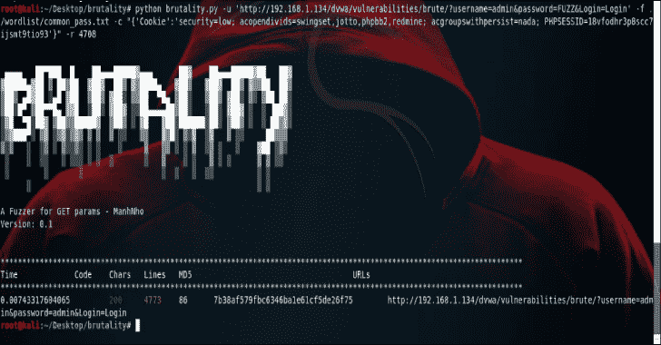

# 残暴:任何 GET 条目的模糊器

> 原文：<https://kalilinuxtutorials.com/brutality/>

一个**暴行**是一个模糊的任何获取条目，以下是特征；

*   按需多线程
*   Fuzzing，bruteforcing GET params
*   查找管理面板
*   彩色输出
*   通过返回代码、字数隐藏结果
*   代理支持
*   Big wordlist

**也可阅读-[IP Finder CLI:IP Finder](https://kalilinuxtutorials.com/ip-finder-cli/)T3 的官方命令行客户端**

用途

*   **安装**

**git 克隆 https://github.com/ManhNho/brutality.git
chmod 755-R 残暴/
cd 残暴/
pip install-R requirements . txt**

*   **帮助**

**巨蟒暴行-h**

#### 例子

*   使用 5 个线程的默认单词列表(-t 5)并隐藏 404 消息(–e 404)来模糊给定的 URL([http://192 . 168 . 1 . 1/FUZZ](http://192.168.1.1/FUZZ)):

**python 残暴. py-u ' http://192 . 168 . 1 . 1/FUZZ '-t 5-e 404**

*   使用 common _ pass . txt word list(-f ./word list/common _ pass . txt)，删除长度为 6969(-r 6969)的响应和 127.0.0.1:8080 的代理(-p [http://127.0.0.1:8080](http://127.0.0.1:8080) )模糊给定的 URL([http://192 . 168 . 1 . 1/brute . PHP？用户名=管理员&密码=模糊&提交=提交#](http://192.168.1.1/brute.php?username=admin&password=FUZZ&submit=submit#) ):

**python 残暴. py-u ' http://192 . 168 . 1 . 1/brute . PHP？用户名=管理员&密码=模糊&提交=提交# '-f ./word list/common _ pass . txt-r 6**

**演示**

[https://www.youtube.com/embed/1JQIjRVzVYA?feature=oembed&enablejsapi=1](https://www.youtube.com/embed/1JQIjRVzVYA?feature=oembed&enablejsapi=1)

[**Download**](https://github.com/ManhNho/brutality#usages)