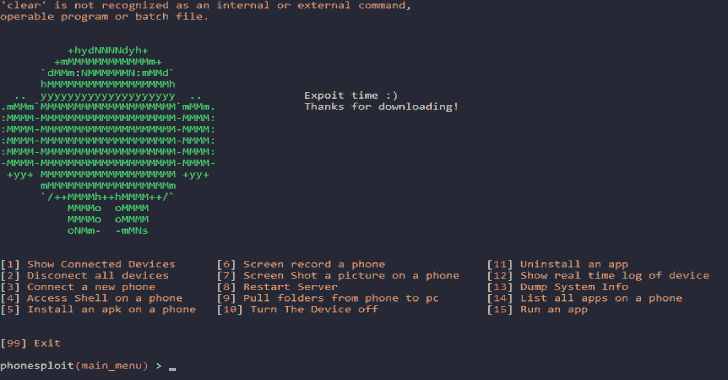

# PhoneSploit:使用开放的 ADB 端口，我们可以利用 Android 设备

> 原文：<https://kalilinuxtutorials.com/phonesploit-adb-ports-exploit-andriod/>

PhoneSploit 正在使用开放的 Adb 端口，我们可以利用 Android 设备。点击[这里](https://www.shodan.io/search?query=android+debug+bridge+product%3A”Android+Debug+Bridge)可以找到开放的端口。

**如何访问本地设备**

[https://www.youtube.com/embed/OlhCAX1qBQo?feature=oembed&enablejsapi=1](https://www.youtube.com/embed/OlhCAX1qBQo?feature=oembed&enablejsapi=1)

**如何安装 WINDOWS**

**git 克隆 https://github.com/Zucccs/PhoneSploit
提取 adb.rar 到 phonesploit 目录
cd PhoneSploit
pip 安装 colorama
python2 main.py**

**也可阅读-[hidden wall:Linux 内核模块生成器，用于使用 Netfilter](https://kalilinuxtutorials.com/hiddenwall/) 和** PhoneSploit:使用开放的 ADB 端口，我们可以利用 Android 设备

**如何安装 Linux**

**git 克隆 https://github.com/Zucccs/PhoneSploit
CD phones loit
pip 安装 colorama
python 2 main _ Linux . py**

**视频演示**

https://www.youtube.com/watch?v=6XNf9s-PZxY

**最近消息(新更新 v.1.2)**

端口转发
NetStat
抓取 wpa _ 恳求者
开启/关闭 WiFi

显示 Mac/Inet
移除密码
从 app 提取 apk
使用键码

获取电池状态
获取当前活动

[**Download**](https://github.com/Zucccs/PhoneSploit)