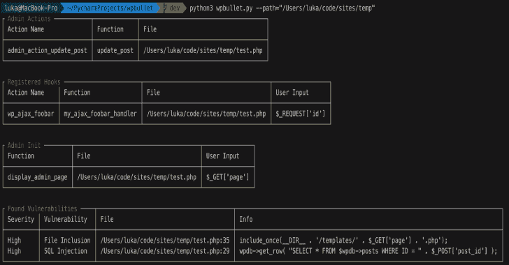

# WP bullet:WordPress & PHP 的静态代码分析

> 原文：<https://kalilinuxtutorials.com/wpbullet/>

WPBullet 是针对 WordPress 插件/主题(和 PHP)的静态代码分析。简单地克隆存储库，安装需求并运行脚本；

**git 克隆 https://github.com/webarx-security/wpbullet WP bullet
CD WP bullet
pip install-r requirements . txt
python WP bullet . py**

**可用选项:**

**–path(必选)系统路径或下载 URL
示例:
–path = "/path/to/plugin "
–path = " https://WordPress . org/plugins/example-plugin "
–path = " https://downloads . WordPress . org/plugin/example-plugin . 1.5 . zip "

–enabled(可选)仅检查给定的模块，例如。–enabled = " SQL injection，cross site scripting "
–disabled(可选)不检查给定的模块，例如。–disabled = " SQL injection，cross site scripting "
–clean up(可选)自动删除的内容。扫描远程下载插件后的临时文件夹

$ python WP bullet . py–path = "/var/www/WP-content/plugins/plugin-name "**

**也可阅读-[为初学者提供的顶级点击付费联盟项目](https://kalilinuxtutorials.com/top-paying-pay-per-click-affiliate-programs-for-beginners/)**

**创建模块**

创建一个模块是灵活的，允许为每个模块覆盖`**BaseClass**` 方法，以及创建它们自己的方法

`**Modules**` 目录中的每个模块都在实现来自`**core.modules.BaseClass**`的属性和方法，因此每个模块需要的参数是`**BaseClass**`

一旦创建，模块需要在`**modules/__init__.py**`中导入。为了加载模块，模块和类名必须一致。

如果您正在打开拉请求以添加新模块，请也为您的模块提供单元测试。

**模块模板**

**模块/示例 Vulnerability.py**

**from core . modules import base class

class example Vulnerability(object):

# Vulnerability name = " Cross-site Scripting "
# Vulnerability severity = " Low-Medium "
# Functions =[" print " " echo "]
# Functions/regex，防止利用黑名单= [ "htmlspecialchars "，" esc_attr" ]**

**覆盖正则表达式匹配模式**

Regex 模式正在`**core.modules.BaseClass.build_pattern**`中生成，因此可以在每个模块类中被覆盖。

**模块/示例 Vulnerability.py**

**导入复制…

构建动态正则表达式模式定位给定内容中的漏洞

def build_pattern(self，content，file):
user _ input = copy . deepcopy(self . user _ input)

variables = self . get _ input _ variables(self，content)

if 变量:
user _ input . extend(variables)

if self . black list:
black list _ pattern = r "(？！(\s？)+(.*(" + '|'.join(self . black list)+")"

else:
black list _ pattern = "

self . functions =[self . functions _ prefix+x for x in self . functions]

pattern = r "(("+' | '。join(self . functions)+" \ s { 0，}\(？\s{0，1}" + blacklist_pattern +"*(" + '|'.join(user_input) +"。*)”返回模式**

**测试**

运行单元测试:

**$ python3 -m 单元测试**

[**Download**](https://github.com/webarx-security/wpbullet)