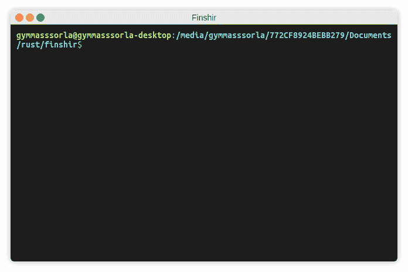

# Finshir:协程驱动的低流量发送器

> 原文：<https://kalilinuxtutorials.com/finshir/>

[](https://1.bp.blogspot.com/-tEbYJ1y5Gog/XPfVTKJ6P-I/AAAAAAAAApo/nar6LQ2eXnIrxJg88XnOdVvsxtOyuGJEwCLcBGAs/s1600/DEMO.gif)

Finshir 是一款高性能、协程驱动、完全可定制的低&慢负载生成器，专为现实测试而设计。

您可以使用各种依赖于平台的实用程序轻松地将其固定/代理。

**优势**

*   **协程驱动。Finshir 使用[协程](https://en.wikipedia.org/wiki/Coroutine)(也称为轻量级线程)而不是普通线程，这让你可以用更少的系统资源打开更多的连接。**
*   **通用。**与其他低&慢的实用程序不同，Finshir 允许你通过 [TCP](https://en.m.wikipedia.org/wiki/Transmission_Control_Protocol) 协议传输任意数据集。可能是部分 HTTP 头、空格等等。
*   **用铁锈写的。**你可以看到，所有的逻辑都是完全用 [Rust](https://www.rust-lang.org/) 编写的，这意味着它利用了裸机性能和高级别的安全性(没有 SIGSEGV、SIGILL 和其他“有趣”的东西)。

* * *

**缺点**

*   **依赖于平台。与大多数 pentesting 实用程序一样，这个项目只为基于 UNIX 的系统开发。如果你是 Windows 用户，你可能需要一台[虚拟机](https://en.wikipedia.org/wiki/Virtual_machine)或另一台装有 UNIX 的计算机。**

**也可阅读-[hidden wall:使用 Netfilter](https://kalilinuxtutorials.com/hiddenwall/)T3 定制规则的 Linux 内核模块生成器**

**安装**

**板条箱建筑**

**$货物安装 finshir**

**从源构建**

**$ git 克隆 https://github.com/Gymmasssorla/finshir.git**
**$ CD 芬希尔**
**$ cargo build–release**

**预编译的二进制文件**

**$ wget https://github . com/Gymmasssorla/fin shir/releases/download/vX。X . X/fin shir-x86 _ 64-Linux
$ chmod a+X fin shir-x86 _ 64-Linux**

**用途**

**标志**

| 名字 | 说明 |
| --- | --- |
| `-h, --help` | 打印帮助信息 |
| `--use-tls` | 使用 TLS 连接，而不是普通的 TCP 协议。它可能被用来测试基于 HTTPS 的服务。 |
| `-V, --version` | 打印版本信息 |

**选项**

| 名字 | 价值 | 默认 | 说明 |
| --- | --- | --- | --- |
| `--connect-periodicity` | 时间间隔 | `7secs` | 如果发生套接字连接错误，将应用此选项(下一次连接将在此周期后执行) |
| `--connect-timeout` | 时间间隔 | `10secs` | 尝试在指定超时时间内连接套接字。如果超时时间已到，但没有连接套接字，程序将稍后重试该操作 |
| `--connections` | 正整数 | `1000` | 程序将同时处理多个连接。这个选项也相当于许多协程 |
| `--date-time-format` | 线 | `%X` | 日志消息中显示本地日期和时间的格式。键入`man strftime`查看格式规范 |
| `--failed-count` | 正整数 | `5` | 用于将套接字重新连接到远程 web 服务器的大量失败的数据传输 |
| `--ip-ttl` | 无符号整数 | 没有人 | 指定所有未来套接字的`IP_TTL`值。通常，该值等于数据包可以通过的路由器数量 |
| `--json-report` | 文件名 | 没有人 | 退出前将生成 JSON 报告(也称为“总摘要”)的文件 |
| `-f, --portions-file` | 文件名 | 没有人 | 由数据部分的定制 JSON 数组组成的文件，指定为字符串。当一个协程程序发送完所有部分后，它会重新连接它的套接字并再次开始发送。 |
| `-r, --receiver` | 套接字地址 | 没有人 | 生成器流量的接收方，指定为 IP 地址(或域名)和端口号，用冒号分隔 |
| `-d, --test-duration` | 时间间隔 | `64years 64hours 64secs` | 整个测试持续时间，在此之后，所有产生的协程将停止它们的工作 |
| `--text-report` | 文件名 | 没有人 | 一个文件，程序将在退出前生成一个可读的报告(也称为“总摘要”) |
| `-v, --verbosity` | 从 0 到 5 | `3` | 启用一个可能的详细级别。零级不打印任何东西，最后一级打印所有东西。

注意，指定 4 和 5 的详细级别可能会降低性能，只在调试时才这样做。 |
| `-w, --wait` | 时间间隔 | `5secs` | 测试执行前的一段等待时间，用于防止启动错误的(不需要的)测试 |
| `--write-periodicity` | 时间间隔 | `30secs` | 写入数据部分之间的时间间隔。该选项可用于修改测试强度 |
| `--write-timeout` | 时间间隔 | `10secs` | 如果超时时间已到，而数据部分尚未发送，程序将稍后重试该操作 |
| `--xml-report` | 文件名 | 没有人 | 退出前将生成 XML 报告(也称为“总摘要”)的文件 |

**概述**

**最小命令**

下面的命令产生了 1000 个协程，每个协程都试图建立一个新的 TCP 连接。当连接建立后，它每 30 秒发送一次空白，从而命令服务器尽可能地等待:

**#指定一个谷歌的 IP 地址作为目标网络服务器
$ fin shir–receiver = Google . com:80**

**测试强度**

Low & Slow 技术假设非常慢，这意味着通常每 N 秒发送一对字节。例如，Finshir 默认使用 30 秒的时间间隔，但是也可以修改:

**#测试谷歌服务器每一分钟发送的数据部分
$ fin shir–receiver = Google . com:80–write-periodicity = 1 分钟**

**连接数**

默认的并行连接数是 1000。但是，您可以使用`--connections`选项来修改这个限制，但是要确保您的系统能够处理这样数量的文件描述符:

**#将文件描述符的默认限制修改为 17015
$ sudo ulimit-n 17015

#使用 17000 个并行 TCP 连接测试目标服务器
$ fin shir–receiver = Google . com:80–connections = 17000**

**TLS 支持**

今天，大多数 web 服务器使用 HTTPS 协议，而不是基于 TLS 的 HTTP 协议。从 [v0.2.0](https://github.com/Gymmasssorla/finshir/releases/tag/v0.2.0) 开始，Finshir 可以使用`**--use-tls**`标志通过 TLS 进行连接。

**#通过 443 端口上的 TLS 连接到谷歌的服务器(HTTPS)
$ fin shir–receiver = Google . com:443–use-TLS**

**记录选项**

考虑指定一个从 0 到 5(包括 0 和 5)的自定义详细级别，这是通过`--verbosity`选项完成的。还有一个`--date-time-format`选项，告诉 Finshir 使用您自定义的日期时间格式。

**#使用自定义的日期时间格式和最后的详细级别
$ fin shir–receiver = Google . com:80–date-time-format = " % F "-verbosity = 5**

不同的详细级别打印不同的日志记录类型。正如您在下表中看到的，零详细级别不打印任何内容，最后一个级别打印所有内容。中间的级别有选择地打印日志:

|  | 错误 | 警告信息 | 通知 | 调试 | 跟踪 |
| --- | --- | --- | --- | --- | --- |
| 零(0) |  |  |  |  |  |
| 第一(1) | ✔ |  |  |  |  |
| 第二部(2) | ✔ | ✔ |  |  |  |
| 第三(3) | ✔ | ✔ | ✔ |  |  |
| 第四部(4) | ✔ | ✔ | ✔ | ✔ |  |
| 第五届(5) | ✔ | ✔ | ✔ | ✔ | ✔ |

**自定义数据部分**

默认情况下，Finshir 生成 100 个空格作为要发送的数据部分。您可以通过将自定义消息指定为一个文件来覆盖这种行为，该文件由一个 JSON 数组组成。这个例子主要针对 Google:

**#使用`–portions-file`
$ fin shir–receiver = Google . com:443-f files/Google . JSON–use-TLS**向谷歌发送部分 HTTP 头

上面的命令通过 TLS(通过指定`--use-tls`标志来实现)发送一个部分 HTTPS 请求(首先由 [Slowloris](https://en.wikipedia.org/wiki/Slowloris_(computer_security)) 引入)。您可以在`files/google.json`中访问这个部分请求。

( [`files/google.json`](https://github.com/Gymmasssorla/finshir/blob/master/files/google.json)

 **“获取 https://www.google.com/ HTTP/1.1 \ r \ n”、
“主机:www.google.com\r\n”、
“用户代理:Mozilla/5.0(X11；UbuntuLinux x86 _ 64RV:66.0)Gecko/2010 01 01 Firefox/66.0 \ r \ n "、
"接受:text/html、application/xhtml+xml、application/XML；q=0.9，*****/*****；q=0.8\r\n "，
"接受-语言:en-US，en；q=0.5\r\n "，
"Accept-Encoding: gzip，deflate，br\r\n "，
"Connection: keep-alive\r\n "，
" Upgrade-unsecured-Requests:1 \ r \ n "，
" Cache-Control:max-age = 0 \ r \ n "，
"TE: Trailers\r\n "，
"\r\n"
]**

**生成报告**

报告是一组统计变量，如建立的连接总数、失败的传输总数等等。为此有三个选项:`**--xml-report**`、`**--json-report**`和`**--text-report**`:

**#测试谷歌的服务器，最后生成 JSON 报告
$ fin shir–receiver = Google . com:80–JSON-report = report . JSON**

“在最后”是什么意思？那么，如果分配的时间到期或者如果你通过 Ctrl-C 取消该过程，Finshir 将为你生成一个报告。你可以在 [`**files/reports**`](https://github.com/Gymmasssorla/finshir/tree/master/files/reports) 文件夹中查看报告示例:

( [`files/reports/report.json`](https://github.com/Gymmasssorla/finshir/blob/master/files/reports/report.json)

**、
、【连接】:{
、
、【成功】:【305】、
、【总计】:【305】、
}、
、【接收方】:【google.com:80】、
、【时间】:{
、【测试时长】:【4s 71ms 819us 653ns】、
、【测试开始】:“周三，2019 年 5 月 29 日 22:**

( [`files/reports/report.xml`](https://github.com/Gymmasssorla/finshir/blob/master/files/reports/report.xml)

```
<?xml version="1.0" encoding="UTF-8"?>
<finshir-report>
  <receiver>google.com:80</receiver>
  <total-bytes-sent>159</total-bytes-sent>
  <total-errors>0</total-errors>
  <time>
    <test-start>Wed, 29 May 2019 22:04:16 -0000</test-start>
    <test-duration>2s 289ms 664us 988ns</test-duration>
  </time>
  <connections>
    <successful>159</successful>
    <failed>0</failed>
    <total>159</total>
  </connections>
  <transmissions>
    <successful>159</successful>
    <failed>0</failed>
    <total>159</total>
  </transmissions>
</finshir-report>
```

( [`files/reports/report.txt`](https://github.com/Gymmasssorla/finshir/blob/master/files/reports/report.txt)

*** * * * * * * * * * * * * * * * * * * * * * fin shir 报告***************************接收方:google.com:80
发送总字节数:535
总错误数:0

测试开始:2019 年 5 月 29 日星期三 22:04:55 -0000
测试持续时间:7s 385ms 765us 179ns

成功连接数:535
失败连接数:0
总连接数:535** 

如果上面的选项都没有指定，Finshir 会直接在您的终端上打印一份报告。也就是说，您可以运行一个测试，稍后取消它，然后查看您可以轻松保存的结果。完美！

**免责声明**

Finshir 是作为一种测试 web 服务器抗压能力的手段开发的，而不是为了黑客攻击，也就是说，项目的作者**对你使用他的程序造成的任何损害**不负责。

**功劳:** [**铁木尔汗**](https://github.com/Gymmasssorla)

[**Download**](https://github.com/Gymmasssorla/finshir)