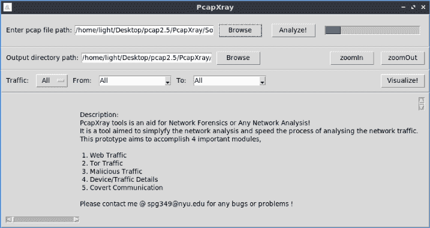
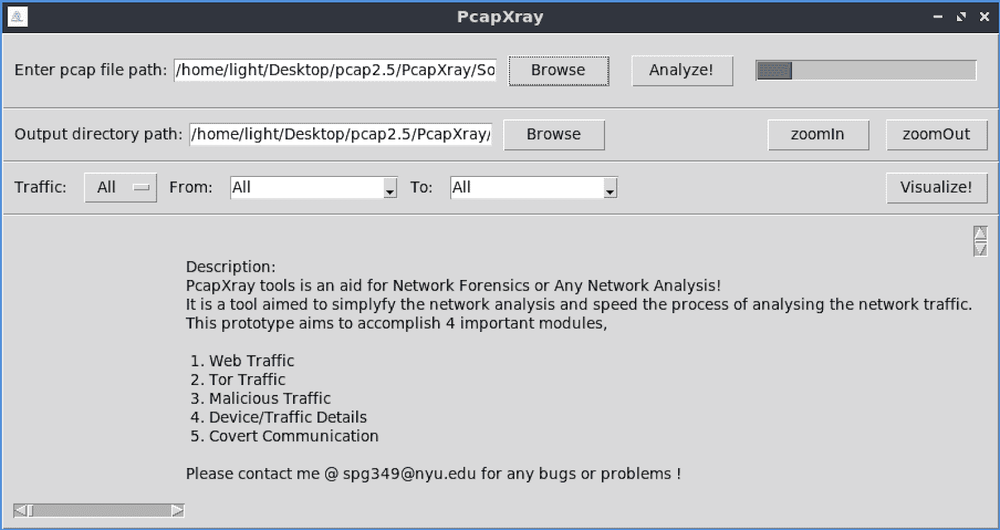
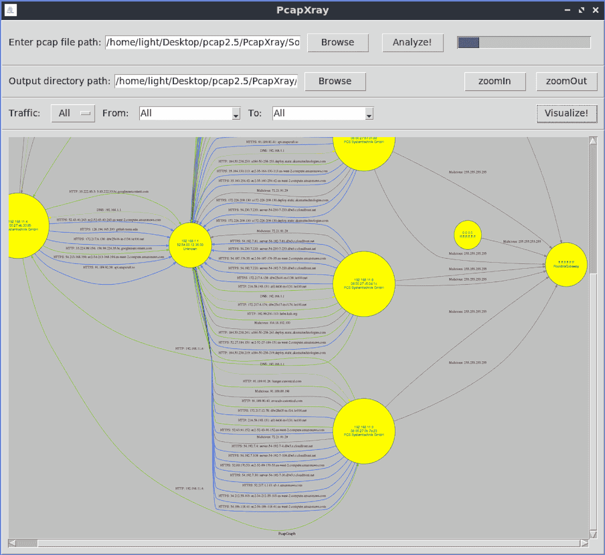

# PcapXray:离线可视化数据包捕获的工具

> 原文：<https://kalilinuxtutorials.com/pcapxray/>

**PcapXray** 是一款网络取证工具，可将数据包捕获离线可视化为网络图，包括设备识别、突出显示重要通信和文件提取。

**PcapXray 设计规范**

**目标:**

给定一个 Pcap 文件，绘制一个网络图，显示网络中的主机、网络流量、重要流量和 Tor 流量以及潜在的恶意流量，包括通信中涉及的数据。

**问题:**

*   考虑到开始调查的初始故障，对 Pcap 文件的调查需要很长时间
*   每个法医调查员和任何分析网络的人都要面对
*   地点:[https://github.com/Srinivas11789/PcapXray](https://github.com/Srinivas11789/PcapXray)

**解决方案:加快调查进程**

*   根据 Pcap 文件制作具有以下特征的网络图工具重点:
*   网络图——整个网络的总结网络图
*   信息:
    *   包含服务器详细信息的 Web 流量
    *   Tor 交通
    *   可能的恶意流量
    *   从报告中的数据包获得的数据–设备/流量/有效负载
    *   设备详细信息

**也读-[残暴:任何 GET 条目的模糊器](https://kalilinuxtutorials.com/brutality/)**

**工具图像**

**组件**

*   网络图
*   设备/流量详细信息和分析
*   恶意流量识别
*   Tor 交通
*   GUI–带有上传 pcap 文件和显示网络图选项的 GUI

**设置**

*   python3

**apt 安装 python3-pip
apt 安装 python3-tk
apt 安装 graphviz
apt 安装 python 3-pil
python 3-pil . imagetk
pip 3 install-r requirements . txt
python 3 Source/main . py**

(确保提升权限以允许文件创建–使用`sudo`运行)

*   Python 2

**apt 安装 python-tk
apt 安装 graphviz
pip install-r requirements . txt
python Source/main . py**

(确保提升权限以允许文件创建–使用`sudo`运行)

**使用的 Python 库:–所有这些库都是功能所需的**

*   Tkinter 和 TTK——从 pip 或 apt-get 安装——确保安装了 Tkinter 和 graphviz(大多数 Linux 默认包含)
    *   apt 安装 python-tk
    *   apt 安装 graphviz
    *   apt 安装 python3-tk(为了 python3 支持)
    *   有时，python 3 env –>使用 apt 安装 python3-pil python3-pil.imagetk 会抛出 ImageTk 错误
*   所有这些都包含在 requirements.txt 文件中
    *   scapy–rdpcap 从 pcap 文件中读取数据包
    *   Ipwhois 从 ip 获取 whois 信息
    *   Netaddr 检查 ip 信息类型
    *   枕头-图像处理库
    *   stem-tor 一致性数据提取库
    *   pyGraphviz–绘图
    *   网络 x–绘图
    *   matplotlib–绘图图(目前未使用)

**入门**

*   克隆存储库
*   pip 安装-r 要求. txt
*   python Source/main.py

**附加信息**

*   在 Linux 上测试
*   流量选项包括–Web(HTTP 和 HTTPS)、Tor、恶意、ICMP、DNS

**挑战**

*   **TK GUI 的不稳定性:**
    *   Django 和 tk 之间关于 GUI 的决定，决定采用 TK 作为简单的本地接口，但是 tk gui 的不稳定性导致了许多问题
*   **图形绘制:**
    *   绘制一个从获得的数据中可读的适当的网络图是一项相当大的工作，使用不同的库来达到一个目的。
*   **性能和计时:**
    *   对于不同的数据收集和输出生成，整个应用程序的性能和时间是一个巨大的挑战

**已知 bug**

*   **内存占用**
    *   当系统内存较低时，有时会发生内存过度占用，因为 pcap 文件中存储在内存中的数据非常大
    *   应该通过将数据移动到数据库而不是内存本身来解决
*   **竞争条件**
    *   由于 TK gui 的主循环，其他线程可能会遇到竞争情况
    *   应该通过转移到结构更好的 TK 实现或 Web GUI 来解决
*   **Tk GUI 不稳定:**
    *   原因同上
*   **代码**:
    *   笨拙和非结构化的代码流
*   目前修复在罕见的情况下:如果任何上述问题发生的进度条保持运行，没有输出生成，应用程序将需要重新启动。

**PcapXray 的 Docker 容器**

*   根文件夹中的 Dockerfile 用于构建映像
*   已经建立的 docker 图片可以在 dockerhub 上找到
    *   srinivas11789/pcapxray-1.0 号文件
    *   srinivas11789/pcapxray-2.2 号文件
*   手动执行`run.sh`文件中的步骤可以通过 docker 启动工具(我可以帮助解决错误)
*   运行`run.sh`脚本是自动化的一种尝试(不会 100%工作)
    *   在 mac 和 linux 上测试–很快会更好！…

**PcapXray 2.0**

*   包括缩放功能
*   通过浏览文件功能提高可用性
*   图表图像的报告目录修复
*   包括一些错误修复

**近期任务:(目标:3.0)**

*   清理代码(美化代码库，使其不再是原型)
*   为数据包捕获的所有资产生成关于唯一文件夹的报告
*   可疑活动检测
*   支持更多 pcap 阅读器引擎
*   流量支持:ICMP、DNS
*   已知文件类型检测和提取
*   Python2 和 Python3

**未来**

*   结构化和干净的代码流
*   由于内存占用，将数据库从 JSON 更改为 sqlite 或突出的数据库
*   将前端改为基于网络的，如 django
*   使应用程序更加稳定
*   更多协议支持
*   清理代码

[**Download**](https://github.com/Srinivas11789/PcapXray)