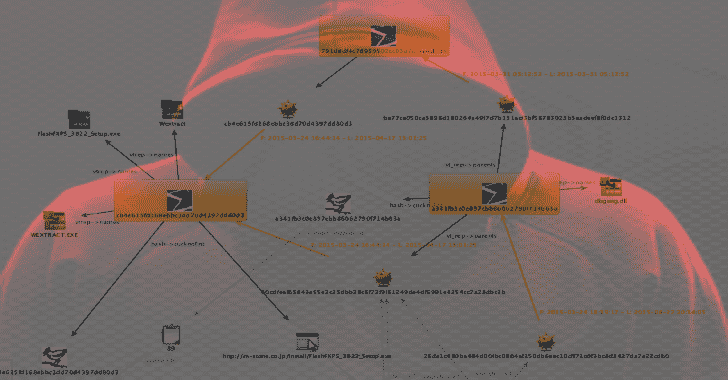
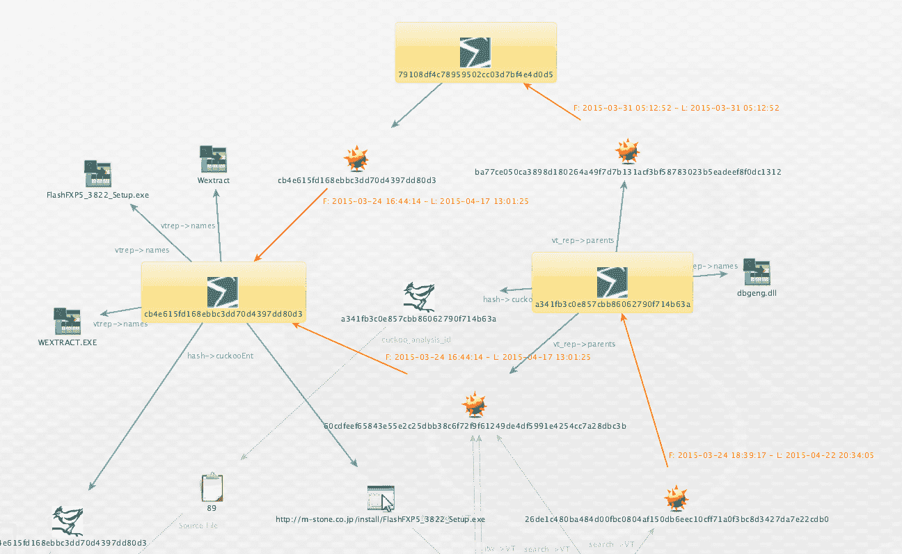
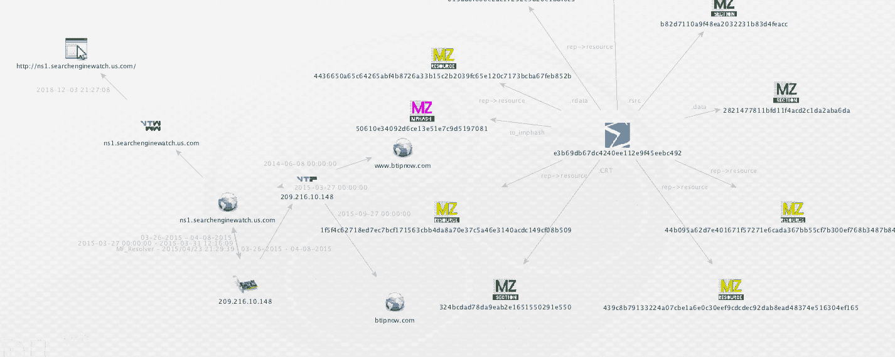

# rip vt:Canari 的病毒总 API Maltego 转换集

> 原文：<https://kalilinuxtutorials.com/ripvt/>

ripVT 是一个 Maltego Canari 针对病毒的完全私有 API 的转换。按原样提供，无担保，无保证。回购协议里没有玩笑。跟你一样严重。

**安装**

1.  需要 Canari，特别是[这个分支/版本](https://github.com/allfro/canari/tree/c90ed9f0f0fb5075358d7a1a4c1080aac3d4e6bc)
2.  安装[不正常](https://github.com/digital4rensics/Malformity)

**sudo python setup . py install
canari create-profile ripVT**

1.  导入生成的 ripVT.mtz
2.  导入存储在以下位置的实体:

**src/rip vt/resources/external/entities . mtz**

1.  将 src/rip vt/resources/etc/rip vt . conf 复制到~/。卡纳里/
2.  在枢轴上转动

**枢轴**

多个唯一实体支持正向和反向搜索。独特的图形识别图标。

**也可阅读-[phones Piot:使用开放的 ADB 端口，我们可以利用 Android 设备](https://kalilinuxtutorials.com/phonesploit-adb-ports-exploit-andriod/)**

**搜索(短语实体)- >**

*   通用搜索
*   行为的
*   发动机
*   ITW

**通用**

*   哈希->下载到存储库

**哈希- > VT 文件报告- >**

*   行为(复制文件、删除、下载、移动、互斥、网络、打开、读取、替换、写入)
*   Imphash
*   证书
*   编译时间
*   侦查
*   出口/进口
*   文件名
*   野外(ITW)地点
*   父项(删除/创建者)
*   体育资源
*   PE 部分
*   SSDEEP
*   类似于

**域- > VT 域报告->**

*   未检测到/检测到的通信样本
*   未检测到/检测到的域嵌入样本
*   未检测到/检测到的域下载样本
*   PCAP
*   域分辨率
*   同科
*   子域
*   检测到的 URL

**IP 地址- > VT IP 报告**

*   未检测到/检测到的通信样本
*   未检测到/检测到的域嵌入样本
*   未检测到/检测到的域下载样本
*   PCAP
*   域分辨率
*   同科
*   子域
*   检测到的 URL

**检测- >**

*   搜索检测名称(包括引擎)
*   搜索检测名称(无引擎

**杜鹃- >(报告 ID)**

*   报表->网络

[**Download**](https://github.com/matonis/ripVT)