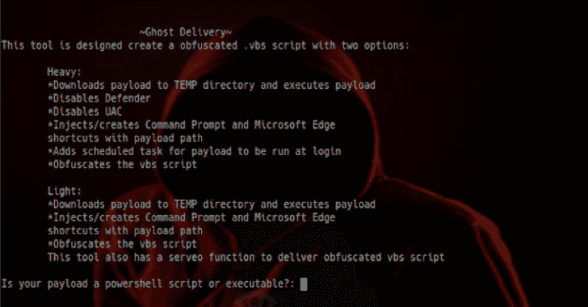

# 幽灵快递:。VBS 脚本提供持久的有效负载

> 原文：<https://kalilinuxtutorials.com/ghostdelivery/>

GhostDelivery 是一个 python 脚本，用于生成混淆。vbs 脚本，提供具有持久性和 windows 防病毒禁用功能的负载(负载丢弃器)。

**沉重的**

将有效负载下载到临时目录，并执行有效负载以绕过 windows 智能屏幕。禁用防御者，

UAC/用户帐户控制、Defender 通知、注入/创建命令提示符和 Microsoft Edge 快捷方式以及有效负载路径(%TEMP%/payload.exe)以在打开时执行有效负载、为有效负载添加名为“WindowsDefender”的计划任务以在登录时运行，以及混淆 vbs 交付脚本。

GhostDelivery 有一个 serveo 函数来传递混淆的 vbs 脚本。

**也可理解为-[vt Hunting:一个用于生成病毒总搜索报告的微小脚本](https://kalilinuxtutorials.com/vthunting-script-virus-total-hunting/)**

**中等**

“中”选项仅传送/执行有效负载，创建名为“WindowsDefender”的计划任务以在登录时运行有效负载以实现持久性，禁用 UAC，并使用有效负载路径注入/创建命令提示符和 Microsoft Edge 快捷方式。

**光**

light 选项仅交付/执行有效负载，创建名为“WindowsDefender”的计划任务以在登录时运行有效负载以实现持久性，并注入/创建命令提示符和带有有效负载路径的 Microsoft Edge 快捷方式。先决条件/要求:

*Python 2.7，脚本中导入的模块。(随机、系统、字符串、操作系统、时间、base64)

[**Download**](https://github.com/s1egesystems/GhostDelivery)