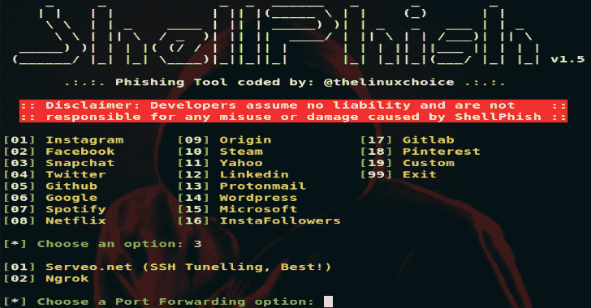

# ShellPhish:18 种社交媒体的网络钓鱼工具

> 原文：<https://kalilinuxtutorials.com/shellphish-phishing-social-media/>

**ShellPhish** 是一款针对 Instagram、脸书、Snapchat、Github、Twitter、雅虎、Protonmail、Spotify、网飞、Linkedin、WordPress、Origin、Steam、微软、InstaFollowers、Gitlab、Pinterest 等 18 家社交媒体的钓鱼工具。

**用途**

**git 克隆 https://github.com/thelinuxchoice/shellphish
CD shellphish
bash shellphish . sh**

**也可理解为-[vt Hunting:一个用于生成病毒总搜索报告的微小脚本](https://kalilinuxtutorials.com/vthunting-script-virus-total-hunting/)**

**免责声明**

未经双方事先同意，使用此工具攻击目标是非法的。最终用户有责任遵守所有适用的地方、州和联邦法律。开发人员不承担任何责任，也不对本程序造成的任何误用或损坏负责。

[**Download**](https://github.com/thelinuxchoice/shellphish)