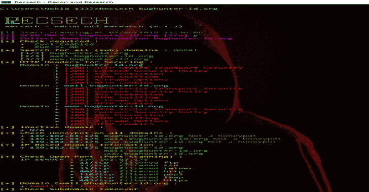
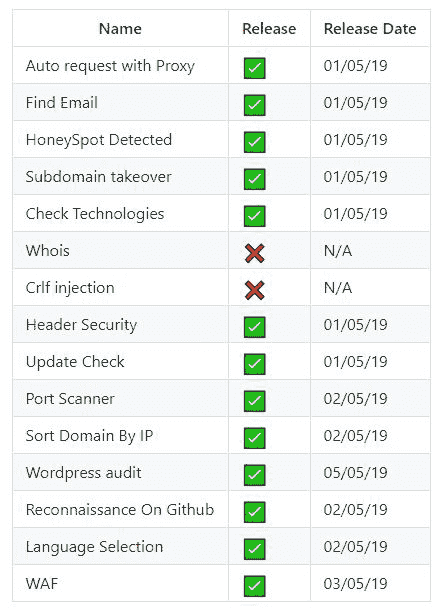
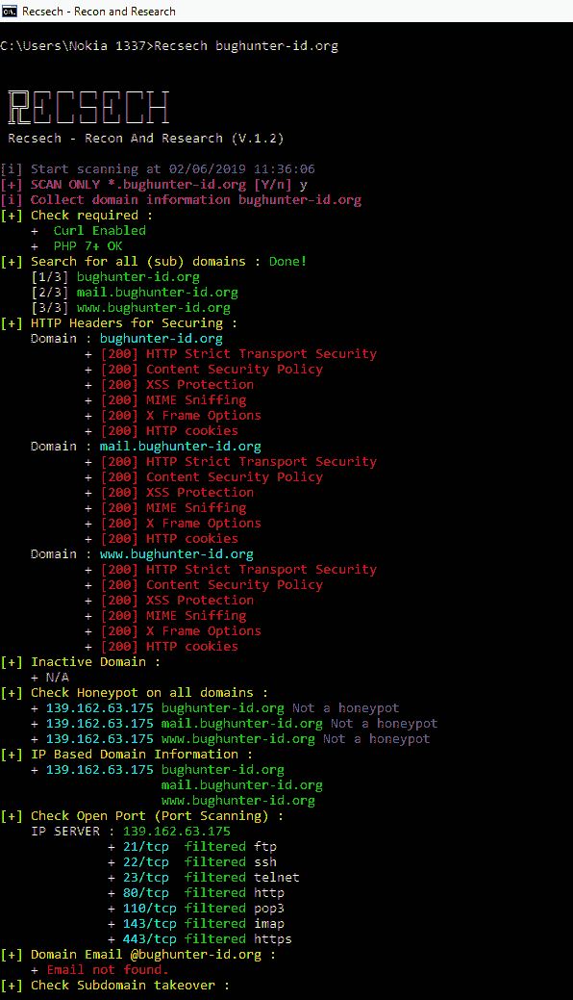

# rec sech——在目标网站上进行足迹和侦察的工具

> 原文：<https://kalilinuxtutorials.com/recsech-footprinting-reconnaissance-web/>

Recsech 是在目标网页上进行**足迹和侦察**的工具。它收集信息，如 DNS 信息，子域，蜜点检测，子域接管，侦察 Github 和更多你可以

**工具中的特性**

**又读-[芬希尔:一个协程驱动的低&慢流量发送器](https://kalilinuxtutorials.com/finshir/)**

**使用该工具的要求**

我们需要几个要求来使用这个工具顺利运行。

*   **Linux**
    *   PHP 7。X PHP 卷曲
*   **窗户**
    *   PHP CURL

**安装**

你可以点击这里下载最新的 tarball 或者点击这里下载最新的 zipball。

最好，您可以通过克隆 Git 存储库来下载 sqlmap:

**git 克隆–深度 1 https://github.com/radenvodka/Recsech.git 记录**

**如何安装到 Windows CLI :**

*   提取 C: \Windows 中的所有文件
*   编辑文件`**Recsech.bat**`，然后设置你的 PHP 补丁(如果你已经在 c 盘上安装了 xampp，你不需要做这个步骤)

**@echo off**
**设置路径= % PATH %C:\ xampp \ PHP**
**title Recsech–Recon and Research**
**PHP " C:\ Windows \ Recsech . PHP " % 1**

*   打开 cmd 并执行 Recsech 命令。

**用途**

足以执行命令:

PHP Recsech.php example.com

或者，如果不起作用，请使用以下命令:

**PHP Recsech.php 调试**

**免责声明**

这是一个对每个人开放的源代码，你可以重新发布，修改，使用专利和私人使用，而没有任何重新发布的义务。但需要注意的是，包括被修改的库的源代码(不是整个程序的源代码)，包括许可证，包括作者的原始版权(radenvodka)，包括所做的任何更改(如果修改)。用户没有权利在软件有损坏的情况下起诉创作者，甚至没有权利要求如果这个工具的制作者造成了问题。因为每一个风险都是用户风险本身造成的。

[**Download**](https://github.com/radenvodka/Recsech/tree/RecsechWIN)