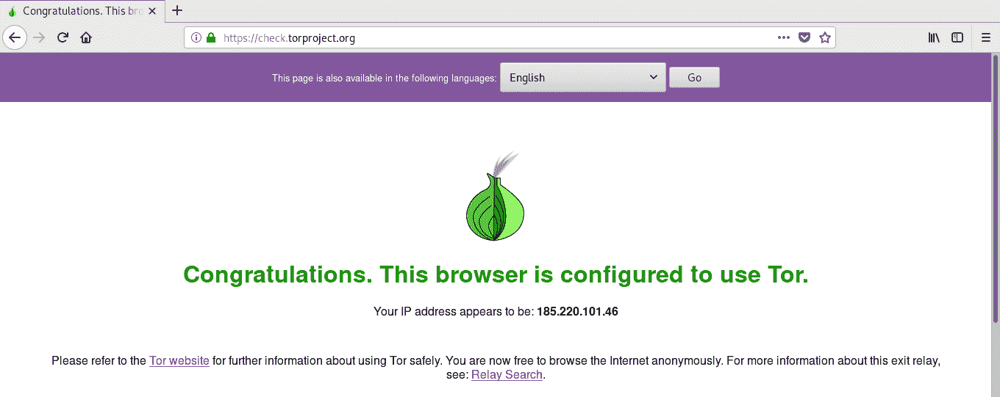
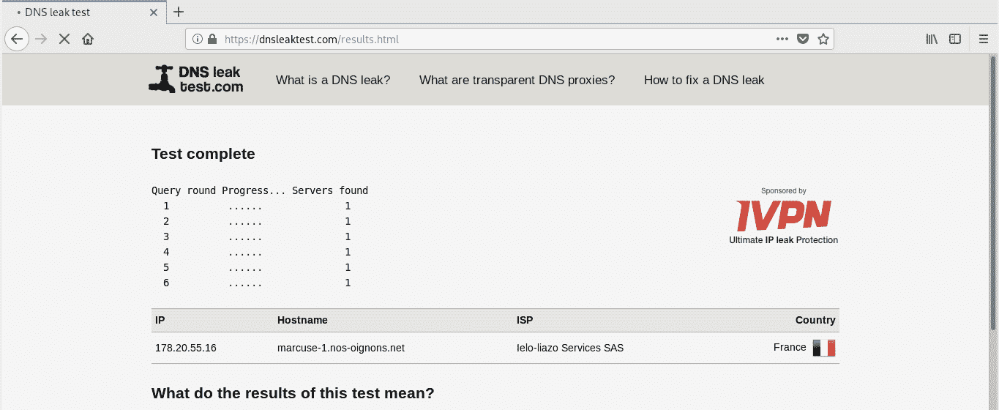

# TOR 路由器:一个允许你将 TOR 设置为默认网关的工具

> 原文：<https://kalilinuxtutorials.com/tor-router-a-tool-that-allow-you-to-make-tor-your-default-gateway/>

TOR 路由器允许你使用 TOR 作为一个透明的代理，在 TOR **下发送你的所有流量，包括 DNS 请求**，你唯一需要的是:一个使用 systemd(如果你想使用服务)和 Tor 的系统。

它不像路由流量的其他工具那样接触系统文件，原因是:路由流量不需要移动文件，移动文件也是一个坏主意，因为脚本/工具中的失败可能会在您不知道发生了什么的情况下中断您的系统连接。

**仅使用 SystemD 安装在发行版上的脚本**

如果你使用的是 BlackArch Linux([https://blackarch.org](https://blackarch.org/))你可以使用下面的命令从 repos 安装这个脚本:`**# pacman -S tor-router**`

要从源安装:

**注意，你需要 BASH，而不是 sh**

**~$ git 克隆 https://gitlab.com/edu4rdshl/tor-router.git&&CD。/tor-router&sudo bash install . sh**

**[也读作–IOC extract:高级危害指示器(IOC)提取器](https://kalilinuxtutorials.com/iocextract/)**

**用法**

在使用 systemd 的发行版中，您应该考虑使用 install.sh 脚本，这里描述了安装/配置 tor-router 的过程。

**It 脚本需要 root 权限**

1.  打开终端，使用以下命令克隆脚本:

**~$ git 克隆 https://gitlab.com/edu4rdshl/tor-router.git&CD tor-router/files**

*   将以下几行放在/etc/tor/torrc 的末尾

**#为 tor-router 设置 TOR 透明代理
虚拟地址网络 10 . 192 . 0 . 0/10
autophossonresolve 1
TransPort 9040
dn sport 5353**

*   重新启动 tor 服务
*   以 root 用户身份执行 tor-router 脚本

**#须藤。/tor-路由器**

*   现在你所有的流量都在 TOR 之下，你可以在下面的页面中查看:[https://check.torproject.org](https://check.torproject.org/)和 DNS 测试:[https://dnsleaktest.com](https://dnsleaktest.com/)
*   为了自动执行脚本，您应该根据您使用的 init 将它添加到系统自动启动脚本中，对于 systemd，我们在 *files* 文件夹中有一个. service 文件。

**卸载/停止**

删除/etc/tor/torrc 中的 tor-router 配置行，使用 systemctl 禁用 tor-router.service(如果您使用了 install.sh 脚本)，删除 **/usr/bin/tor-router，/etc/systemd/system/tor-router . service**并重启您的计算机。

**概念验证**

在运行脚本之后，按照下面的步骤确保一切按预期运行:

*   **Ip 隐藏和 TOR 网络配置**:访问 https://check.torproject.org，应该会看到这样一条消息:

*   **检查 DNS 泄漏**:访问 https://dnsleaktest.com[做一个扩展测试，看看你的 DNS 是什么。你应该得到一些这样的:](https://dnsleaktest.com/)

[**Download**](https://github.com/Edu4rdSHL/tor-router)